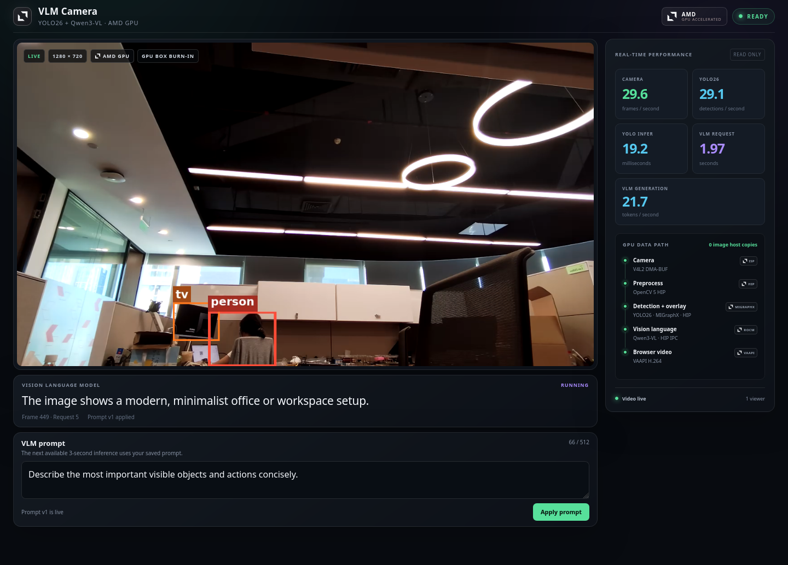
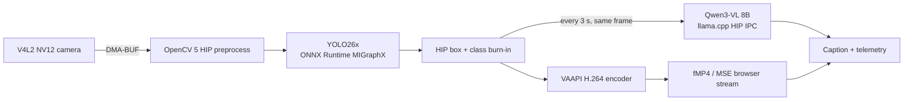

# VLM Camera Pipeline

**English** | [Chinese](README.zh-CN.md)

A low-latency, GPU-resident camera demo for AMD Ryzen AI MAX+ 395 / Radeon 8060S
(`gfx1151`). It runs YOLO26 continuously, asks Qwen3-VL to describe a recent
detector-annotated frame every three seconds, and streams the result to a prompt-only web UI.



## What is included

- A browser dashboard with live video, colored YOLO boxes, and COCO class labels.
- A single editable control: the VLM prompt. All runtime settings remain read-only.
- Live camera, YOLO, YOLO inference, VLM request, and generation-speed telemetry.
- Same-frame Hybrid guidance: Qwen3-VL receives the numbered GPU overlay and a bounded set of
  YOLO hints from the exact frame being described.
- A strict `zero-host-copy` image path for camera pixels and model I/O.
- A depth-one/latest-frame scheduler, so slow VLM work never stalls video or YOLO.
- Separate web, native Hybrid, clean zero-copy, VLM-only, and legacy host-copy launchers.



The CPU forwards compressed video and small control-plane data only. Camera pixels, YOLO model
I/O, VLM images, and vision embeddings remain in GPU-accessible memory. Small transfers such as
prompt text, bounded detection metadata, token logits, and UI glyph resources are explicitly
classified as control-plane traffic. For that reason this project says **zero-host-copy**, not
"zero bytes ever move."

## Quick start

### Requirements

The validated target is:

- AMD Ryzen AI MAX+ 395 / Radeon 8060S (`gfx1151`)
- ROCm 7.2.1
- Ubuntu with kernel `6.17.0-1032-oem` for the locked ISP4 DMA-BUF patch
- Python 3.12, [`uv`](https://docs.astral.sh/uv/), Git, curl, CMake, Ninja, and an accessible V4L2 camera
- Matching ROCm/MIGraphX development packages plus GStreamer and VAAPI runtime support

All Python dependencies, caches, application configuration, native builds, and models stay inside
this repository. The setup does not install packages into the system Python or user site-packages.

### Install the repository-local runtime

```bash
bash scripts/setup_native_gfx1151.sh
bash scripts/setup_migraphx_gfx1151.sh
bash scripts/setup_opencv_hip_gfx1151.sh
bash scripts/setup_zerocopy_kernels_gfx1151.sh
bash scripts/setup_camera_dmabuf_gfx1151.sh
bash scripts/setup_llama_vlm_zerocopy_gfx1151.sh
bash scripts/setup_egl_present_gfx1151.sh
```

These scripts create the repository `uv` environment, install the pinned Ultralytics/MIGraphX path,
build the OpenCV 5 HIP and llama.cpp zero-copy forks, build the native camera/presenter components,
download the locked models, and validate their checksums.

The strict camera path also needs the version-locked `amd_capture.ko` override. Install it once, then
perform a controlled reboot:

```bash
./scripts/setup_amd_isp4_dmabuf_patch.sh
./scripts/install_amd_isp4_dmabuf_patch.sh
```

This module install is intentionally limited to kernel `6.17.0-1032-oem`. Rebuild and reinstall it
after a kernel upgrade. The stock module remains available and the override can be removed with:

```bash
./scripts/uninstall_amd_isp4_dmabuf_patch.sh
```

### Run the web demo

```bash
./scripts/run_yolo_vlm_web_zerocopy.sh
```

The launcher opens <http://127.0.0.1:8765/>. The default `/dev/video0` front camera is corrected in
the HIP conversion kernel so video, YOLO, overlays, and VLM all share the same non-mirrored view.
For a rear or external camera that already has the desired orientation, run:

```bash
./scripts/run_yolo_vlm_web_zerocopy.sh --no-camera-horizontal-flip
```

The browser path is:

```text
HIP YUYV DMA-BUF + in-place overlay
  -> VAAPI VPP
  -> low-latency VAAPI H.264
  -> fragmented MP4
  -> Media Source Extensions
```

The current player targets about `0.16 s` of live buffering. A 40-second Firefox validation measured
camera-to-display latency at approximately `156 ms` median and `196 ms` P95, with no new decoded-frame
drops, confirmed rebuffer events, or append-queue overflows across 1,192 frames.

## Other launchers

Run the recommended native Hybrid UI:

```bash
./scripts/run_yolo_vlm_hybrid_zerocopy.sh \
  --camera /dev/video0 \
  --window-scale 0.5 \
  --show-performance
```

Run the clean zero-copy path for A/B comparison:

```bash
./scripts/run_yolo_vlm_zerocopy.sh \
  --camera /dev/video0 \
  --vlm-interval 3 \
  --window-scale 0.5 \
  --show-performance
```

Run Qwen3-VL only, with no detector construction:

```bash
uv run --frozen python scripts/run_vlm_demo.py \
  --device /dev/video0 --fourcc NV12 \
  --width 1280 --height 720 --camera-fps 30 \
  --vlm-interval 3 --window-scale 0.75
```

Run the separate legacy ONNX Runtime MIGraphX + VLM host-copy demo:

```bash
uv run --frozen --extra migraphx --extra vlm \
  python scripts/run_yolo_vlm_demo.py \
  --device /dev/video0 --fourcc NV12 \
  --width 1280 --height 720 --camera-fps 30 \
  --vlm-interval 3 --window-scale 0.75
```

The legacy launcher rejects CPU execution-provider fallback but does not use strict GPU I/O Binding,
so it is correctly described as host-copy. It remains separate for regression testing.

## Validated results

| Path | Result |
| --- | --- |
| Strict zero-copy soak | 1,308 s; 39,007/39,007 acquire/requeue/present; display 29.815 FPS; YOLO 29.233 FPS; VLM 437/437 |
| Hybrid stability sample | 371.420 s; 11,071/11,071 frames; display/YOLO 29.807 FPS; 124/124 exact-frame VLM results |
| Hybrid VLM latency | 2.256 s median; 2.517 s P95; zero scheduling drops, timeouts, or frame mismatches |
| Web end-to-end latency | 156 ms median; 196 ms P95 over a 40-second Firefox run |
| Model placement | Qwen3-VL 37/37 layers and vision projector on `ROCm0`; partial offload fails closed |
| Profiler copy audit | Camera image, model-I/O, and vision-embedding H2D/D2H counters are zero |

The Hybrid cadence is fixed at three seconds. The previous caption remains visible until the next one
is ready, while video and YOLO continue independently. Model inference can take longer than three
seconds under load; the latest-frame scheduler never builds an unbounded request queue.

## Preflight and validation

Check the complete strict path without opening the camera:

```bash
./scripts/run_yolo_vlm_hybrid_zerocopy.sh --preflight-only
```

Run the source and unit-test gates through the repository environment:

```bash
uv run --frozen ruff check src scripts tests
uv run --frozen python -m pytest -q
```

Additional hardware checks:

```bash
uv run --frozen --extra vlm python scripts/check_vlm_gpu.py
uv run --frozen --extra migraphx --extra vlm \
  python scripts/check_migraphx_backend.py --iterations 20
```

## Repository map

| Path | Purpose |
| --- | --- |
| `web/` | Prompt-only browser dashboard and AMD visual identity |
| `src/zerocopy_web.py` | Web control plane, fragmented-MP4 fan-out, and telemetry |
| `src/zerocopy_hybrid.py` | Same-frame lease management, bounded hints, and prompt construction |
| `src/zerocopy_camera.py` | Camera DMA-BUF capture and GPU buffer lifecycle |
| `src/zerocopy_vlm.py` | llama.cpp HIP-IPC VLM client and strict placement checks |
| `native/` | HIP kernels, camera bridge, presenter, and ORT/MIGraphX binding code |
| `scripts/` | Reproducible setup, launch, audit, and validation entry points |
| `native-lock/` | Pinned component identities, model metadata, and checksums |
| `doc/` | Design decisions, implementation records, and acceptance evidence |

## Design and implementation records

- [AMD Ryzen AI MAX+ 395 deployment plan](doc/amd_395_pipeline.md)
- [Strict zero-host-copy YOLO + VLM design](doc/zerocopy_yolo_vlm_design.md)
- [Hybrid YOLO + VLM design](doc/hybrid_yolo_vlm_design.md)
- [Prompt-only web demo design](doc/web_prompt_demo_design.md)

Model weights, compiled caches, local environments, and large runtime logs are intentionally excluded
from Git. Their pinned identities and reproducible setup steps remain in the repository.
