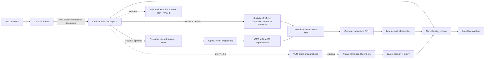

# Ultralytics YOLO26 在 AMD Ryzen AI MAX+ 395（含 PRO 395）上的本地摄像头实时部署方案

> 文档状态：已完成目标机只读可行性核验；尚未安装项目 Python AI 栈或执行 YOLO 推理
>
> 编写日期：2026-09-08
>
> 本地工作区：`/home/amd/work/vlm_camera_pipeline`
>
> 上游源项目：`https://github.com/zihaomu/notebook.git` 中的 `ultralytics_yolo26/`
>
> 源码基线：release-lock commit `d9d32c37a29272540937d3ee02b3f8f709046464`；镜像 build commit `865c5871d41af46c5da08b65ea9eb5e5ce16b049`
>
> 目标硬件：AMD Ryzen AI MAX+ 395 / Ryzen AI MAX+ PRO 395，Radeon 8060S，RDNA 3.5，LLVM target `gfx1151`
>
> 部署约束：不使用 Docker/Podman；直接安装到目标机；输入改为本地摄像头；实时显示优先

## 1. 目标、边界与重要结论

目标是在一台独立的 AMD Ryzen AI MAX+ 395（含 PRO 395）台式机上原生部署 YOLO26 pipeline，通过 USB/UVC 或板载摄像头持续采集画面，在本地窗口中实时显示检测框、类别、置信度、FPS 和延迟；按需增加硬件录制与低频 Qwen3-VL 场景字幕。

本文所称“实时 VLM demo”默认指：摄像头持续采集、YOLO 持续逐帧/按最新帧检测、Qwen3-VL
以低频最新快照异步生成场景字幕。它不表示 Qwen3-VL 8B 能以 30 FPS 对每一帧做语言生成；
若需求是逐帧 VLM，需要另选更小模型、专用视觉编码器或不同硬件预算。

这不是把云端命令原样复制到本机。云端版本和本地版本的输入、调度与性能边界不同：

| 维度 | 云端 workshop | 395 本地实时版 |
|---|---|---|
| 输入 | 固定 H.264 文件，393 帧 | 无限摄像头流 |
| 解码 | rocDecode -> DLPack GPU frame | 第一版 V4L2/OpenCV host frame；后续可做 DMABUF |
| GPU | W7900D，`gfx1100`，48 GiB 独显 | Radeon 8060S，`gfx1151`，统一内存 APU |
| 推理 cache | 已烘焙 `gfx1100` `.mxr` | 必须在 395 本机重新生成 `gfx1151` cache |
| 调度 | 每帧必处理，要求输出帧数完全相等 | 最新帧优先；允许丢旧帧，禁止延迟堆积 |
| 展示 | 生成 MP4 和 Notebook | 本地实时窗口；录制是可选支路 |
| VLM | 离线四段分析 | 默认关闭；可选低频异步字幕 |
| 数据复制口径 | 文件 decode 后主视觉路径无完整帧 D2H | 摄像头首版天然有一次 host -> GPU；不宣称全链路零拷贝 |

### 1.1 必须接受的结论

1. 云端 `models/ort-migraphx-cache/735f1583e99dfeb733da/*.mxr` **不能复制到 395 使用**。它绑定 `gfx1100`、ROCm、MIGraphX、ORT、PyTorch 和补丁 identity。
2. 云端编译的 `hip_vaapi_bridge*.so` **不能复制到 395 使用**。必须以 `AMDGPU_TARGET=gfx1151` 在目标机重编译。
3. 云端 `.build/wheels/onnxruntime_migraphx-1.24.2-cp310-*.whl` 只能在 ABI、Python 和 ROCm/MIGraphX 均匹配时使用；395 推荐 Python 3.12 时不能安装 `cp310` wheel。
4. 不要设置 `HSA_OVERRIDE_GFX_VERSION` 把 `gfx1151` 伪装成 `gfx1100`。需要真正包含 `gfx1151` code object 的 PyTorch、OpenCV HIP、llama.cpp 和其他 native 工件。
5. 本文把“395”解释为 AMD Ryzen AI MAX+ 395 / Ryzen AI MAX+ PRO 395 / Radeon 8060S。目标机 `rocminfo` 如果不是 `gfx1151`，立即停止，重新选择架构参数。

### 1.2 交付范围：先跑通什么

当前工作区只有本文档；release-lock 上游源码尚未取回。该上游基线包含云端 finite-video pipeline，**尚未包含**
`scripts/run_camera.py`、`src/camera_io.py` 或 `src/realtime_pipeline.py`。因此本文有两层目标：

1. **当天可跑的摄像头基线**：安装原生 PyTorch ROCm、Ultralytics 和普通 OpenCV，直接用
   `yolo26x.pt` 打开摄像头，确认 395 GPU 推理和本地窗口正常。
2. **最终低延迟本地 pipeline**：在本工作区按第 9 节新增 latest-frame 调度、可复用上传 buffer、
   metrics，以及可选 OpenCV HIP、MIGraphX、VA-API、Qwen 支路。

如果只需要先看到实时检测效果，做到 M0、M1、6.1、6.2 的 MVP 部分和 Route P 即可。
不要一开始同时编译 OpenCV HIP、ORT-MIGraphX、VA-API bridge 和 llama.cpp。

### 1.3 资源总表：从哪里获取

| 优先级 | 资源 | 获取位置 | 固定身份或用途 |
|---|---|---|---|
| 必需 | AMD Linux 驱动 | `https://www.amd.com/en/support/download/linux-drivers.html` | 新装机器选择匹配驱动；本机已有可用驱动，不为 MVP 重装 |
| 必需 | Radeon/Ryzen ROCm 兼容矩阵 | `https://rocm.docs.amd.com/projects/radeon-ryzen/en/latest/docs/compatibility/compatibility.html` | 确认目标 OS、PyTorch 和 Ryzen APU 支持范围 |
| 必需 | Strix Halo 系统优化 | `https://rocm.docs.amd.com/en/latest/how-to/system-optimization/strixhalo.html` | kernel、统一内存和 TTM/GTT 设置 |
| 必需 | AMD GPU 架构表 | `https://rocm.docs.amd.com/en/latest/reference/gpu-arch-specs.html` | Radeon 8060S 应识别为 `gfx1151` |
| 必需 | ROCm 7.2.1 Ryzen PyTorch 安装 | `https://rocm.docs.amd.com/projects/radeon-ryzen/en/latest/docs/install/installryz/native_linux/install-pytorch.html` | 本机 MVP 使用官方 PyTorch 2.9.1 / Python 3.12 wheel |
| 必需 | YOLO26 项目源码 | `https://github.com/zihaomu/notebook.git` | checkout `d9d32c37a29272540937d3ee02b3f8f709046464` |
| 必需 | YOLO26x PyTorch 权重 | `https://github.com/ultralytics/assets/releases/download/v8.4.0/yolo26x.pt` | MVP 唯一必需模型，118,667,365 bytes |
| 必需 | Ultralytics fork | `https://github.com/zihaomu/ultralytics.git` | checkout `34e213ca3ece4c18962f5bb922ec74da0c474d24` |
| 必需 | YOLO26 NMS 语义 | `https://docs.ultralytics.com/guides/end2end-detection/` | 根据模型 metadata 选择 confidence-only 或 NMS，禁止重复 NMS |
| 可选 Route M | YOLO26x ONNX | `https://github.com/ultralytics/assets/releases/download/v8.4.0/yolo26x.onnx` | ORT-MIGraphX 使用，223,287,479 bytes |
| 可选 Route M | ONNX Runtime | `https://github.com/microsoft/onnxruntime` | 没有匹配 gfx1151 wheel 时源码构建 |
| 可选 Route M | MIGraphX | `https://github.com/ROCm/AMDMIGraphX` | 必须与目标 ROCm release 匹配 |
| 可选优化 | OpenCV HIP fork | `https://github.com/zhangnju/opencv.git` | commit `e0387086b2103c23b3b25952b5fb700ca2e42132` |
| 可选优化 | OpenCV contrib HIP fork | `https://github.com/zhangnju/opencv_contrib.git` | commit `467cbc6f99aa82ebda39a2e94d6125557bd84d0b` |
| 可选 VLM | Qwen3-VL GGUF | `https://huggingface.co/unsloth/Qwen3-VL-8B-Instruct-GGUF` | 主 GGUF + `mmproj-F16.gguf` |
| 可选 VLM | llama.cpp | `https://github.com/ggml-org/llama.cpp.git` | gfx1151 参考 commit `0b1bad14ff204627636aeb1de22ddcd5acb859d4` |
| 参考 fallback | TheRock gfx1151 wheel index | `https://rocm.nightlies.amd.com/v2/gfx1151/` | 历史参考 pin，不替代当前兼容矩阵 |

若目标机访问 GitHub 不稳定，源码 URL 可将 `https://github.com/` 替换为
`https://gh-test.anruicloud.com/`；commit SHA 和模型 SHA 不得改变。

以下 ROCm 7.14 archive URL 与 SHA 可作为 **gfx1151 side-by-side 工具链参考**，但该
archive 当前并不在本工作区，且不是本机 MVP 的前置条件：

```text
URL:    https://repo.amd.com/rocm/tarball-multi-arch/therock-dist-linux-gfx1151-7.14.0.tar.gz
Bytes:  1,713,449,440
SHA256: 2567d5e34e470db104a62a02c36aa770cb0430175e48c1c46df0eefc05e1d77c
```

上游设计说明称该 archive 曾在另一项 395 llama.cpp/GGUF 工作负载中验证；当前工作区
没有相应日志，因此不把该陈述当成本项目证据。它也没有替本项目验证 PyTorch、OpenCV
HIP 或 ORT-MIGraphX。优先采用 AMD 当前兼容矩阵给出的完整支持组合；只有需要
side-by-side 工具链时才使用该 archive，并保持独立前缀。

### 1.4 模型和磁盘：MVP 不需要四个模型

| 目标 | 必需文件 | 约占空间 |
|---|---|---:|
| PyTorch 摄像头 MVP | `yolo26x.pt` | 119 MB |
| 可选 ORT-MIGraphX | 再加 `yolo26x.onnx`，并在 395 生成 cache | 223 MB + cache |
| 可选 Qwen3-VL | 再加主 GGUF 和 `mmproj-F16.gguf` | 约 9.2 GiB |
| OpenCV/ORT/native 构建树 | 源码、wheel 和中间文件 | 建议预留 30-60 GiB |

所以第一轮只传输 `yolo26x.pt`。只有决定启用 Route M 时才准备 ONNX；只有决定启用
VLM 时才准备两份 GGUF。

### 1.5 最短必做路径

```text
1. M0：记录本机 gfx1151、kernel、/dev/kfd、摄像头和用户组
2. 保留已安装且受支持的 ROCm 7.2.1；在工作区 `.venv` 安装官方 PyTorch 2.9.1 wheel
3. 在本工作区取得上游参考源码，checkout d9d32c37...
4. 安装 pinned Ultralytics fork 和普通 opencv-python
5. 只下载并校验 yolo26x.pt
6. ffplay 验证 /dev/video0
7. yolo predict source=0 验证 PyTorch GPU 摄像头基线
8. 按第 9 节实现 latest-frame 低延迟入口并完成 M2 的 30 分钟 Gate
9. M2 通过后，按需独立启用 OpenCV HIP/MIGraphX、VA-API 或 Qwen，不互相作为前置条件
```


## 2. 目标架构



第一版 Route P 保留摄像头采集得到的 host BGR frame，用于窗口显示，并把同一 frame 交给
Ultralytics/PyTorch 完成预处理和 H2D。Route M 才引入显式固定 staging buffer 与 OpenCV
HIP 预处理。检测后只取回 compact boxes/classes/scores，在原始 host frame 上绘制。这样
没有额外完整帧 D2H，但仍存在摄像头帧的必需 H2D。

第二阶段才考虑 V4L2 DMABUF -> HIP external memory，不能把它列为首次部署阻断项。

## 3. 硬件与系统基线

### 3.1 推荐硬件

- AMD Ryzen AI MAX+ 395 或 Ryzen AI MAX+ PRO 395；最终以 `rocminfo=gfx1151` 为准；
- Radeon 8060S，40 CU，`gfx1151`；
- 64 GiB 内存为 YOLO-only 推荐下限；同时运行 Qwen3-VL 建议 96/128 GiB；
- NVMe 剩余空间至少 80 GiB，包含源码、编译树、模型和录制文件；
- UVC 摄像头，首选 1280x720@30 或 1920x1080@30；
- 显示器接在 8060S 驱动的桌面会话上；
- 有线网络仅用于首次安装/模型传输，运行时可离线。

### 3.2 推荐操作系统

推荐 Ubuntu 24.04。Ryzen AI MAX 300 系列需要包含 KFD 修复的内核：

- Ubuntu 24.04 HWE：`6.17.0-19.19~24.04.2` 或更高；或
- Ubuntu 24.04 OEM：`6.14.0-1018` 或更高；或
- 其他发行版：内核 `6.18.4` 或更高。

ROCm 使用一套完整、相互匹配的版本。本机已经安装 **ROCm 7.2.1**，AMD 的 Ryzen Linux
支持矩阵明确列出 `gfx1151` / Ryzen AI Max+ 395、Ubuntu 24.04.4、PyTorch 2.9.1 和
Python 3.12 为正式支持组合。因此 MVP 先沿用这套系统栈，不为追求版本号而升级驱动或
混入 7.14/10.x 用户态库。

若后续功能确实需要 ROCm 7.14.x 或更新版本，先建立独立 side-by-side 前缀和新 venv，
完整验证后再切换；不能与 `/opt/rocm-7.2.1` 的用户态库或 native extension 混用。

ROCm 7.14 archive 只证明官方提供了 `gfx1151` 工具链工件，**不证明**本项目所需的
PyTorch、ORT-MIGraphX、OpenCV HIP 和摄像头组合已经通过。本文仍要求逐 Gate 在目标机验证。

AMD 面向 Ryzen APU 的公开 ROCm 支持矩阵首先列出 PyTorch；不要据此自动推导 ORT-MIGraphX 在 `gfx1151` 上属于同等级官方支持。因此本文把 **PyTorch ROCm 定义为默认交付路径**，把 ORT-MIGraphX 定义为实验性性能优化路径。只要 PyTorch GPU 路径和实时调度 Gate 通过，本地摄像头 MVP 即可交付；MIGraphX 必须单独验证后才能启用。

### 3.3 统一内存配置

395 使用 GPUVM/GTT 映射系统内存。`rocm-smi` 显示的 VRAM 数值不是应用完整内存占用。

推荐策略：

- BIOS dedicated VRAM 保持较小，例如 512 MiB；
- 通过 TTM/GTT 提高 GPU 可映射系统内存；
- YOLO-only 可先设 32 GiB；YOLO + Qwen 建议 48-64 GiB；
- 用进程 RSS、系统 available memory 和应用实测共同判断，不只看 `rocm-smi`。

本机 2026-09-08 的现状与上面的推荐默认值不同：固件为 GPU 暴露约 96 GiB VRAM，
TTM pages limit 为 80 GiB，而 Linux host 侧可见约 31 GiB 内存和 8 GiB swap。该配置足以
先跑 YOLO，但暂不因文档建议修改 BIOS；先完成 M1/M2 实测。若编译 OpenCV、ORT 或
llama.cpp，默认限制并行度为 `${BUILD_JOBS:-8}`，禁止直接使用 `-j$(nproc)` 耗尽 host 内存。

官方工具示例：

```bash
sudo apt install -y pipx
pipx ensurepath
pipx install amd-debug-tools
amd-ttm
sudo -H "$(command -v amd-ttm)" --set 64
sudo reboot
```

不同安装方式下 `amd-ttm` 的提权调用路径可能不同。执行后必须再次运行 `amd-ttm` 验证，而不是假设写入成功。

### 3.4 本机只读核验快照（2026-09-08）

| 项目 | 本机结果 | 判定 |
|---|---|---|
| CPU/APU | AMD Ryzen AI MAX+ PRO 395 / Radeon 8060S | 通过 |
| OS/kernel | Ubuntu 24.04.4 / `6.17.0-1030-oem` | 通过 |
| ROCm/GPU | ROCm 7.2.1；`rocminfo=gfx1151`；40 CU | 通过 |
| 设备权限 | `/dev/kfd`、`/dev/dri/renderD128` 可访问；用户属于 `render,video` | 通过 |
| 摄像头 | `/dev/video0`（AMD ISP Preview）；NV12/YUYV；1280x720@30 实采 60 帧 | 通过 |
| 桌面 | Wayland 会话，XWayland `DISPLAY=:0` 可用 | GUI 条件具备，待 OpenCV 实测 |
| Python | Python 3.12.3；尚无 torch/cv2/ultralytics/onnxruntime | M1 待执行 |
| 存储 | 工作区所在文件系统约 1.6 TiB 可用 | 通过 |
| 可选录制工具 | FFmpeg 含 `h264_vaapi`；`vainfo` 尚未安装/验证 | 不阻塞 M2 |

快照只说明硬件入口具备，不替代 PyTorch GPU smoke、OpenCV GUI 和 30 分钟实时 Gate。

## 4. M0：目标机环境识别门

当前机器缺少 `v4l2-ctl` 和 `vainfo`。先安装只读盘点所需的小型工具，再执行完整脚本并
把输出保存在本工作区；不要把工具缺失误判成摄像头或 VA-API 硬件失败：

```bash
sudo apt install -y v4l-utils vainfo
export WORKSPACE=/home/amd/work/vlm_camera_pipeline
mkdir -p "$WORKSPACE/output/bringup/logs"
{
  date -Is
  uname -a
  lscpu
  free -h
  lspci -nnk | grep -A3 -Ei 'VGA|Display'
  groups
  ls -l /dev/kfd /dev/dri /dev/video* 2>&1
  rocminfo | grep -E 'Name:|Marketing Name:'
  rocm-smi --showproductname --showmeminfo vram --showuse
  vainfo
  v4l2-ctl --list-devices
} |& tee "$WORKSPACE/output/bringup/logs/00-host-inventory.log"
```

必须满足：

```text
rocminfo LLVM target = gfx1151
Marketing Name       = Radeon 8060S（或等价 395 标识）
/dev/kfd             = 存在且当前用户可访问
/dev/dri/renderD*    = 存在且当前用户属于 render/video
/dev/video*          = 摄像头存在并能持续出帧
```

`vainfo` 能列出 H.264 encode profile 只作为 M4 录制 Gate，不阻塞摄像头 + YOLO 实时窗口。

权限设置：

```bash
sudo usermod -aG render,video "$USER"
sudo reboot
```

若 `rocminfo` 不是 `gfx1151`、kernel 低于要求、`/dev/kfd` 不可访问，或摄像头不能出帧，
M0 失败，不能进入模型安装。本机已通过这些核心只读检查；安装工具后的正式日志仍需归档。

## 5. M1：原生 ROCm、Python 与摄像头基线

### 5.1 安装系统依赖

本机已有匹配的 amdgpu/ROCm 7.2.1，不重复执行 `amdgpu-install`。只补齐项目依赖：

```bash
sudo apt install -y \
  build-essential cmake ninja-build git git-lfs pkg-config curl wget rsync \
  python3.12 python3.12-dev python3.12-venv \
  ffmpeg vainfo v4l-utils \
  libdrm-dev libva-dev libavcodec-dev libavformat-dev libavutil-dev \
  libgl1 libglib2.0-0 libgtk-3-dev
```

只补装用户态依赖不需要重启；仅在更新 kernel/driver 或变更用户组后重启。

只有新装机器或 M0 证明驱动损坏时，才打开第 1.3 节的兼容矩阵与 Linux driver 页面，选择
同一 release 的驱动和 ROCm，并执行对应 `amdgpu-install`。不得在当前可用系统上盲目覆盖。

`amdgpu-install` 是系统安装路线。若明确选择第 1.3 节的 ROCm 7.14 side-by-side archive，
则不要再用另一 release 的 `/opt/rocm` 用户态库覆盖它；该 archive 也不替代 kernel driver。
确需试验 7.14.0 时，示例安装到工作区私有前缀；该步骤不是 MVP 命令：

```bash
export WORKSPACE=/home/amd/work/vlm_camera_pipeline
export ROCM_ARCHIVE="$WORKSPACE/.cache/rocm/therock-dist-linux-gfx1151-7.14.0.tar.gz"
export ROCM_PATH="$WORKSPACE/.toolchains/rocm-7.14.0"
mkdir -p "$(dirname "$ROCM_ARCHIVE")" "$(dirname "$ROCM_PATH")"
curl -fL --retry 5 \
  -o "$ROCM_ARCHIVE" \
  https://repo.amd.com/rocm/tarball-multi-arch/therock-dist-linux-gfx1151-7.14.0.tar.gz
test "$(stat -c %s "$ROCM_ARCHIVE")" -eq 1713449440
printf '%s  %s\n' \
  2567d5e34e470db104a62a02c36aa770cb0430175e48c1c46df0eefc05e1d77c \
  "$ROCM_ARCHIVE" | sha256sum -c -
test ! -e "$ROCM_PATH"
mkdir -p "$ROCM_PATH"
tar -xf "$ROCM_ARCHIVE" -C "$ROCM_PATH"
test -x "$ROCM_PATH/bin/hipcc"
export PATH="$ROCM_PATH/bin:$PATH"
export LD_LIBRARY_PATH="$ROCM_PATH/lib:${LD_LIBRARY_PATH:-}"
```

只选一种用户态 ROCm 路线。不要同时把 `/opt/rocm/lib` 和 `$WORKSPACE/.toolchains/rocm-7.14.0/lib`
放进同一个 `LD_LIBRARY_PATH`。

记录实际环境：

```bash
export WORKSPACE=/home/amd/work/vlm_camera_pipeline
mkdir -p "$WORKSPACE/output/bringup/logs"
dpkg -l | grep -E 'amdgpu|rocm|migraphx' \
  | tee "$WORKSPACE/output/bringup/logs/01-rocm-packages.log"
"${ROCM_PATH:-/opt/rocm}/bin/hipcc" --version \
  | tee "$WORKSPACE/output/bringup/logs/01-hipcc.log"
```

### 5.2 创建独立 Python 环境

```bash
export WORKSPACE=/home/amd/work/vlm_camera_pipeline
cd "$WORKSPACE"
python3.12 -m venv .venv
source .venv/bin/activate
python -m pip install -U pip wheel setuptools
python -m pip install 'numpy<2' 'opencv-python>=4.10,<5'
```

PyTorch 必须使用 AMD 为 Ryzen APU 发布的 ROCm wheel，不使用通用 PyPI CPU/CUDA wheel。
本机 ROCm 7.2.1 对应 AMD 官方 PyTorch 2.9.1 / Python 3.12 组合。先把原始 wheel 放到
工作区 cache，记录 URL 与 SHA，再安装到 `.venv`：

```bash
export WORKSPACE=/home/amd/work/vlm_camera_pipeline
mkdir -p "$WORKSPACE/.cache/wheels/rocm7.2.1" "$WORKSPACE/native-lock"
cd "$WORKSPACE/.cache/wheels/rocm7.2.1"

wget https://repo.radeon.com/rocm/manylinux/rocm-rel-7.2.1/torch-2.9.1%2Brocm7.2.1.lw.gitff65f5bc-cp312-cp312-linux_x86_64.whl
wget https://repo.radeon.com/rocm/manylinux/rocm-rel-7.2.1/torchvision-0.24.0%2Brocm7.2.1.gitb919bd0c-cp312-cp312-linux_x86_64.whl
wget https://repo.radeon.com/rocm/manylinux/rocm-rel-7.2.1/triton-3.5.1%2Brocm7.2.1.gita272dfa8-cp312-cp312-linux_x86_64.whl
wget https://repo.radeon.com/rocm/manylinux/rocm-rel-7.2.1/torchaudio-2.9.0%2Brocm7.2.1.gite3c6ee2b-cp312-cp312-linux_x86_64.whl

sha256sum ./*.whl | tee "$WORKSPACE/native-lock/python-wheels.sha256"
printf '%s\n' \
  'https://repo.radeon.com/rocm/manylinux/rocm-rel-7.2.1/torch-2.9.1%2Brocm7.2.1.lw.gitff65f5bc-cp312-cp312-linux_x86_64.whl' \
  'https://repo.radeon.com/rocm/manylinux/rocm-rel-7.2.1/torchvision-0.24.0%2Brocm7.2.1.gitb919bd0c-cp312-cp312-linux_x86_64.whl' \
  'https://repo.radeon.com/rocm/manylinux/rocm-rel-7.2.1/triton-3.5.1%2Brocm7.2.1.gita272dfa8-cp312-cp312-linux_x86_64.whl' \
  'https://repo.radeon.com/rocm/manylinux/rocm-rel-7.2.1/torchaudio-2.9.0%2Brocm7.2.1.gite3c6ee2b-cp312-cp312-linux_x86_64.whl' \
  > "$WORKSPACE/native-lock/python-wheel-urls.txt"
cd "$WORKSPACE"
python -m pip install \
  .cache/wheels/rocm7.2.1/torch-2.9.1+rocm7.2.1.lw.gitff65f5bc-cp312-cp312-linux_x86_64.whl \
  .cache/wheels/rocm7.2.1/torchvision-0.24.0+rocm7.2.1.gitb919bd0c-cp312-cp312-linux_x86_64.whl \
  .cache/wheels/rocm7.2.1/triton-3.5.1+rocm7.2.1.gita272dfa8-cp312-cp312-linux_x86_64.whl \
  .cache/wheels/rocm7.2.1/torchaudio-2.9.0+rocm7.2.1.gite3c6ee2b-cp312-cp312-linux_x86_64.whl
```

若选择其他 ROCm release，必须重新从该 release 的官方页面生成完整 wheel 集与独立 venv；
不能把历史 nightly wheel 或另一 release 的 wheel 塞进当前 `.venv`。

安装后立即执行：

```bash
python - <<'PY'
import torch
print("torch", torch.__version__)
print("hip", torch.version.hip)
print("available", torch.cuda.is_available())
print("count", torch.cuda.device_count())
print("name", torch.cuda.get_device_name(0))
print("arch", torch.cuda.get_device_properties(0).gcnArchName)
assert torch.cuda.is_available()
assert torch.cuda.get_device_properties(0).gcnArchName.startswith("gfx1151")
x = torch.randn((2048, 2048), device="cuda")
torch.cuda.synchronize()
print("torch gfx1151 smoke", float(x.square().mean()))
PY
```

将 `pip freeze`、上述下载 URL 和 wheel 哈希保存到 `native-lock/`；初次不要凭 W7900
容器版本猜测兼容组合。

### 5.3 摄像头基线

列出摄像头格式：

```bash
v4l2-ctl --device=/dev/video0 --list-formats-ext
```

本机 AMD ISP 摄像头已确认支持 NV12 和 YUYV，不提供 MJPG；默认使用
`NV12 1280x720@30`，YUYV 作为回退。先验证不经过 AI 的采集：

```bash
ffplay -f v4l2 -input_format nv12 -framerate 30 -video_size 1280x720 /dev/video0
```

自动化/无保存 smoke 可使用；成功标准是约 2 秒收到 60 帧：

```bash
ffmpeg -hide_banner -f v4l2 -input_format nv12 \
  -video_size 1280x720 -framerate 30 -i /dev/video0 \
  -t 2 -an -f null -
```

再验证 OpenCV/V4L2，并显式降低缓存：

```python
import cv2

cap = cv2.VideoCapture("/dev/video0", cv2.CAP_V4L2)
cap.set(cv2.CAP_PROP_FOURCC, cv2.VideoWriter_fourcc(*"NV12"))
cap.set(cv2.CAP_PROP_FRAME_WIDTH, 1280)
cap.set(cv2.CAP_PROP_FRAME_HEIGHT, 720)
cap.set(cv2.CAP_PROP_FPS, 30)
cap.set(cv2.CAP_PROP_BUFFERSIZE, 1)
assert cap.isOpened()
ok, frame = cap.read()
assert ok and frame.shape[:2] == (720, 1280)
fourcc = int(cap.get(cv2.CAP_PROP_FOURCC))
fourcc_text = "".join(chr((fourcc >> (8 * i)) & 0xFF) for i in range(4))
print(frame.shape, cap.get(cv2.CAP_PROP_FPS), fourcc_text)
cap.release()
```

`CAP_PROP_BUFFERSIZE=1` 在部分 V4L2/OpenCV 组合中可能被忽略，不能把它当作唯一低延迟
保证；第 9 节的独立采集线程和 depth-1 latest-frame slot 才是应用侧硬约束。

M1 Gate：摄像头连续预览 10 分钟，无断流、无不断增长的 RSS、无数秒级延迟累积。

## 6. 源码与模型准备

### 6.1 源码

当前 Git 仓库就是最终项目工作区。上游 notebook 只作为锁定的只读参考放在
`third_party/notebook`，新摄像头代码直接写入工作区根目录的 `src/`、`scripts/` 和
`tests/`：

```bash
export WORKSPACE=/home/amd/work/vlm_camera_pipeline
cd "$WORKSPACE"
source .venv/bin/activate
mkdir -p third_party
git clone https://github.com/zihaomu/notebook.git third_party/notebook
git -C third_party/notebook checkout d9d32c37a29272540937d3ee02b3f8f709046464
export UPSTREAM_YOLO26="$WORKSPACE/third_party/notebook/ultralytics_yolo26"
test -f "$UPSTREAM_YOLO26/src/pipeline.py"
```

该 release-lock commit 指向的镜像 build source 是：

```text
865c5871d41af46c5da08b65ea9eb5e5ce16b049
```

安装 PyTorch 以外的 Python 依赖，并固定当前 Ultralytics fork。MVP 使用普通
`opencv-python` 提供 V4L2/GUI；进入第 8 节自编 OpenCV HIP 前再卸载这个 wheel：

```bash
cd "$WORKSPACE"
python -m pip install \
  'numpy<2' matplotlib pillow pyyaml requests scipy psutil polars \
  ultralytics-thop av openai

mkdir -p third_party
git clone https://github.com/zihaomu/ultralytics.git third_party/ultralytics
git -C third_party/ultralytics checkout 34e213ca3ece4c18962f5bb922ec74da0c474d24
python -m pip install --no-deps --no-build-isolation -e third_party/ultralytics

python - <<'PY'
import cv2, torch, ultralytics
print("opencv", cv2.__version__)
print("torch", torch.__version__, torch.version.hip)
print("ultralytics", ultralytics.__version__)
assert torch.cuda.is_available()
PY
```

本地摄像头适配建议创建独立分支：

```bash
git switch -c feature/gfx1151-native-camera
```

当前工作区尚无首个 commit，且文档从根目录移动到 `doc/` 后 Git index 尚未整理；应先把
文档和忽略规则记录为干净基线，再创建功能分支。不要直接在上游只读 checkout 中实现
摄像头功能。

下载依赖和模型前，`.gitignore` 至少覆盖以下重型/生成目录；小型 metrics JSON、manifest
和 SHA lock 仍应提交：

```gitignore
.venv/
.cache/
.toolchains/
.local/
build/
third_party/
models/*.pt
models/*.onnx
models/*.gguf
models/ort-migraphx-cache/
output/**/*.mp4
output/**/*.jpg
output/**/*.png
```

不要改动已经发布的云端 finite-video 路径；按第 9 节新增本地入口。当前基线仓库没有
`run_camera.py`，文档中的最终 CLI 必须在这些新增文件实现后才能使用。

### 6.2 模型

MVP 只需要 `yolo26x.pt`。从官方 release 下载并立即校验：

```bash
mkdir -p models
curl -fL --retry 5 \
  -o models/yolo26x.pt \
  https://github.com/ultralytics/assets/releases/download/v8.4.0/yolo26x.pt
printf '%s  %s\n' \
  9fdd44a31c504547ffb81d2c6d9e6dac3493c8eaa8b0398d3f43bae6c7003e92 \
  models/yolo26x.pt | sha256sum -c -
```

启用 Route M 时再下载 ONNX：

```bash
curl -fL --retry 5 \
  -o models/yolo26x.onnx \
  https://github.com/ultralytics/assets/releases/download/v8.4.0/yolo26x.onnx
printf '%s  %s\n' \
  88568299de91d4967f239a062c9f1619f695ebd05de73cd66b8f589591aaeb0a \
  models/yolo26x.onnx | sha256sum -c -
```

启用 Qwen3-VL 时再安装 `huggingface_hub` 并下载两份 GGUF：

```bash
python -m pip install huggingface_hub
hf download \
  unsloth/Qwen3-VL-8B-Instruct-GGUF \
  Qwen3-VL-8B-Instruct-Q8_0.gguf mmproj-F16.gguf \
  --local-dir models
printf '%s  %s\n' \
  cb8616bf6ed228982d9e47d7b72b42195342efa26044b0ee1873e61d9e78d3d7 \
  models/Qwen3-VL-8B-Instruct-Q8_0.gguf | sha256sum -c -
printf '%s  %s\n' \
  d406d03ebabefdef86a2c86bf0c1b65f9e046f7a81c218f25de4931b46a07fc4 \
  models/mmproj-F16.gguf | sha256sum -c -
```

仅在 Hugging Face 直连失败时，才为同一条 `hf download` 命令临时设置
`HF_ENDPOINT=https://hf-mirror.com`；无论从哪里取得，都必须执行上面的 SHA-256 校验。

如果目标机无法直接下载，也可以从已校验开发机按需传输；MVP 不要先搬 Qwen：

```bash
rsync -avP user@source:/verified/path/yolo26x.pt models/
printf '%s  %s\n' \
  9fdd44a31c504547ffb81d2c6d9e6dac3493c8eaa8b0398d3f43bae6c7003e92 \
  models/yolo26x.pt | sha256sum -c -
```

完整文件身份如下，只有启用相应功能时才要求文件存在：

| 文件 | 用途 | 字节数 | SHA-256 |
|---|---|---:|---|
| `yolo26x.pt` | PyTorch MVP，必需 | 118,667,365 | `9fdd44a31c504547ffb81d2c6d9e6dac3493c8eaa8b0398d3f43bae6c7003e92` |
| `yolo26x.onnx` | Route M，可选 | 223,287,479 | `88568299de91d4967f239a062c9f1619f695ebd05de73cd66b8f589591aaeb0a` |
| `Qwen3-VL-8B-Instruct-Q8_0.gguf` | VLM，可选 | 8,709,520,224 | `cb8616bf6ed228982d9e47d7b72b42195342efa26044b0ee1873e61d9e78d3d7` |
| `mmproj-F16.gguf` | VLM，可选 | 1,159,030,336 | `d406d03ebabefdef86a2c86bf0c1b65f9e046f7a81c218f25de4931b46a07fc4` |

**禁止传输**：

```text
models/ort-migraphx-cache/735f1583e99dfeb733da/*.mxr
native/build/hip_vaapi_bridge*.so
```

## 7. 推理后端分层落地

### 7.1 Route P：PyTorch ROCm 默认交付路径，必须先通

先以 `yolo26x.pt` 和 Ultralytics/PyTorch ROCm 跑摄像头短循环。该路径是 395 首版的
默认交付后端，同时把摄像头/GUI/PyTorch 正确性与可选 ORT-MIGraphX 构建隔离。

先做不改代码的 5 分钟基线：

```bash
cd /home/amd/work/vlm_camera_pipeline
source .venv/bin/activate
yolo predict \
  model=models/yolo26x.pt \
  source=0 device=0 half=True imgsz=640 \
  conf=0.50 iou=0.45 stream_buffer=False show=True
```

窗口能持续显示检测框、日志中明确使用 `cuda:0`，才进入第 9 节。如果摄像头不是 index 0，
先用 `v4l2-ctl --list-devices` 找到设备，再用 Python API 传 `/dev/videoN`。

Route P 的最终实时入口需要新增 `PyTorchCameraDetector`：内部持有
`YOLO("models/yolo26x.pt")`，接受 host BGR frame，并返回 Ultralytics `Results` 或统一
的 compact detections。锁定上游参考中的
`src/detector.py::UltralyticsYOLODetector` 是
ONNX/MIGraphX 专用类，不能拿 `.pt` 文件初始化，也不能作为 Route P 的实现。

验收：同一保存帧在 395 PyTorch 与云端参考结果的类别和主要框一致；记录 latency，
不要求数值逐 bit 相同。

`yolo26x` 用于和锁定 workshop 做正确性对照，但“功能可用”和“达到 25/30 FPS”是两个
Gate。若 `x` 版检测正确却达不到实时目标，先保留真实基准，再以 `yolo26s.pt` 或
`yolo26n.pt` 建立实时展示 profile；选定后同样记录下载 URL、字节数和 SHA，不允许静默换模型。

### 7.2 Route M：ORT MIGraphX 实验性优化后端

只有目标机验证通过后，才切换到项目现有 `UltralyticsYOLODetector`：

```text
Ultralytics 8.4.75 fork commit 34e213ca...
I/O Binding patch SHA 6c43dc90...
yolo26x.onnx SHA 88568299...
MIGraphXExecutionProvider first
migraphx_fp16_enable=1
GPU input/output binding
```

锁定的 `yolo26x.onnx` 预期输出 `(1, 300, 6)`。对 YOLO26 来说，该 shape 可能来自
NMS-free one-to-one head，也可能来自图内嵌 NMS；shape 本身不能决定后处理语义。Route M
必须读取 ONNX metadata，并与导出 manifest 对照。对这两类 `(1,300,6)` 最终检测输出，
应用只做 confidence filter、坐标还原和退化框过滤，**不得再执行外部 NMS**。若 metadata
表明模型是 raw one-to-many 输出，则使用单独的 raw-output parser/NMS 实现，不能复用当前
`(1,300,6)` parser。

安装顺序：

1. 安装与 ROCm release 匹配的系统 MIGraphX；
2. 获取与 Python 3.12、ROCm/MIGraphX 匹配的 `onnxruntime-migraphx` wheel；若没有匹配 wheel，则从 ONNX Runtime 源码构建，不能安装云端 `cp310` wheel；
3. 检出 Ultralytics fork commit `34e213ca3ece4c18962f5bb922ec74da0c474d24`；
4. 应用上游参考目录中的 `docker/patches/ultralytics-migraphx-iobinding.patch`；
5. 使用 `--no-deps` 安装 fork，避免 pip 替换已经验证的 ROCm PyTorch；
6. 运行 provider 和指针复用测试。

示意：

```bash
export WORKSPACE=/home/amd/work/vlm_camera_pipeline
export UPSTREAM_YOLO26="$WORKSPACE/third_party/notebook/ultralytics_yolo26"
cd "$WORKSPACE"
git -C "$WORKSPACE/third_party/ultralytics" checkout 34e213ca3ece4c18962f5bb922ec74da0c474d24
git -C "$WORKSPACE/third_party/ultralytics" apply \
  "$UPSTREAM_YOLO26/docker/patches/ultralytics-migraphx-iobinding.patch"
python -m pip install --no-deps --no-build-isolation -e third_party/ultralytics
```

安装 ORT 后的硬门：

```bash
python - <<'PY'
import onnxruntime as ort
print(ort.__version__)
print(ort.get_available_providers())
assert "MIGraphXExecutionProvider" in ort.get_available_providers()
session = ort.InferenceSession(
    "models/yolo26x.onnx", providers=["MIGraphXExecutionProvider"]
)
print("model_metadata", session.get_modelmeta().custom_metadata_map)
PY

python tests/test_ultralytics_migraphx_backend.py \
  --model models/yolo26x.onnx --iterations 100
```

必须看到：

```text
provider=MIGraphXExecutionProvider
io_binding=true
migraphx_fp16=true
input_device=cuda:0
output_device=cuda:0
output_shape=[1,300,6]
external_nms=false
iterations=100
```

如果 `MIGraphXExecutionProvider` 缺失或首次推理出现 `invalid device function`，说明 wheel/native library 不含 `gfx1151`，不要回退 CPU 后声称完成 Route M；应继续使用已经通过的 PyTorch GPU 路径。

### 7.3 生成 gfx1151 cache

隔离旧 cache 并生成 395 专用 cache；保留失败工件用于排查，不直接删除：

```bash
mkdir -p output/realtime/failed-cache
if test -e models/ort-migraphx-cache/gfx1151-bringup; then
  mv models/ort-migraphx-cache/gfx1151-bringup \
    "output/realtime/failed-cache/gfx1151-bringup-$(date +%Y%m%d-%H%M%S)"
fi
export ULTRALYTICS_MIGRAPHX_CACHE_ROOT="$PWD/models/ort-migraphx-cache"
python tests/test_ultralytics_migraphx_backend.py \
  --model models/yolo26x.onnx --iterations 10
```

运行后检查 `identity.json`：

```bash
find models/ort-migraphx-cache -name identity.json -print -exec cat {} \;
```

Gate：`gpu_arch` 必须是 `gfx1151`；缓存目录不能是云端 `735f1583e99dfeb733da`；连续重启应命中同一 identity。

## 8. OpenCV HIP 与 native bridge

### 8.1 OpenCV HIP

可选 Route M 优化依赖定制 OpenCV；M2 PyTorch MVP 不依赖它：

```text
opencv origin         https://github.com/zhangnju/opencv.git
opencv branch         5.x-hip
opencv commit         e0387086b2103c23b3b25952b5fb700ca2e42132
opencv_contrib origin https://github.com/zhangnju/opencv_contrib.git
opencv_contrib branch 5.x-hip-zerocopy
opencv_contrib commit 467cbc6f99aa82ebda39a2e94d6125557bd84d0b
```

如果目标网络无法访问 GitHub，可将域名替换为已验证的镜像 `https://gh-test.anruicloud.com/`，commit 必须保持不变。

在 395 上从源码构建，目标架构必须是 `gfx1151`。安装到项目私有前缀，避免覆盖系统 OpenCV。先取得固定源码：

```bash
mkdir -p third_party build

git clone --branch 5.x-hip \
  https://github.com/zhangnju/opencv.git \
  third_party/opencv
git -C third_party/opencv checkout e0387086b2103c23b3b25952b5fb700ca2e42132

git clone --branch 5.x-hip-zerocopy \
  https://github.com/zhangnju/opencv_contrib.git \
  third_party/opencv_contrib
git -C third_party/opencv_contrib checkout 467cbc6f99aa82ebda39a2e94d6125557bd84d0b
```

从当前 Python 3.12 venv 动态获取 include、library 和 site-packages 路径：

```bash
export WORKSPACE=/home/amd/work/vlm_camera_pipeline
cd "$WORKSPACE"
source .venv/bin/activate
export OPENCV_INSTALL="$WORKSPACE/.local/opencv5-gfx1151"
export ROCM_PATH="${ROCM_PATH:-/opt/rocm}"
export PATH="$ROCM_PATH/bin:$PATH"
export LD_LIBRARY_PATH="$ROCM_PATH/lib:${LD_LIBRARY_PATH:-}"

PYTHON_EXECUTABLE="$PWD/.venv/bin/python"
PYTHON_INCLUDE="$($PYTHON_EXECUTABLE -c 'import sysconfig; print(sysconfig.get_path("include"))')"
PYTHON_LIBRARY="$($PYTHON_EXECUTABLE -c 'import sysconfig; print(sysconfig.get_config_var("LIBDIR") + "/" + sysconfig.get_config_var("LDLIBRARY"))')"
PYTHON_PACKAGES="$($PYTHON_EXECUTABLE -c 'import site; print(site.getsitepackages()[0])')"
```

摄像头实时 MVP 不调用 `RocDecodeReader`，因此先以 `WITH_ROCDECODE=OFF` 减少依赖：

```bash
cmake -S third_party/opencv -B build/opencv-gfx1151 -G Ninja \
  -DCMAKE_BUILD_TYPE=Release \
  -DCMAKE_INSTALL_PREFIX="$OPENCV_INSTALL" \
  -DOPENCV_EXTRA_MODULES_PATH="$PWD/third_party/opencv_contrib/modules" \
  -DWITH_HIP=ON \
  -DWITH_CUDA=OFF \
  -DWITH_ROCDECODE=OFF \
  -DWITH_V4L=ON \
  -DWITH_GTK=ON \
  -DWITH_FFMPEG=ON \
  -DCMAKE_HIP_ARCHITECTURES=gfx1151 \
  -DBUILD_opencv_python3=ON \
  -DBUILD_TESTS=OFF \
  -DBUILD_PERF_TESTS=OFF \
  -DBUILD_EXAMPLES=OFF \
  -DPYTHON3_EXECUTABLE="$PYTHON_EXECUTABLE" \
  -DPYTHON3_INCLUDE_DIR="$PYTHON_INCLUDE" \
  -DPYTHON3_LIBRARY="$PYTHON_LIBRARY" \
  -DPYTHON3_PACKAGES_PATH="$PYTHON_PACKAGES"
cmake --build build/opencv-gfx1151 -j"${BUILD_JOBS:-8}"
cmake --install build/opencv-gfx1151
```

如果还需要用 `$UPSTREAM_YOLO26/data/sidewalk.mp4` 跑云端 finite-video 回归，再安装与
ROCm 版本匹配的 rocDecode/rocPyDecode，并单独建立 `WITH_ROCDECODE=ON` build。不要让
这个可选依赖阻塞摄像头 MVP。

保存构建身份：

```bash
mkdir -p native-lock
cp build/opencv-gfx1151/CMakeCache.txt native-lock/opencv-CMakeCache.txt
git -C third_party/opencv rev-parse HEAD > native-lock/opencv.commit
git -C third_party/opencv_contrib rev-parse HEAD > native-lock/opencv_contrib.commit
```

验收：

```bash
export PYTHONPATH="$PYTHON_PACKAGES:${PYTHONPATH:-}"
export LD_LIBRARY_PATH="$OPENCV_INSTALL/lib:$ROCM_PATH/lib:${LD_LIBRARY_PATH:-}"
python - <<'PY'
import cv2
print(cv2.__version__)
print(cv2.cuda.getCudaEnabledDeviceCount())
assert cv2.cuda.getCudaEnabledDeviceCount() == 1
assert hasattr(cv2.cuda_GpuMat, "fromDevicePointer")
assert "align_corners" in (cv2.cuda.resize.__doc__ or "")
print("optional_external_nms", hasattr(cv2.cuda, "nms"))
PY
```

`cv2.cuda.nms` 只对明确选择 raw one-to-many 输出的独立 parser 有意义，不是锁定
`(1,300,6)` Route M 的前置 Gate。

### 8.2 重编译 HIP/VA-API bridge

下面命令假定已把锁定上游的 bridge 源码和两个 build script 复制到当前功能分支的
`native/`、`scripts/`，并在 diff 中保留来源 commit；不要直接修改
`third_party/notebook` 的只读 checkout。

```bash
export AMDGPU_TARGET=gfx1151
export PYTHON="$PWD/.venv/bin/python"
export OUTPUT_DIR="$PWD/native/build-gfx1151"
bash scripts/build_native_bridge.sh
bash scripts/build_vaapi_hip_probe.sh
```

不要把 `native/build/` 中的 gfx1100 `.so` 加入 `PYTHONPATH`。

寻找 8060S 对应 render node：

```bash
for node in /sys/class/drm/renderD*; do
  printf '%s ' "$(basename "$node")"
  grep -E 'PCI_SLOT_NAME|DRIVER' "$node/device/uevent"
done
```

再执行 standalone probe。若 VA-API 驱动不支持所需 surface/encode，M4 录制失败，但不阻塞 M2 实时窗口。

## 9. 实时代码改造设计

### 9.1 新增文件，不破坏云端路径

```text
src/camera_io.py
src/realtime_pipeline.py
scripts/run_camera.py
scripts/check_gfx1151_environment.py
tests/test_latest_frame_queue.py
tests/test_camera_replay.py
tests/test_realtime_metrics.py
```

`third_party/notebook` 中的云端 `src/pipeline.py` 和 `RocDecodeReader` 保持不变；当前
工作区通过适配层或带来源记录的复制文件做 replay 回归，不在上游 checkout 内开发。

### 9.2 CameraReader

`CameraReader` 运行独立线程：

- 后端固定 `cv2.CAP_V4L2`；
- 显式设置 device、width、height、FPS、FOURCC；本机默认 `NV12`，回退 `YUYV`；
- 打开后读取并记录实际协商的 width/height/FPS/FOURCC，不接受静默降规格；
- `CAP_PROP_BUFFERSIZE=1`；
- 每次 `read()` 成功后立即记录 `capture_seq` 和 `time.monotonic_ns()`；该时间表示 host
  收帧时刻，不冒充 sensor exposure timestamp；
- 只保存最新一帧；新帧覆盖未消费旧帧；
- 连续 N 次读取失败后关闭设备并报错；
- `stop()` 设置停止事件、释放 capture 并以有限 timeout join；线程若仍阻塞则明确报错，
  不能让 SIGINT 无限等待。

建议结构：

```python
@dataclass
class CapturedFrame:
    sequence: int
    captured_ns: int
    bgr: np.ndarray

class LatestFrameSlot:
    def publish(self, frame: CapturedFrame) -> None: ...
    def consume_after(self, sequence: int, timeout: float) -> CapturedFrame: ...
```

`consume_after()` 是按 sequence 等待/读取同一最新快照的非破坏性操作，不会把元素从队列
移走，因而 UI 和 inference 可以独立消费。`publish()` 后的 `CapturedFrame.bgr` 视为只读；
绘制、JPEG 编码等会修改/持有数据的支路必须显式复制或拥有自己的有界 buffer。

禁止使用无界 `queue.Queue()`。实时系统的正确策略是丢旧帧，不是排队把用户送回几秒前。

### 9.3 Camera GPU adapter

该 adapter 是 **Route M 或后续自定义 GPU 预处理优化**所需；PyTorch MVP 可直接把 host BGR
frame 交给 `PyTorchCameraDetector`/Ultralytics，不依赖定制 OpenCV HIP。

Route M 必须严格遵守颜色合同：

```text
cv2.VideoCapture output = BGR uint8 ndarray
GPUPreprocessor.process input = contiguous RGB uint8 GPU tensor [H,W,3]
Ultralytics ONNX input = float32 BCHW [1,3,640,640]
```

新增可复用 buffer：

- host/pinned staging：`H x W x 3 uint8`；
- GPU BGR buffer：`H x W x 3 uint8`；
- GPU RGB buffer：`H x W x 3 uint8`；
- 现有 `GPUPreprocessor` 固定输出 `1 x 3 x 640 x 640`；
- 所有 allocation 在 warmup 前完成；热循环不 `torch.empty()`。

Route M 第一版数据流：

```text
camera BGR ndarray
  -> reusable pinned host tensor
  -> synchronous H2D into GPU BGR buffer
  -> BGR-to-RGB GPU conversion into contiguous RGB buffer
  -> GPUPreprocessor.process(rgb_gpu)
  -> UltralyticsYOLODetector (ONNX/MIGraphX only)
```

建议 adapter 接口：

```python
class CameraGpuUploader:
    def __init__(self, height: int, width: int, device: str = "cuda:0"):
        self.host_bgr = torch.empty(
            (height, width, 3), dtype=torch.uint8, pin_memory=True
        )
        self.gpu_bgr = torch.empty(
            (height, width, 3), dtype=torch.uint8, device=device
        )
        self.gpu_rgb = torch.empty_like(self.gpu_bgr)

    def upload_rgb(self, frame_bgr: np.ndarray) -> torch.Tensor:
        assert frame_bgr.dtype == np.uint8
        assert frame_bgr.shape == tuple(self.host_bgr.shape)
        np.copyto(self.host_bgr.numpy(), frame_bgr)
        self.gpu_bgr.copy_(self.host_bgr, non_blocking=False)
        self.gpu_rgb[..., 0].copy_(self.gpu_bgr[..., 2])
        self.gpu_rgb[..., 1].copy_(self.gpu_bgr[..., 1])
        self.gpu_rgb[..., 2].copy_(self.gpu_bgr[..., 0])
        assert self.gpu_rgb.is_contiguous()
        return self.gpu_rgb
```

首版使用同步 H2D，避免 pinned host buffer 在 DMA 完成前被下一帧覆盖。优化版必须使用
双缓冲和 HIP event 保护后才能改为 `non_blocking=True`；测试必须用已知色块验证红/蓝
通道没有交换。必须保留原始 host BGR frame 给显示线程，不能推理后再下载完整 GPU frame。

### 9.4 推理 worker 与非阻塞 UI 循环

推理不能和 `imshow/waitKey` 串在同一循环，否则模型变慢时窗口也会卡顿。推理 worker
消费最新帧并发布 depth-1 检测快照；UI 保持在主线程，持续消费最新摄像头帧：

```python
@dataclass(frozen=True)
class DetectionSnapshot:
    sequence: int
    captured_ns: int
    completed_ns: int
    detections: list

def inference_loop():
    last_infer_sequence = -1
    while not stop_requested:
        frame = latest_slot.consume_after(last_infer_sequence, timeout=1.0)
        last_infer_sequence = frame.sequence
        if backend == "pytorch":
            detections = pytorch_detector.detect_bgr(frame.bgr)
        else:
            rgb_gpu = uploader.upload_rgb(frame.bgr)
            blob, scale, pad_w, pad_h = processor.process(rgb_gpu)
            detections = migraphx_detector.detect_and_parse_gpu(
                blob, scale, pad_w, pad_h, frame.bgr.shape
            )
        result_slot.publish(DetectionSnapshot(
            sequence=frame.sequence,
            captured_ns=frame.captured_ns,
            completed_ns=time.monotonic_ns(),
            detections=detections,
        ))

# OpenCV UI stays on the main thread.
last_display_sequence = -1
while not stop_requested:
    frame = latest_slot.consume_after(last_display_sequence, timeout=0.1)
    last_display_sequence = frame.sequence
    result = result_slot.latest()
    result_age_ms = (
        (time.monotonic_ns() - result.captured_ns) / 1e6 if result else float("inf")
    )
    detections = (
        result.detections
        if (
            result is not None
            and result.sequence <= frame.sequence
            and result_age_ms <= max_latency_ms
        )
        else []
    )
    preview = draw_on_host_frame(
        frame.bgr.copy(), detections, latest_caption,
        detection_sequence=result.sequence if result else None,
        detection_age_ms=result_age_ms,
    )
    display(preview)
```

实时 UI 模式会把“最近且未过期”的检测框画在最新摄像头帧上，因此必须显示 detection age；
快速运动场景可能存在轻微位置差。正确性截图/replay parity 则使用检测对应的源帧，不把旧框
画到新帧上。后续如需同时兼顾 30 FPS 画面和运动框稳定性，再增加 tracker，不作为 M2 前置。

要求：

- inference 慢于 camera 时自动掉帧；
- UI 不等待 inference，摄像头预览不会因一次慢推理停住；
- 不为了录制或 VLM 阻塞主循环；
- `q`、Esc、SIGINT 都能退出；
- camera、VLM、recorder exception 传回主线程；
- warmup 不计入实时 FPS；
- 每秒打印/显示一次滑动统计，不逐帧刷日志。
- GPU 分阶段 latency 使用 HIP/PyTorch event，或在计时边界显式同步；不能用未同步的 host
  wall clock 把异步 kernel launch 时间当作真实推理时间。

### 9.5 建议 CLI

注意：锁定上游发布源码还没有 `scripts/run_camera.py`。按 9.1-9.4 在当前工作区实现并通过 replay tests 后，
默认 PyTorch 命令应为：

```bash
python scripts/run_camera.py \
  --device /dev/video0 \
  --width 1280 --height 720 --camera-fps 30 \
  --model models/yolo26x.pt \
  --backend pytorch \
  --confidence 0.50 --iou 0.45 \
  --display \
  --record off \
  --vlm off
```

只有 Route M 全部门通过后才使用：

```bash
python scripts/run_camera.py \
  --device /dev/video0 \
  --width 1280 --height 720 --camera-fps 30 \
  --model models/yolo26x.onnx \
  --backend migraphx \
  --confidence 0.50 --iou 0.45 \
  --display --record off --vlm off
```

必须提供：

```text
--backend pytorch|migraphx
--device /dev/videoN
--fourcc NV12|YUYV|MJPG                 # 本机默认 NV12
--width/--height/--camera-fps
--nms-mode auto|off|external            # 默认 auto，按模型 metadata 决定
--display-mode live|processed           # 默认 live；parity/截图用 processed
--display/--no-display
--record off|vaapi|cpu
--record-path
--vlm off|llamacpp
--vlm-interval
--max-latency-ms
--metrics-json
```

## 10. 实时显示、录制与 VLM

### 10.1 本地显示

首版用 OpenCV GUI：

```python
cv2.imshow("YOLO26 on Ryzen AI MAX+ 395", preview)
key = cv2.waitKey(1) & 0xFF
```

窗口 overlay 至少显示：

- capture FPS；
- inference FPS；
- capture-to-display p50/p95；
- dropped frames；
- detection count；
- active backend；
- VLM caption age（启用时）。

Wayland 下若 OpenCV GUI 不稳定，优先用 XWayland/Qt build；不要为了显示问题回退整个推理后端。

### 10.2 可选录制

M2 先不录制。M4 再独立启用：

```bash
--record vaapi --record-path output/camera-$(date +%Y%m%d-%H%M%S).mp4
```

可复用 `GpuDirectVaapiWriter`，但摄像头 host frame 仍先上传 GPU。验收继续要求：

```text
submitted_frames == encoded_frames == packets == decoded_frames
```

录制队列必须有界。磁盘写慢时应丢录制帧或停止录制，不得拖慢 live preview。

### 10.3 可选 Qwen3-VL

Qwen 不是实时 YOLO MVP 的一部分；M2 通过后可独立启用，不依赖 M3/M4。先在 395 上原生构建 llama.cpp：

```bash
cmake -S third_party/llama.cpp -B third_party/llama.cpp/build-gfx1151 \
  -DGGML_HIP=ON \
  -DAMDGPU_TARGETS=gfx1151 \
  -DCMAKE_BUILD_TYPE=Release
cmake --build third_party/llama.cpp/build-gfx1151 -j"${BUILD_JOBS:-8}" \
  --target llama-server
```

启动时使用本项目两份 GGUF，保留和云端一致的模型参数；源码 commit 需要在首次目标机验证后写入 `native-lock/manifest.json`，不能只记录模糊 build number。

实时接入规则：

- 每 4-8 秒最多提交一张 snapshot；
- VLM queue 深度 1，覆盖旧 snapshot；
- 请求在独立 worker 中执行；
- caption 带生成时间和 10-15 秒 expiry；
- VLM 超时/失败不影响 YOLO 和显示；
- 先对比 `--vlm off/on` 的 YOLO FPS、p95 latency 和系统功耗。

395 的 GPU 与 CPU 共用内存带宽，Qwen 并发很可能降低 YOLO FPS。不能把云端 W7900 + 独立服务的性能直接套用。
本分支的“持续”含义是 worker 始终可接收最新快照，但生成频率受 interval 和上一次请求
完成时间约束；禁止积压请求，也不宣称 30 FPS 逐帧 VLM。

## 11. 性能与实时性定义

### 11.1 指标

每秒聚合并最终写入 JSON：

```text
camera_frames
processed_frames
dropped_frames
capture_fps
inference_fps
display_fps
capture_to_infer_ms p50/p95/p99
capture_to_display_ms p50/p95/p99
preprocess_ms
inference_ms
postprocess_ms
external_nms_ms                     # 仅 raw one-to-many profile 存在
display_ms
record_queue_depth
vlm_requests / failures / latency
process_rss
GPU power / temperature
```

### 11.2 建议验收门

第一轮 1280x720@30、YOLO26x、VLM off 分为正确性/稳定性 Gate 与性能目标：

- 连续运行 30 分钟；
- 无 crash、GPU reset、camera reopen loop；
- 队列深度不增长；
- capture-to-display p95 <= 150 ms；
- `yolo26x` 处理 FPS 的目标为 >= 25，但未达标不抹掉正确性结果；
- RSS 在 warmup 后无持续线性增长；
- PyTorch backend 的 tensor 与 model 均在 `cuda:0`/ROCm，不能静默运行 CPU；
- 只有选择实验性 Route M 时，ORT 第一 provider 才必须是 MIGraphX。

面向现场展示的实时 profile 必须另行满足处理 FPS >= 25；若 `yolo26x` 未达到，允许明确
切换到已锁定身份的 `yolo26s/n` 或隔帧推理。交付物同时保留 `x` 的真实性能和展示 profile，
不能用模型切换掩盖基准结果。

第二轮 1920x1080@30：只提高摄像头/显示分辨率，推理仍固定 640x640；重新记录指标，不预设一定达到 30 FPS。

## 12. 分阶段执行与 Gate

### M0：硬件、内核、权限

- `rocminfo=gfx1151`；
- kernel 达标；
- `/dev/kfd`、render node、camera 可访问；
- host inventory 入档。

### M1：摄像头 + PyTorch ROCm

- 10 分钟 camera baseline；
- YOLO `.pt` 单帧和短循环正确；
- 确认没有 CPU/CUDA wheel 混装。

### M2：实时窗口 MVP

- 最新帧队列；
- 可丢帧、低延迟；
- 30 分钟稳定性与 metrics JSON；
- VLM off、record off。

### M3：OpenCV HIP + 可选 ORT MIGraphX 优化

- OpenCV HIP external pointer/resize gate 通过；外部 NMS 仅在 raw one-to-many profile 验证；
- PyTorch GPU 实时路径继续可用；
- 若启用 Route M：MIGraphX provider first、GPU I/O Binding/指针复用，并生成 `gfx1151` cache；
- Route M 失败不允许静默切 CPU，也不影响已经通过的 M2 PyTorch MVP。

### M4：VA-API 录制

- bridge 以 `gfx1151` 编译；
- 12 帧 smoke；
- 30 分钟录制计数一致；
- preview 不被录制阻塞。

### M5：Qwen3-VL 异步字幕

- native llama.cpp gfx1151；
- 独立 worker、latest snapshot；
- VLM failure isolation；
- on/off 性能对照。

主线只强制 `M0 -> M1 -> M2`。M2 通过后，M3（GPU 优化）、M4（录制）和 M5（VLM）是
三个独立分支，可按需求并行或分别验证，彼此不作为前置条件；每个分支失败都必须回到已
验证的 M2 PyTorch profile，而不是静默切 CPU。

## 13. 建议项目目录

```text
vlm_camera_pipeline/
├── doc/
│   └── amd_395_pipeline.md
├── native-lock/
│   ├── host-inventory.txt
│   ├── python-freeze.txt
│   ├── native-components.json
│   └── model-sha256.txt
├── src/
│   ├── camera_io.py
│   └── realtime_pipeline.py
├── scripts/
│   ├── check_gfx1151_environment.py
│   ├── setup_native_gfx1151.sh
│   └── run_camera.py
├── tests/
│   ├── test_latest_frame_queue.py
│   ├── test_camera_replay.py
│   └── test_realtime_metrics.py
├── third_party/
│   ├── notebook/                 # 锁定 commit 的只读上游参考
│   ├── ultralytics/              # 锁定 fork
│   └── llama.cpp/                # M5 可选
└── output/realtime/
    ├── metrics.json
    ├── environment.json
    ├── smoke.mp4
    └── screenshots/
```

摄像头硬件难以放进 CI，因此增加 replay mode：从锁定上游的 `data/sidewalk.mp4` 复制一份
带 SHA 的小型 fixture 到 `tests/data/`，但仍走 `LatestFrameSlot` 和 realtime scheduler，
覆盖并发、丢帧、退出和 metrics 单测；真实 camera gate 在 395 本机执行并保存 artifacts。

## 14. 故障排查与回滚

### 14.1 先收集故障证据

出现 crash、GPU reset、黑屏、延迟增长或性能异常时，先停止摄像头程序并保存：

```bash
export WORKSPACE=/home/amd/work/vlm_camera_pipeline
cd "$WORKSPACE"
FAIL_DIR="output/bringup/logs/failure-$(date +%Y%m%d-%H%M%S)"
mkdir -p "$FAIL_DIR"
{
  date -Is
  uname -a
  free -h
  groups
  rocminfo | grep -E 'Name:|Marketing Name:'
  rocm-smi --showproductname --showmeminfo vram --showuse
  v4l2-ctl --device=/dev/video0 --all
  vainfo
  python -m pip freeze
} > "$FAIL_DIR/environment.txt" 2>&1
journalctl -k -b --no-pager | grep -Ei 'amdgpu|kfd|gpu reset|fault' \
  > "$FAIL_DIR/kernel-amdgpu.log" || true
```

不要在日志中记录 API key、私有 registry 密码或其他凭据。

### 14.2 分层回滚顺序

回滚不使用 `git reset --hard`，也不删除已验证环境：

1. **关闭可选功能**：先用 `--vlm off --record off`，保留实时 YOLO。
2. **MIGraphX 回滚到 PyTorch**：改为
   `--backend pytorch --model models/yolo26x.pt`；把失败 cache 移到带时间戳的
   `output/realtime/failed-cache/`，不要覆盖证据。
3. **OpenCV HIP 回滚到普通 OpenCV**：开启新 shell，只激活 `.venv`，不导出自编
   `PYTHONPATH/LD_LIBRARY_PATH`，先恢复 `yolo predict source=0` 基线。
4. **用发布源码做隔离回归**：从只读上游 checkout 建立独立 worktree，不覆盖当前项目代码：

   ```bash
   export WORKSPACE=/home/amd/work/vlm_camera_pipeline
   mkdir -p "$WORKSPACE/output/recovery"
   git -C "$WORKSPACE/third_party/notebook" worktree add \
     "$WORKSPACE/output/recovery/notebook-release" \
     d9d32c37a29272540937d3ee02b3f8f709046464
   ```

5. **ROCm side-by-side 回滚**：开启新 shell并取消 `$WORKSPACE/.toolchains/rocm-7.14.0` 的
   `PATH/LD_LIBRARY_PATH`；不要在运行任务时删除系统驱动。若是 kernel/driver 回归，
   从启动菜单选择上一条已知可用 kernel，并保留 M0 inventory 做对照。

任何回滚层只要恢复 M2 的 PyTorch 摄像头实时 profile，就可以继续现场使用；不要因为 Route M、
VA-API 或 Qwen 失败而把整个部署判为不可用。

### 14.3 常见症状

| 症状 | 判断 | 处理 |
|---|---|---|
| `rocminfo` 无 `gfx1151` | driver/kernel 不正确 | 先修 M0，不安装 AI 栈 |
| `invalid device function` | native wheel/`.so` 不含 gfx1151 | 重装/重编，禁止伪装 gfx1100 |
| ORT 只有 CPU provider | ORT-MIGraphX wheel/build 错 | 停止 Route M；保留 PyTorch baseline |
| 误命中 `735f...` cache | 复制了 W7900 cache | 移出 cache 并在 395 重编 |
| 画面延迟持续增长 | 摄像头/显示队列无界 | latest-frame depth 1，丢旧帧 |
| GUI 流畅但检测落后 | 展示旧推理结果 | overlay 标记 detection sequence/age，过期结果不画 |
| VA-API probe 失败 | render node/driver/bridge 问题 | `--record off`，不阻塞实时窗口 |
| Qwen 开启后 FPS 降低 | 统一内存带宽竞争 | 延长 interval、限制上下文或关闭 VLM |
| `rocm-smi` 只显示部分内存 | APU memory 口径 | 查看 TTM/GTT、RSS 和 available memory |
| camera read 卡死 | UVC/USB/格式问题 | 固定 V4L2 格式，换接口/线缆，设置失败上限 |

## 15. 首次目标机执行清单

必做 MVP：

```text
[x] 确认型号为 AMD Ryzen AI MAX+ PRO 395 / Radeon 8060S（2026-09-08）
[x] rocminfo 确认 gfx1151（2026-09-08）
[x] kernel 版本达到要求：6.17.0-1030-oem（2026-09-08）
[x] render/video 用户组生效（2026-09-08）
[ ] TTM/GTT 配置与系统内存记录完成
[x] 摄像头 NV12 720p30 无保存采集 2 秒 / 60 帧（2026-09-08）
[ ] 摄像头 720p30 连续预览 10 分钟
[ ] Python/PyTorch gfx1151 smoke
[ ] yolo26x.pt SHA-256 一致
[ ] yolo predict source=0 的 PyTorch GPU 基线正确
[ ] latest-frame replay test
[ ] camera realtime 30 分钟 Gate
[ ] environment/metrics/logs/screenshots 归档
```

按需启用：

```text
[ ] Route M：yolo26x.onnx SHA-256 一致
[ ] Route M：model metadata/NMS 语义、MIGraphX provider first、GPU I/O Binding、gfx1151 cache identity
[ ] OpenCV HIP external-pointer/resize Gate；raw one-to-many profile 才增加 GPU NMS Gate
[ ] VA-API：gfx1151 bridge、12 帧 smoke、长时间计数一致
[ ] VLM：两份 GGUF SHA-256、native llama.cpp、on/off 性能对照
```

## 16. 交付判定

本地 395 版本的第一可交付目标是：

```text
摄像头 -> 最新帧调度 -> YOLO26 GPU 推理 -> 检测框实时窗口
```

它不要求第一版同时完成 DMABUF 零拷贝、硬件录制和 Qwen。正确顺序是先证明本机摄像头实时性和 gfx1151 推理正确，再逐项增加可选支路。

最终完成时，应提交：

1. `feature/gfx1151-native-camera` 的代码与测试；
2. `native-lock/` 中的精确版本和 SHA；
3. 30 分钟 camera metrics；
4. PyTorch 正确性基线，以及启用 Route M 时的 PyTorch/MIGraphX parity；
5. VLM off/on 对照；
6. 一段 30-60 秒录屏或录制视频；
7. 已知限制和目标机恢复步骤。

在这些目标机证据产生前，本文是可执行部署设计，不把 W7900 的 74.7 FPS 或 zero-full-frame-D2H 结论宣称为 395 实测结果。
