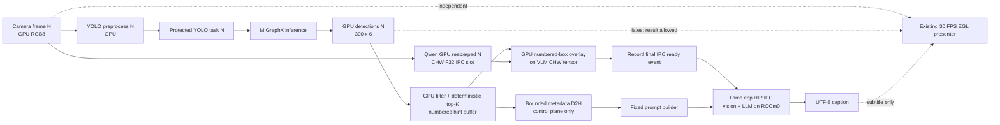
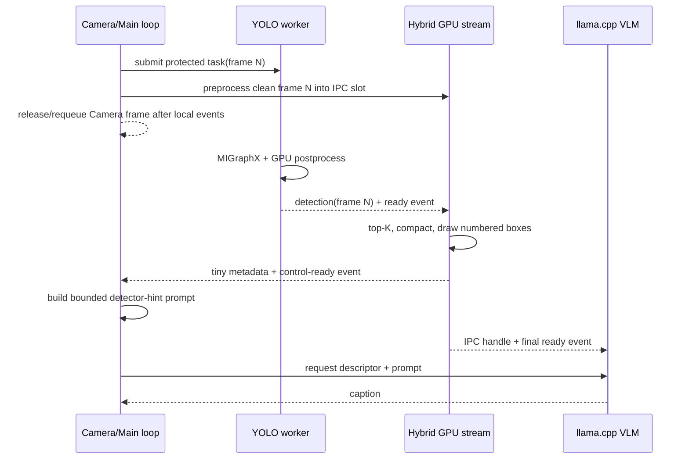

# YOLO26 引导 Qwen3-VL 的 Hybrid 零主机图像拷贝设计

> 状态：**核心落地完成；H0--H4、H3 profiler 与 371 秒稳定性样本已通过；原 20 分钟 H5 未跑满**
> 日期：2026-09-10
> 基线：[zerocopy_yolo_vlm_design.md](./zerocopy_yolo_vlm_design.md)
> 目标平台：AMD Ryzen AI MAX+ 395 / `gfx1151`
> 固定节拍：VLM 仍为 `3.0 s`，不得通过增大间隔规避性能问题。

## 0. 实施进度

| 时间 | 阶段 | 状态 | 说明 |
| --- | --- | --- | --- |
| 2026-09-10 | 实施启动 | **进行中** | 已复核现有 clean zero-copy 调度、YOLO `[300,6]` GPU lease、Qwen `960x512` CHW F32 IPC 路径和 presenter overlay；先实现可离线验证的 Hybrid ABI/kernel，再接入实机调度。现有 clean 模式和用户生成的 metrics 文件保持不变。 |
| 2026-09-10 | Phase 1--3 / Hybrid GPU component | **通过** | 新增 canonical COCO80 manifest、固定 `32-byte record / 260-byte top-8 buffer` ABI、GPU 确定性 top-K、编号框 CHW F32 overlay，以及 VLM IPC base-ready/final-ready 两阶段发布。`gfx1151` native build 成功；离线 GPU Gate 验证排序、错误检测过滤、`960x512`/`911x512` 几何、10,706 个 overlay 像素和 padding 零污染。生产 contract 只有每请求 260 bytes control metadata D2H，图像/完整 detection tensor D2H 为 0。证据：`output/realtime/zerocopy-hybrid-check.json`。 |
| 2026-09-10 | Phase 4--6 / 调度与入口 | **代码完成，待实机 Gate** | 已加入 protected YOLO pending/result slot、三方 exact `frame_id` 断言、bounded prompt builder、Hybrid metrics 与独立 `run_yolo_vlm_hybrid_zerocopy.sh`；clean 模式仍为默认。静态测试由 39 增至 44 项并全部通过，相机持久模块 preflight 通过。 |
| 2026-09-10 | 首次真实 Hybrid smoke / 9 秒 | **功能通过；H4 未通过** | 264/264 Camera requeue/present，display/YOLO=`29.231 FPS`，YOLO p50/p95=`23.677/30.055 ms`；2/2 Hybrid 请求 exact-frame，依赖 p50/p95=`14.339/16.039 ms`，compose p50/p95=`0.372/0.634 ms`，metadata=`520 bytes`，图像 host-copy counter 为 0。首个 VLM 请求生成到 32-token 上限并耗时 `3.312 s`，因此 9 秒窗口内产生 1 次 missed deadline；这轮不能标记 H4 通过。证据：`output/realtime/metrics-yolo-vlm-hybrid-smoke.jsonl`。下一步收紧但不扩展 prompt、仍保持 32 max tokens 与 3 秒 cadence，再跑 21 秒 Gate。 |
| 2026-09-10 | Hybrid H4 v1 / 21 秒 | **实时链路稳定；VLM cadence 未通过** | 622/622 帧，display=`29.584 FPS`、YOLO=`29.489 FPS`，exact-frame=`4/4`，YOLO dependency p95=`15.727 ms`、compose p95=`0.365 ms`、mismatch/arm-timeout=`0/0`。但模型连续 3 次忽略“最多 16 词”并生成满 32 tokens，单请求约 `3.07 s`，导致 3 次 deadline miss；H4 仍判失败。下一版保持 `n_predict=32` 上限不变，在 Hybrid 请求上增加首句 stop sequence，使行为与单句 contract 一致。证据：`output/realtime/metrics-yolo-vlm-hybrid-gate-v1.jsonl`。 |
| 2026-09-10 | Hybrid constrained-output smoke / 7 秒 | **短测通过；待 21 秒正式 H4** | Hybrid 请求增加单句 GBNF 与首句 stop，仍保留 `n_predict=32` 硬上限。204/204 帧，display/YOLO=`29.023 FPS`，exact-frame=`3/3`，dependency p95=`14.946 ms`、compose p95=`0.356 ms`；VLM 端到端 p50/p95=`1.983/2.644 s`，schedule drop、missed deadline、mismatch、arm-timeout 均为 0，全部 runtime checks 通过。metadata=`780 bytes`（3 × 260），图像 host copy 仍为 0。该轮证明输出约束能把请求稳定压回 3 秒 cadence 内；由于持续时间不足 21 秒，不提前宣告 H4 通过。证据：`output/realtime/metrics-yolo-vlm-hybrid-grammar-smoke.jsonl`。 |
| 2026-09-10 | Hybrid H4 v2 / 21 秒 | **H4 通过** | 622/622 Camera requeue/present，display/YOLO completion=`29.609 FPS`，frame-loop p95=`35.301 ms`；7/7 请求 exact-frame，YOLO dependency p95=`15.503 ms`、compose p95=`0.386 ms`。VLM 端到端 p50/p95=`2.404/2.581 s`，HTTP start error p95=`63.393 ms`，schedule drop、missed deadline、worker failure、arm-timeout、frame mismatch 全为 0。7 条结果全部落盘且均不超过 16 词；metadata=`1,820 bytes`（7 × 260），生产图像 H2D/D2H=`0/0`。所有 H4 runtime checks 通过。证据：`output/realtime/metrics-yolo-vlm-hybrid-gate-v2.jsonl`。 |
| 2026-09-10 | Hybrid H4 v3 + 独立验收器 / 21 秒 | **H4 可重复验收通过** | 增加每请求 `request_id`、`prompt_tokens`、`generated_tokens`，并统一正常循环/关停阶段的 VLM 结果落盘。最终格式再次得到 622/622 帧、display/YOLO=`29.590 FPS`、exact-frame=`7/7`、VLM p50/p95=`2.381/2.600 s`、HTTP start error p95=`65.293 ms`，全部 drop/deadline/failure/mismatch/timeout 为 0；7 个 request/result ID 和 frame ID 全部一一对应。新增 `check_zerocopy_hybrid_metrics.py` 独立复核字幕、token、260-byte ABI、copy counter、lease/queue 回收及全部 H4 条件并判定 passed。证据：`output/realtime/metrics-yolo-vlm-hybrid-gate-v3.jsonl`、`output/realtime/zerocopy-hybrid-h4-check.json`。 |
| 2026-09-10 | clean 模式回归 / 7 秒 | **功能兼容；clean cadence 非 Gate** | 原 `run_yolo_vlm_zerocopy.sh` 未加 Hybrid 参数即可正常运行：204/204 帧、display/YOLO=`29.067 FPS`，Hybrid request/metadata=`0/0`，clean prompt 和非 constrained 输出保持原行为，Camera/YOLO/VLM 图像 copy counters 仍为 0。首个 clean 请求耗时 `3.130 s`，产生 1 次 busy schedule drop；这与修改前 119 秒 clean 证据中的 VLM p95=`3.026 s`、3 次 schedule drop 一致，是既有 clean 长输出特性，不归为 Hybrid 回归。证据：`output/realtime/metrics-yolo-vlm-clean-regression-after-hybrid.jsonl`；修改前参考为用户已有 `output/realtime/metrics-yolo-vlm-zerocopy.jsonl`（未改写）。 |
| 2026-09-10 | H3 双进程 rocprof copy/event audit | **H3 通过** | `rocprofv3` 同时采集 Python parent 与 llama-server：最终可复现采样为 175/175 帧、display/YOLO=`29.133 FPS`、2/2 Hybrid 请求且全部 runtime checks 通过。Parent trace 中 top-K、numbered-box、Qwen preprocess kernel 均为 2 次；base-ready record/wait、final-ready record、control record/sync 也各 2 次，`hipDeviceSynchronize=0`。两次 260-byte D2H 均由 HIP API trace 按固定 device/host pointer ledger 精确匹配，完整 `[300,6]` 与图像 D2H 为 0；本机 rocprof 未为 pinned-host 小 D2H 生成 memory-activity 条目，因此以含 kind/bytes/src/dst 的 HIP API trace 为硬证据并在报告中显式披露。Server trace 中 IPC image 为 2 × `5,898,240 bytes` D2D，vision embedding host copy=`0/0`，仅 position metadata H2D 与 token-logits D2H 属控制面。主程序新增 `--vlm-log`，确保 trace/metrics/server log 不被后续运行覆盖。证据：`output/realtime/zerocopy-hybrid-camera-copy-audit-v2.json`、`output/realtime/metrics-yolo-vlm-hybrid-profiled-v3.jsonl`、`output/realtime/llama-server-hybrid-profiled-v3.log`、`.build/rocprof-hybrid-camera-integration-v3/{39575,39930}/hybrid-camera-integration-v3_results.json`。 |
| 2026-09-10 | H1 GPU 数值/视觉 component v2 | **H1 通过** | 离线 checker 增补 no-detection 与错帧对抗：0 个有效 detection 时 Hybrid 输出与 clean preprocess 逐元素相等（差异元素 0），错误 frame ID 在 final-ready 前 fail-closed；3 个有效框的 CPU reference→GPU overlay 四边最大坐标误差为 0 px，编号 badge、content padding、确定性置信度排序和非法 detection 过滤均通过。注意 badge 设计为位于框顶边上方 18 px，坐标校验在 badge 宽度之外读取真实顶边。证据：`output/realtime/zerocopy-hybrid-check-v2.json`。 |
| 2026-09-10 | H0 生命周期与 SIGINT | **H0 通过** | 单元测试由 44 增至 47 项，覆盖 protected pending 不被普通帧覆盖、VLM timeout、protected YOLO failure、Hybrid prompt 分支、request ID、错帧拒绝以及 lease 单次释放；Ruff 与全套 pytest 通过。真实无时限 Demo 在运行中收到 SIGINT 后仍写出 completed summary：80/80 Camera acquire/requeue、active clean lease=0，VLM/YOLO outstanding 与 queue 均为 0，`/dev/video0` 无占用且 llama-server 已回收。短中断造成的 FPS 不属于性能 Gate。证据：`output/realtime/metrics-yolo-vlm-hybrid-sigint.jsonl`。 |
| 2026-09-10 | H2 fixed-image clean/Hybrid A/B + adversarial hints | **H2 通过** | 在 tiger、lotus、dog 三张固定自然图上，clean 与真实 YOLO-guided Hybrid 的主目标命中均为 3/3，字幕没有输出编号、框、hint、score 或 detector。更关键的是 YOLO 将 tiger 错判成 `zebra 0.96` 时，Hybrid 仍视觉核验并输出 tiger；另注入覆盖全图的错误 `#1 airplane 0.99` 后仍输出 `A tiger ...`，没有继承 airplane；完全遗漏 hint 时也保留 tiger 识别。5 次 Hybrid 请求均满足最多 16 词的单句 contract，metadata 精确为 5 × 260 bytes。固定图像与合成 detection 上传只属于 validation-only H2D，报告与生产 copy counters 分开披露。证据：`output/realtime/zerocopy-hybrid-semantics-check.json`、`output/realtime/llama-server-hybrid-semantics.log`。 |
| 2026-09-10 | Hybrid 稳定性样本 / 371 秒 | **360 秒替代性 Gate 通过；原 H5 未跑满** | 用户在运行 371.420 秒后决定进入下一阶段。11,071/11,071 Camera acquire/requeue/present，display/YOLO completion=`29.807 FPS`；124/124 Hybrid 请求与结果逐一关联且 exact-frame=`100%`。VLM p50/p95=`2.256/2.517 s`、HTTP start error p95=`64.657 ms`，YOLO dependency p95=`14.273 ms`、compose p95=`0.567 ms`；schedule drop、missed deadline、failure、frame mismatch、arm timeout、pool drop 均为 0。metadata=`32,240 bytes`（124 × 260），生产图像和完整 detection tensor D2H/H2D 为 0。SIGINT 后所有 lease/queue 清空，Camera 与 llama-server 均释放；Hybrid 专用 metrics checker 和通用 soak checker 按 `minimum_seconds=360` 均通过。原文件名保留启动时计划的 `20m`，但最终摘要明确 `duration_gte_20_minutes=false`，不得将本轮记为 20 分钟 H5。证据：`output/realtime/metrics-yolo-vlm-hybrid-soak-20m.jsonl`、`output/realtime/zerocopy-hybrid-soak-6m-metrics-check.json`、`output/realtime/zerocopy-hybrid-soak-6m-check.json`。 |

## 1. 目标与结论

Hybrid 模式让 YOLO26 的检测结果参与 VLM 输入，但不把用户最终看到的窗口截图直接交给
VLM。每个 VLM 请求必须由以下两部分组成：

1. 同一 Camera `frame_id=N` 的完整场景图，GPU resize/pad 后叠加少量**编号框**；
2. 与这些编号一一对应的结构化提示，例如 `#1 person 0.93; #2 car 0.87`。

VLM 必须把 YOLO 当作可能错误或遗漏的提示，而不是事实来源；它仍需检查完整图像和未框选区域。
最终字幕不得提及编号、框、置信度或“检测器”。

本方案保留现有 zero-host-copy 数据面：Camera 像素、YOLO 模型 I/O、VLM 图像和 vision
embedding 不进入 CPU。允许每个 VLM 请求回读一个固定上限的小型检测摘要，用于在 CPU
控制面构造提示词；该摘要不是图像，也不是完整 `[300,6]` 检测张量，必须单独计量和披露。

## 2. 为什么不直接输入“屏幕上那张图”

当前显示画面和 VLM 输入承担不同职责，不能复用最终 EGL surface：

| 路径 | 图像内容 | 检测时序 | 用途 |
| --- | --- | --- | --- |
| 用户窗口 | 当前帧 `M` + 最近可用检测 `K` + class name + 旧 VLM 字幕 + 可选 HUD | 允许 `K < M` | 30 FPS 流畅显示 |
| Hybrid VLM | 冻结帧 `N` + **检测帧也为 `N`** 的编号框 | 强制 `N == N` | 每 3 秒一次语义理解 |

直接读取最终窗口会产生以下问题：

- 旧字幕会成为下一次 VLM 的视觉输入，形成自我反馈；
- HUD、窗口缩放和黑边会污染模型观察；
- 窗口允许复用 1--2 帧前的 YOLO 结果，移动物体上会出现框与像素错位；
- EGL surface 回读会破坏零主机图像拷贝约束；
- 完整 class name 在缩小后的 VLM 图像中依赖 OCR，既遮挡像素又不稳定。

因此，Hybrid VLM 使用独立的、不可见的 GPU 合成路径。用户窗口保持现状，不参与 VLM
采样。

## 3. 核心语义

### 3.1 同帧是硬约束

每个 Hybrid 请求都记录：

```text
camera_frame_id == yolo_source_frame_id == hybrid_image_frame_id
```

禁止用 `latest_detection` 给另一个更新的 Camera 帧画框。即使结果只相差一帧也不能视为
“基本相同”。若无法获得准确配对，严格模式保留旧字幕并记录本次 Hybrid deadline 失败，不能
静默使用旧框或 CPU 路径。

### 3.2 YOLO 是提示，不是裁判

默认提示词必须包含以下语义：

```text
Answer in at most 16 English words. Visually describe the main objects/action in the
whole image. Object hints may be wrong/incomplete: #1 person 0.93; #2 car 0.87.
Check unboxed regions; never mention hints, boxes, IDs, scores, or speculate.
```

实际请求由固定模板生成，不允许模型类别名直接拼成任意指令。类别名只来自锁定的 COCO80
metadata。无有效检测时使用 `Object hints may be wrong/incomplete: none.`，VLM 仍观察完整
干净场景。

### 3.3 编号框优于图片内 class name

VLM 图像只画 `#1`、`#2` 等短编号，类别名和置信度放在文本控制面：

- 避免 VLM 对小字号 class name 做 OCR；
- 减少标签背景对目标像素的遮挡；
- 编号建立图像空间与结构化提示的确定映射；
- 文本类别拼写可由程序保证，不受渲染质量影响；
- 最多只传少量高置信度目标，限制视觉和 prompt 噪声。

## 4. 总体数据流



关键点是 VLM 图像在 deadline 时已经从 Camera 帧 `N` 预处理到独立 IPC slot。等待 YOLO
期间不需要占住或回读 Camera buffer。只有编号框合成完成后才记录对 llama.cpp 可见的最终
ready event。

## 5. 调度与状态机

### 5.1 每 3 秒的正常时序



具体规则：

1. 以第一帧为锚点，deadline 仍为 `t0, t0+3, t0+6, ...`；
2. 到 deadline 后，在首个成功获得 YOLO input/output slot 的 Camera 帧上创建 Hybrid 请求；
3. 该 YOLO task 标记为 `protected_for_vlm=true`；若它位于 pending slot，后续普通 YOLO 帧不得
   覆盖它；
4. 同时把同一帧预处理到 VLM IPC slot，但暂不提交 HTTP 请求；
5. worker 完成 `source_frame_id=N` 后，由 coordinator 通过 `frame_id` 精确匹配；
6. Hybrid stream 等待 YOLO detection-ready event，随后完成 top-K、编号框和小型 metadata
   copy；
7. CPU 只等待 Hybrid 局部 control event 来生成 prompt，不调用 `hipDeviceSynchronize()`；
8. 最终 IPC ready event 记录完成后才允许 VLM worker 消费该 slot；
9. caption 返回后更新字幕；视频和窗口从不等待 VLM。

每 3 秒保护一个 YOLO task，最坏会让一帧普通 pending YOLO 任务被丢弃，但不会阻塞 30 FPS
显示，也不应创建第二个 YOLO session 或重复推理。

### 5.2 状态机

```text
IDLE
  -> WAIT_SCHEDULABLE_FRAME
  -> WAIT_EXACT_YOLO(frame_id=N, protected=true)
  -> COMPOSE_HINTS_ON_GPU
  -> WAIT_CONTROL_METADATA
  -> VLM_IN_FLIGHT
  -> IDLE
```

合法取消路径必须释放 VLM IPC slot、Hybrid hint slot 和 YOLO detection lease。任何路径都不允许
无限等待或扩大池。

### 5.3 超时和失败策略

- `frame_id` 不一致：拒绝结果，计为实现错误；
- deadline 后 `100 ms` 内仍无法保护一个 YOLO task：本轮不提交 VLM，保留旧字幕；
- 已保护的 YOLO task 失败：沿用当前 strict pipeline 行为，向主线程传播错误并干净退出；
- VLM 上次请求仍在运行：不创建新 Hybrid snapshot，不积压任务，记录 missed deadline；
- 不允许自动切换成旧框、窗口截图、CPU overlay、JPEG/base64 或另一个推理后端。

正常验收要求上述失败计数全部为零。

## 6. GPU 图像合成设计

### 6.1 在 VLM resize/pad 后画框

固定 Camera 输入为 `1280x720`。当前 `image_max_tokens=512` 的 Qwen3-VL smart-resize 结果为
`960x512`，内容区域为 `911x512`，左 pad 为 24 px、右 pad 为 25 px。编号框应直接画到最终的
`[3,512,960]` planar F32 IPC tensor，而不是先在 1280x720 上画长 class name 再缩小。

这样做有三点收益：

- 字号、线宽在模型实际输入分辨率上确定，不会在 resize 中变糊；
- 不增加一张完整 RGB8 中间图；
- 现有 VLM image token 数保持不变，不声称由此获得推理加速。

由于当前 resize 使用 `align_corners=True`，从源坐标到 VLM 内容坐标应使用同一几何定义：

```text
x_vlm = pad_left + x_src * (resized_width  - 1) / (source_width  - 1)
y_vlm = pad_top  + y_src * (resized_height - 1) / (source_height - 1)
```

坐标必须 clip 到内容区域，不能把框画入 padding。几何参数直接复用
`QwenPreprocessGeometry`，禁止另写一套近似 scale。

### 6.2 编号框样式

建议锁定以下首版 contract，避免视觉提示反客为主：

- 默认 `max_hints=8`，硬上限也是 8；
- 沿用主 YOLO confidence threshold，默认 `0.5`；
- 按 confidence 降序编号，分数相同时按原 detection index 排序，保证确定性；
- 线宽 3 px，框内不做半透明填充；
- 左上角使用紧凑的 `#1`--`#8` badge；
- 颜色按编号选择固定高对比 palette，而不是由 class name 决定；
- 数字可使用编译进 kernel 的小型 bitmap font，避免每请求上传 glyph；
- overlay 颜色直接写成 `(RGB8 - 127.5) / 127.5` 的 planar F32 值，不做 CPU 反归一化；
- 无检测时不修改干净 VLM tensor。

YOLO26 当前 ONNX 输出已经是 end-to-end `[1,300,6]`，不应为 Hybrid 再运行一次 NMS。GPU
filter 只检查 confidence、有效坐标并选 top-K。

### 6.3 两阶段 IPC ready

现有 `ZeroCopyVlmPreprocessor.prepare_rgb8_pointer()` 在 resize/pad 后立即记录 IPC ready
event。Hybrid 模式需要拆成：

1. `prepare_base_rgb8_pointer()`：写入 clean CHW tensor，记录仅供本进程使用的 base-ready；
2. `finalize_hybrid(detection_lease)`：等待 base-ready 和 detection-ready，合成编号框；
3. 对 metadata 发起异步 D2H，记录 control-ready；
4. 最后记录可导出的 IPC final-ready；
5. `caption_prepared()` 只接受已经 final-ready 的 lease。

同一个 IPC event 在提交给 server 前可以重新记录，但实现上优先区分 base-ready 与
final-ready，避免未来代码过早发布半成品图像。

## 7. 检测摘要与 CPU 控制面

### 7.1 固定大小的 GPU hint buffer

新增固定池 `HybridHintSlot[2]`。每个 slot 包含：

```cpp
struct HybridHintRecord {
    float x1, y1, x2, y2;  // source-frame coordinates
    float confidence;
    int32_t class_id;
    int32_t source_index;
    int32_t rank;
};

struct HybridHintBuffer {
    uint32_t count;
    HybridHintRecord records[8];
};
```

该结构最多 `260 bytes`；实际 C/C++ ABI 大小必须用 `static_assert` 固定并写入 runtime
manifest。GPU kernel 从 `[300,6]` 生成此摘要，编号框也只读取该摘要，确保图片中的 `#K` 与
prompt 中的 `#K` 来自同一排序结果。

### 7.2 有界 metadata D2H

为构造文本提示，允许每个成功的 Hybrid 请求把上述摘要复制到预分配 pinned host slot：

- 每 3 秒最多一次；
- 单次不超过锁定 ABI 大小，首版目标 `<=260 bytes`；
- 不回读原始 `[300,6]` 输出，更不回读任何像素；
- 使用 `hipMemcpyAsync` + 局部 event；
- profiler 报告中单独分类为 `hybrid_control_metadata_d2h_bytes`；
- `image_h2d_bytes`、`image_d2h_bytes` 和 `model_io_d2h_bytes` 仍必须为 0。

因此本模式仍可称为 `zero_host_image_copy=true`，但不能宣传为“热路径绝对没有任何 D2H”。

如果以后要求字节级 D2H 也为零，只能退化为 GPU 编号框、不传类别文本；这不是本设计默认
Hybrid 语义。

### 7.3 class metadata 一致性

COCO80 class name 必须只有一个受版本控制的 canonical manifest，并记录 SHA-256。启动时同时
校验：

- YOLO 模型 metadata 的 class id/name；
- Hybrid prompt builder 使用的 class id/name；
- EGL presenter class atlas 使用的 class id/name。

任一顺序或拼写不一致都在 Camera open 前失败，防止图片框、用户窗口和 prompt 对同一
class id 给出不同名称。

## 8. Prompt contract 与长度控制

动态 prompt 只允许由模板和已校验的 COCO class name 生成。建议格式：

```text
Answer in at most 16 English words. Visually describe the main objects/action in the
whole image. Object hints may be wrong/incomplete: #1 person 0.93; #2 car 0.87.
Check unboxed regions; never mention hints, boxes, IDs, scores, or speculate.
```

约束：

- confidence 固定两位小数，不输出像素坐标；编号框已经表达空间对应关系；
- 重复类别仍保留独立编号，例如 `#1 person; #2 person`；
- `max_hints=8`，超出只保留 top-K，不使用无界文本；
- prompt builder 对未知 class id 直接报错，不输出任意字符串；
- 保持 `temperature=0.0`、`top_k=1`、`max_tokens=32`；
- Hybrid 请求设置 `stop=[".", "\\n"]`，在首句结束时提前停止；`n_predict=32` 仍是安全上限，
  客户端为 stop 后未返回的句点补上 `.`；
- 同一请求附带 GBNF，限定 1--16 个无逗号英文词并以句点结束；它落实既有输出 contract，
  不降低 `n_predict`，并防止模型忽略自然语言字数要求后持续生成到 32-token 上限；
- 最终回答要求仍是英文单句、最多 16 words；
- 记录 prompt 字符数和 tokenizer 后 token 数，验证新增文本没有破坏 3 秒 cadence。

Hybrid 提示可能提高定位和类别稳定性，但不会减少固定的 512 个 image token。额外文本 token
反而可能小幅增加 prompt evaluation 时间，所以必须通过 clean/hybrid A/B 证明总体收益。

## 9. Buffer 与生命周期

在现有固定池基础上新增，不允许逐请求 `hipMalloc`：

| Pool | 深度 | 内容 | 释放条件 |
| --- | ---: | --- | --- |
| VLM IPC | 2 | 最终 `[3,512,960]` F32 图像 | llama.cpp 请求完成或取消 |
| Hybrid hint GPU | 2 | top-8 固定摘要 | overlay 和 metadata copy 都完成 |
| Hybrid hint host | 2 | pinned control metadata | prompt 构造完成 |

YOLO detection slot 同时被 presenter 和 Hybrid compositor 使用时必须有明确 consumer-done
语义。可选实现是扩展 `GpuDetectionLease.release(consumer_done_event=...)`，由 slot 在下一次
写入前等待该 event。禁止在 overlay 尚未读取 detection 时仅依赖 Python 析构释放 slot，否则
下一次 MIGraphX 输出可能覆盖数据。

所有异常分支必须满足：

```text
active_camera_leases == 0
active_yolo_detection_leases == 0
active_hybrid_hint_leases == 0
active_vlm_ipc_leases == 0
```

## 10. 与当前代码的建议落点

为保留已经通过 20 分钟验收的 clean baseline，首版不直接删除原路径：

```text
native/zerocopy_kernels/zerocopy_kernels.hip
  + hybrid top-K/compact kernel
  + CHW F32 numbered-box overlay kernel

src/zerocopy_hybrid.py
  + HybridCoordinator
  + HybridHintLease / HybridPromptContext
  + exact frame-id state machine

src/zerocopy_vlm.py
  + two-stage IPC image readiness
  + per-request detector-hint prompt context

scripts/run_yolo_vlm_zerocopy.py
  + --vlm-input-mode clean|hybrid
  + protected YOLO task/result routing
  + Hybrid metrics

scripts/run_yolo_vlm_hybrid_zerocopy.sh
  + locked convenience launcher using repo-local uv

scripts/check_zerocopy_hybrid.py
scripts/analyze_zerocopy_hybrid_trace.py
tests/test_zerocopy_hybrid.py
```

建议新增独立启动入口：

```bash
./scripts/run_yolo_vlm_hybrid_zerocopy.sh --show-speed
```

底层 Python 入口显式使用：

```text
--vlm-input-mode hybrid
--vlm-interval 3.0
--hybrid-max-hints 8
--zero-copy require
```

所有 Python 依赖继续只通过仓库内 `.venv` 和 `uv` 管理；不安装或修改系统 Python。

## 11. Metrics 与可观测性

每个 Hybrid 请求至少记录：

```json
{
  "type": "hybrid_request",
  "request_id": 1,
  "camera_frame_id": 101,
  "yolo_source_frame_id": 101,
  "exact_frame_match": true,
  "hint_count": 2,
  "yolo_dependency_ms": 24.0,
  "hybrid_compose_ms": 0.0,
  "control_metadata_d2h_bytes": 260,
  "vlm_http_start_error_ms": 31.0,
  "input_mode": "hybrid-numbered-boxes-v1"
}
```

实际浮点值由运行测量填写，不能使用示例值冒充结果。汇总报告增加：

- exact frame match 成功率；
- protected task 数和因此丢弃的普通 YOLO frame 数；
- deadline→YOLO ready、overlay ready、HTTP start 的 p50/p95；
- hint count 分布和零检测比例；
- dynamic prompt token 数；
- Hybrid request latency 与 clean baseline 的差值；
- 小型 metadata D2H 次数/字节；
- image/model I/O H2D/D2H 仍为零的 profiler 证据。

HUD 首版不显示 hint 细节，避免干扰主画面。可以把第二行状态扩展为 `VLM HYBRID RUNNING`，
但仍由 `H` 开关统一控制。

## 12. 验收方案

### H0：静态与生命周期 Gate

- exact-frame state machine 的单元测试覆盖成功、超时、取消和 worker failure；
- protected pending task 不会被普通 YOLO 帧覆盖；
- 每个 lease 在正常、异常和 SIGINT 路径都只释放一次；
- clean 模式行为和现有 CLI 保持兼容。

### H1：数值与视觉 Gate

- 使用离线 GPU test frame 验证 top-K 顺序、threshold、class id 和编号稳定；
- validation-only D2H 对比 CPU reference，box 坐标最大误差不超过 1 pixel；
- 编号框只落在 Qwen 内容区，不污染 center padding；
- alternating-frame 测试故意让目标快速移动，证明 box frame id 永远与 image frame id 相同；
- 无检测时 Hybrid 图像逐元素等于 clean VLM preprocess 输出。

### H2：Prompt 与语义 Gate

- prompt 只含 canonical COCO 类别、有限置信度和固定指令；
- 0--8 个目标时长度均有界，未知 class id fail-closed；
- 用一组固定图像比较 `clean` 与 `hybrid`：主要目标命中、动作描述、幻觉和 YOLO 错误继承率；
- 加入故意错误/遗漏的 detector hint，确认 VLM 不会无条件照抄 YOLO；
- 字幕不得输出 box number、confidence 或 detector 字样。

### H3：Copy audit Gate

- Camera/YOLO/VLM/present 图像 H2D/D2H=`0/0`；
- YOLO 和 VLM 模型 I/O host copy=`0`；
- 每个 Hybrid 请求只有一次有界 control metadata D2H，且字节数等于锁定 ABI；
- 没有完整 `[300,6]` D2H、framebuffer readback、JPEG/base64 或 global device sync；
- trace 中 top-K、numbered-box overlay 和 IPC event 次数与 Hybrid 请求数一致。

### H4：实时短测 Gate

至少运行 21 秒，覆盖 7 次 VLM deadline：

- display `>=29 FPS`；
- YOLO completion `>=25 FPS`；
- VLM interval 固定 `3.0 s`；
- exact frame match=`100%`；
- Hybrid HTTP start error p95 `<=100 ms`；
- VLM schedule drop、missed deadline、worker failure 均为 0；
- 图像和旧字幕始终流畅，窗口 resize/F11/H/Escape 不退化。

### H5：20 分钟稳定性 Gate

沿用用户确认的 20 分钟门槛：

- 所有 H4 性能/调度约束持续满足；
- Camera acquire/requeue 数一致，所有 pool 高水位有界；
- exact frame mismatch=`0`；
- GPU reset/fault/hang 和 ISP error=`0`；
- 退出后所有 lease 为 0，Camera 设备无残留占用；
- 与 clean baseline 对比，明确披露 VLM p50/p95、YOLO FPS 和 prompt token 增量。

当前已完成 371.420 秒、124 次 VLM 请求的替代性稳定性样本，所有 H4 与资源回收条件持续
通过。用户据此决定进入下一阶段，但它没有达到本节定义的 1,200 秒门槛，因此原 H5 状态仍为
“未跑满”。若该 Demo 之后用于发布、外部交付或修改 GPU kernel/调度器，应重新执行完整 H5；
日常本机演示可使用已通过的 360 秒样本作为当前证据。

## 13. 实施顺序

- [x] Phase 1：锁定 Hybrid ABI、COCO80 canonical manifest 和 prompt contract；
- [x] Phase 2：实现 GPU top-K/compact 与 CHW F32 编号框 kernel，完成离线 reference；
- [x] Phase 3：把 VLM IPC lease 改成 base-ready/final-ready 两阶段；
- [x] Phase 4：实现 protected YOLO task、exact-frame coordinator；当前实现以 Hybrid 局部
  control event 同步完成 detection 消费，不需要扩展跨帧 consumer event；
- [x] Phase 5：接入 bounded metadata D2H 与动态 prompt；
- [x] Phase 6：增加独立 Hybrid launcher、metrics、单元测试和 component checker；
- [x] Phase 7：完成 H0--H4 与 clean/hybrid 语义、性能 A/B；
- [x] Phase 8a：完成双进程 profiler copy/event audit；
- [x] Phase 8b：按用户决定完成并验收 371 秒替代性稳定性样本；
- [ ] H5 发布级长稳：原 20 分钟门槛尚未跑满；
- [x] Phase 9：将独立 `run_yolo_vlm_hybrid_zerocopy.sh` 设为推荐的组合 Demo 入口；保留
  `run_yolo_vlm_zerocopy.sh` clean 入口与 Python `clean` 默认值用于回归和 A/B。

## 14. 明确不做的事情

- 不把字幕、HUD 或最终显示 surface 输入 VLM；
- 不用“最新框”代替同帧检测；
- 不把 YOLO ROI crop/mosaic 设为默认输入，完整场景必须保留；
- 不在 VLM 图像中渲染长 class name 或 confidence；
- 不启动第二份 YOLO 推理来服务 VLM；
- 不回读 Camera pixels 或完整 detection tensor；
- 不增加无界 queue、动态 GPU allocation 或全局 device synchronize；
- 不改变 `3.0 s` VLM cadence、512 image-token contract 或 32 max output tokens；
- 不因 Hybrid 设计而改动系统 Python、系统 OpenCV 或现有持久化 Camera module。

## 15. 预期收益与风险

预期收益是让 VLM 更稳定地关联小目标、相似物体和空间位置，并减少类别遗漏；它主要改善
语义质量，而不是加速模型。YOLO 依赖、编号框合成和额外 prompt token 可能让单次请求增加数十
毫秒，必须实测确认仍留在 3 秒 cadence 内。

主要风险及控制方式：

| 风险 | 控制 |
| --- | --- |
| VLM 盲信错误 YOLO 类别 | 明确“可能错误/不完整”，加入错误 hint 对抗测试 |
| 框与图像错帧 | protected task + 三个 frame id 硬断言 |
| 标签遮挡关键细节 | top-8、细框、短编号、无填充，不画 class name |
| dynamic prompt 增加延迟 | bounded top-K、紧凑格式、记录真实 token 数并做 A/B |
| detection slot 被提前覆写 | consumer-done event + lease 生命周期 Gate |
| 小型 D2H 被误宣传为绝对零拷贝 | 单独计量 metadata；只声明 zero-host-image-copy |
| Hybrid 破坏现有稳定 Demo | 保留 clean 模式和独立 Hybrid launcher，逐 Gate 切换 |

基于 H2 语义对抗、H3 copy audit、H4 可重复短测和本轮 371 秒稳定性样本，当前本机组合 Demo
推荐使用独立 Hybrid launcher。clean 模式不被删除或隐式改写；原 20 分钟 H5 仍是发布级验证
门槛，不能由本轮 371 秒结果替代。
