# AMD Ryzen AI MAX+ 395 摄像头 YOLO26 + VLM 零主机拷贝设计

> 状态：Z0--Z5 已在当前机器上全部通过。锁定的补丁版 `amd_capture.ko` 已持久安装到当前内核的
> `updates/vlm-camera-pipeline/` 优先目录，原始 stock module 保持原位；8-frame coherency、300-frame Camera runtime、
> 真实整链 copy audit、用户确认的 20 分钟 soak，以及可见窗口 resize/F11/Escape/字幕 QA 均已完成。
> 安装后的 cold `modprobe`、真实受控重启与完整 YOLO+VLM 短验收也已通过。持久化范围仅限当前
> `6.17.0-1032-oem`；升级内核后必须重新构建/安装，否则严格入口 fail closed。本文同时作为实现
> 日志与唯一零拷贝验收契约。  
> 目标平台：AMD Ryzen AI MAX+ 395 / Radeon 8060S / `gfx1151` / ROCm 7.2.1。  
> 固定节拍：VLM 每 `3.0 s` 尝试处理一次最新画面，禁止通过增大间隔掩盖性能问题。  
> 与现有文档的关系：[amd_395_pipeline.md](./amd_395_pipeline.md) 记录已落地的 host-copy
> 基线；本文只描述新的严格 GPU-resident 路径。

## 1. 结论

这个方案在当前机器上**已完成真实摄像头短时整链、profiler、长稳和可见交互验证**。不能把已有
Demo 或名字为 `vlm_zerocopy` 的分支直接称为端到端零拷贝。五项关键改造的当前状态为：

1. 摄像头 V4L2/HIP DMA-BUF：补丁模块已持久安装并经 cold `modprobe` 重载；8-frame sentinel/coherency probe 和
   300-frame NV12→RGB runtime 和 21 分 48 秒整链 soak 均通过；
2. OpenCV `5.x-hip` / `5.x-hip-zerocopy`：repo-local 构建与 Z1 验证已通过；
3. YOLO26 Ultralytics + ONNX Runtime MIGraphX：strict GPU I/O Binding、固定 GPU 双输入/三输出
   pool、GPU 前后处理及 Camera 接入已通过短验收；
4. `llama.cpp:vlm_zerocopy`：HIP IPC 图像输入和 mtmd vision embedding→LLM input 的设备桥
   已完成；runtime pointer audit 证明图像派生 H2D/D2H 均为 0，Z3 VLM 组件已通过。
5. 独立严格入口已落地；真实 Camera 同时运行 YOLO、每 3 秒 VLM 和 EGL 的最新 18 秒短验收达到
   display/YOLO=`29.543 FPS`、capture-to-present p95=`34.931 ms`、532/532 帧无丢弃、VLM 6/6
   成功且无 deadline/drop。随后整链 profiler 对 175 帧和 2 次 VLM 请求完成 pointer/kernel/copy
   审计，图像和 vision embedding H2D/D2H=`0/0`。用户随后确认 20 分钟足以作为当前长稳门槛；
   实际 soak 为 `1308.3 s`，39,007/39,007 帧完成，YOLO/VLM worker 均干净退出。可见窗口又完成
   半尺寸/720×405 resize、2880×1800 F11 全屏与恢复、WM move、字幕换行和 Esc 干净退出 QA；最终
   presenter 二进制重新做整链 profiler 审计，结论仍为图像/embedding host copy=`0/0`。

另外，严格模式不能用 `cv2.imshow`、`Results.plot()` 或 `cv2.putText`，因为这些接口需要
CPU 图像。窗口必须改为 DMA-BUF/EGL/DRM 的 GPU 原生呈现，字幕文字本身由 CPU 生成，字形
和画面合成在 GPU 完成。

当前摄像头 `amd_isp_capture` 能输出 `/dev/video0` 的 NV12 1280×720@30。driver-export DMA-BUF
仍不能被本机 KFD/HIP 导入；交付路径使用反向 HIP/HSA-export→V4L2 DMABUF，经补丁驱动的
amdgpu PRIME/GART import 后已证明 ISP 写入对 GPU 可见。严格入口会核对活动 module
`srcversion`，stock driver 或任一能力不匹配时仍在 Camera open 前退出，绝不回退到 CPU capture。

## 2. “零拷贝”的精确定义

本文的 `zero-copy` 指**零主机图像拷贝（zero-host-copy）和零图像回读**：从摄像头缓冲区
出队后，完整帧、ROI、YOLO 输入/输出和 VLM 图像输入始终留在 GPU 可访问内存中，不进入
NumPy、Pillow、CPU OpenCV Mat、JPEG/base64 像素载荷或 CPU `std::vector`。

它不表示“任何字节都不能移动”。NV12 转 RGB、letterbox、resize、归一化、HWC 转 CHW
以及模型内部计算必然会写入新的设备缓冲区。允许以下操作：

- GPU 别名：DMA-BUF、HIP external memory、`GpuMat.fromDevicePointer`、DLPack；
- GPU 到 GPU 的 kernel 写入或 D2D copy；
- CPU 控制面：文件描述符、64-byte HIP IPC handle、shape/stride、时间戳、队列索引、错误码、
  提示词和最终 UTF-8 字幕；
- 为监控读取少量标量，但不得读取完整检测张量或图像。

不允许以下操作出现在严格运行热路径：

- `GpuMat.download()`、tensor `.cpu()` / `.numpy()`；
- `cv2.VideoCapture.read()` 返回像素、Pillow 转图、`cv2.imencode`、JPEG/PNG、图片 base64；
- ORT 把输入转为 NumPy 或把输出返回 NumPy；
- `hipMemcpyDeviceToHost` / `hipMemcpyHostToDevice` 传送图像或模型 I/O 张量；
- `cv2.imshow`、CPU overlay、FFmpeg raw-BGR pipe；
- 任何自动 CPU EP、CPU VLM layer 或“失败后继续跑”的 host-copy fallback。

若需要区分两种说法，验收报告统一写：

- `zero_host_copy=true`：本文必须达到的目标；
- `allocation_alias_only=false`：允许必要的 D2D 变换；
- 不使用没有限定语的“完全零拷贝”宣传语。

## 3. 固定源码与本机隔离约束

远端分支头已于 2026-09-09 复核。实现时不能只锁 branch 名，必须锁以下 commit，并把后续
补丁 SHA 一并写入 `native-lock/zerocopy-components.json`。

| 组件 | 固定源码 | 固定 commit | 用途 / 额外工作 |
| --- | --- | --- | --- |
| OpenCV core | [`zhangnju/opencv:5.x-hip`](https://github.com/zhangnju/opencv/tree/5.x-hip) | `e0387086b2103c23b3b25952b5fb700ca2e42132` | OpenCV 5.x HIP 和 `GpuMat.fromDevicePointer` |
| OpenCV contrib | [`zhangnju/opencv_contrib:5.x-hip-zerocopy`](https://github.com/zhangnju/opencv_contrib/tree/5.x-hip-zerocopy) | `467cbc6f99aa82ebda39a2e94d6125557bd84d0b` | HIP port、`cv::cuda::nms`、`align_corners`；Demo 必须用此分支 |
| Ultralytics | [`zihaomu/ultralytics:add-onnx-migraphx-backend`](https://github.com/zihaomu/ultralytics/tree/add-onnx-migraphx-backend) | `34e213ca3ece4c18962f5bb922ec74da0c474d24` | 保留现有 MIGraphX backend 和 Ultralytics 结果语义 |
| Ultralytics I/O 参考补丁 | [`zihaomu/ultralytics:add-migraphx-io-binding`](https://github.com/zihaomu/ultralytics/tree/add-migraphx-io-binding) | `1dfab4a67319c94931c08e145fffb520108d0c74` | 不能整分支盲切；把 I/O Binding 改动重放到上一行的固定 commit 后再锁新 SHA |
| llama.cpp | [`zhangnju/llama.cpp:vlm_zerocopy`](https://github.com/zhangnju/llama.cpp/tree/vlm_zerocopy) | `be84695622f7be5c307d726379ddd745993669b8` | 作为 IPC 协议起点；仍需本文第 10 节的设备输入补丁 |
| AMD ISP4 kernel source | [`Ubuntu linux-oem-6.17`](https://git.launchpad.net/ubuntu/+source/linux-oem-6.17) tag `applied/6.17.0-1032.32` | `32bed5152a6e284e02c0f803772bc48960f06e32` | 修正 foreign DMA-BUF 的 amdgpu PRIME/GART 导入和两个异步 buffer queue 竞态；repo-local build 后以受控 current-kernel override 安装 |
| ORT MIGraphX | AMD ROCm 7.2.1 cp312 wheel | `onnxruntime-migraphx==1.23.2` | 本机已验证 MIGraphX EP；wheel SHA 继续由 `native-lock/` 固定 |

模型继续使用现有锁：

| 模型 | SHA-256 |
| --- | --- |
| `models/yolo26x.onnx` | `88568299de91d4967f239a062c9f1619f695ebd05de73cd66b8f589591aaeb0a` |
| `models/Qwen3-VL-8B-Instruct-Q8_0.gguf` | `cb8616bf6ed228982d9e47d7b72b42195342efa26044b0ee1873e61d9e78d3d7` |
| `models/mmproj-F16.gguf` | `d406d03ebabefdef86a2c86bf0c1b65f9e046f7a81c218f25de4931b46a07fc4` |

除下述明确授权的 kernel module override 外，所有新增内容只能落在仓库内部：

- Python 解释器和包：`.venv/`，只通过 `uv sync` / `uv run` 管理；
- 源码：`third_party/`；
- native build：`.build/`；
- native install：`.local/`；
- wheel、编译和模型 cache：`.cache/`、`models/`；
- 补丁：`patches/`；
- 禁止 `sudo make install`、写 `/usr`、写系统 Python 或 user site-packages；唯一系统写入是
  `/lib/modules/6.17.0-1032-oem/updates/vlm-camera-pipeline/amd_capture.ko` 及对应 `depmod` 索引，
  由专用安装/卸载脚本校验和回滚。

OpenCV Python binding 安装到 `.local/opencv5-gfx1151/python/`，由严格启动脚本显式设置
`PYTHONPATH` 和本地库路径。虽然当前 `pyproject.toml` 仍含 `opencv-python>=4.10,<5`，严格
入口必须验证 `cv2.__file__` 指向 `.local/opencv5-gfx1151`；若导入 `.venv` 中的 4.x wheel，
立即退出。这样既不碰系统环境，也不会把 CPU wheel 当作 HIP OpenCV 使用。

## 4. 当前路径与目标差距

现有 `run_yolo_vlm_demo.py` 是可运行基线，不是零拷贝实现。关键差距如下：

| 环节 | 当前实现 | 目标实现 |
| --- | --- | --- |
| 摄像头 | OpenCV V4L2 `read()` 返回 host BGR NumPy | V4L2 DMA-BUF，HIP external-memory 一次性导入 |
| OpenCV | `.venv` 中 `opencv-python 4.11.0`，HIP device count 为 0 | 固定 OpenCV 5.x HIP 两个分支，device count 为 1 |
| YOLO 预处理 | Ultralytics CPU letterbox/NumPy，再 H2D | OpenCV HIP + fused HIP kernel，直接写稳定 GPU tensor |
| ORT 输入 | backend 内 `im.cpu().numpy()` | GPU pointer I/O Binding |
| ORT 输出 | ORT NumPy输出，再转 GPU tensor | 预分配 GPU OrtValue，输出绑定在 device 0 |
| 检测结果 | `xyxy/conf/cls` 分别回 CPU | GPU 过滤、坐标恢复和 GPU overlay |
| VLM 请求 | CPU 图像编码后传 HTTP | GPU 预处理 + HIP IPC handle，仅控制描述符走 HTTP/UDS |
| llama.cpp IPC | 当前分支仍执行 D2H 到 `std::vector<uint8_t>` | 借用 HIP buffer + D2D 到 ggml 输入，绝不经过 host pixels |
| 同步 | 多处全局 `torch.cuda.synchronize()` / `hipDeviceSynchronize()` | 有界 buffer lease + stream event / IPC event |
| 显示 | CPU compose + `cv2.imshow` | HIP 合成到可呈现 DMA-BUF，EGL/DRM/Wayland 显示 |

因此，新路径必须使用单独入口，不能在旧的 `CapturedFrame.bgr` 类型上继续叠补丁。

## 5. 总体架构

```mermaid
flowchart LR
    CAM[Camera ISP<br/>NV12 1280x720@30] --> V4L2[V4L2 DMA-BUF ring<br/>DQBUF/QBUF only]
    V4L2 --> HIP[HIP external-memory import<br/>persistent device mappings]
    HIP --> CV[OpenCV 5 HIP GpuMat view<br/>fromDevicePointer]
    CV --> CLEAN[clean RGB GPU frame pool<br/>latest-frame lease]

    CLEAN --> YPRE[YOLO GPU letterbox + normalize<br/>stable FP16 BCHW tensor]
    YPRE --> ORT[ORT MIGraphX FP16<br/>GPU I/O Binding]
    ORT --> YOUT[GPU detections<br/>filter + unletterbox]

    CLEAN -->|every 3.0 s, latest only| VPRE[Qwen3-VL GPU preprocess<br/>resize + pad + normalize + CHW]
    VPRE --> IPC[HIP IPC memory + ready event<br/>descriptor only on CPU]
    IPC --> LLAMA[llama.cpp ROCm<br/>borrowed GPU buffer]
    LLAMA --> MM[GPU D2D to ggml inp_raw<br/>vision encoder on ROCm0]
    MM --> EMB[borrowed vision embeddings<br/>GPU D2D to LLM inp_embd]
    EMB --> TXT[LLM on ROCm0<br/>UTF-8 caption is CPU control data]

    CLEAN --> COMP[HIP overlay/compositor]
    YOUT --> COMP
    TXT --> GLYPH[GPU glyph atlas/quad update]
    GLYPH --> COMP
    COMP --> EGL[EGL/DRM/Wayland present<br/>no readback]
```



图像数据面和 CPU 控制面必须分开：Python 可以负责调度、服务生命周期和 metrics，但不持有
任何像素数组。核心 native 模块暴露的是 `GpuFrameLease`、device pointer、event、shape 和
时间戳。

## 6. GPU 帧、buffer pool 与生命周期

### 6.1 核心对象

建议由 C++/pybind11 模块提供不可复制的 `GpuFrameLease`：

```cpp
struct GpuFrameLease {
    uint64_t frame_id;
    int64_t  captured_monotonic_ns;
    int      dmabuf_fd;       // duplicated fd owned by the pool, not by Python
    void *   hip_base;
    size_t   allocation_bytes;
    int      width;
    int      height;
    size_t   y_pitch;
    size_t   uv_offset;
    size_t   uv_pitch;
    hipEvent_t ready;
    std::shared_ptr<BufferLease> owner;
};
```

`GpuMat.fromDevicePointer` 是 non-owning view，绝不能比 `owner` 活得更久。Python 侧不得只
传裸整数 pointer；所有 view、Torch/DLPack 包装和异步任务都必须持有同一个 lease。

### 6.2 固定池，而不是运行时分配

| Pool | 建议深度 | 内容 | 释放条件 |
| --- | ---: | --- | --- |
| Camera DMA-BUF ring | 4 | NV12 capture buffers | NV12→clean RGB kernel 的完成 event 已结束 |
| Clean RGB frame pool | 3 | 1280×720 RGB8，无框无字幕 | YOLO/VLM snapshot/render lease 全部释放 |
| YOLO input/output | input 2 / output 3 | 固定 FP32 BCHW input、固定 `[1,300,6]` output；一个 running、一个 newest pending，第三个 output 可供 presenter 持有；MIGraphX EP 内部 FP16 | input 在对应 ORT run 返回后释放；output 在最新框被替换后释放 |
| VLM IPC pool | 2 | packed planar RGB F32，最大 512 image tokens | llama-server 确认已消费；最迟 HTTP 请求返回 |
| Present pool | 2 或 3 | EGL 可导入的 RGBA/NV12 DMA-BUF | compositor/display release fence 完成 |

启动 warm-up 后禁止在逐帧热路径 `hipMalloc` / `hipFree`。如果所有 clean frame slot 都被占用，
丢弃旧的待处理任务，不阻塞相机，也不无限增池。

### 6.3 Stream 与 event

至少划分四条职责流：

1. ingest/preprocess stream：NV12→clean RGB；
2. YOLO stream：letterbox、MIGraphX、检测后处理；
3. VLM-preprocess stream：每 3 秒生成 IPC buffer；
4. compositor/present stream：框、字幕和窗口 surface。

生产者在写完 buffer 后记录 HIP event，消费者使用 stream wait；不使用逐帧
`torch.cuda.synchronize()` 或 `hipDeviceSynchronize()`。若 MIGraphX EP 暂不支持传入用户
stream，允许在 ORT 调用前只等待该 input 的 event；禁止同步整个 device。ORT 返回后也必须
通过 output-ready 语义证明结果完成。

跨进程 VLM 使用 `hipEventInterprocess | hipEventDisableTiming` 创建 ready event，和
`hipIpcMemHandle_t` 一起传给服务器。服务器打开 event 并在自己的 HIP stream 上等待，不能
靠生产者全局同步来保证可见性。

## 7. Camera DMA-BUF：第一硬门槛

### 7.1 实现路径

新增 native V4L2 capture adapter，不经过 OpenCV `VideoCapture`。本机 probe 已排除
driver-export→HIP import，因此交付路径改为**由 GPU 分配并导出、由 V4L2/ISP 导入**：

1. `VIDIOC_QUERYCAP` 和 `VIDIOC_S_FMT` 固定协商 NV12 1280×720@30；
2. `hipMalloc` 预分配至少 4 个 camera slot；每个 allocation 至少 `4 MiB`，避免 ROCr 把
   `1,382,400`-byte payload 放入共享小块 BO 后导出非零 offset。通过
   `hsa_amd_portable_export_dmabuf` 一次性导出 DMA-BUF fd，要求 export offset 为 0；
3. `VIDIOC_REQBUFS(memory=V4L2_MEMORY_DMABUF)` 建立等深 V4L2 queue，以 fd 执行 `QBUF`；
4. 修复后的 `amd_isp_capture` 必须通过 `isp_user_buffer_alloc()` 调用 amdgpu PRIME import，
   pin BO 并取得 ISP GART GPU 地址，不能读取 foreign exporter 的 `dma_buf->priv`；
5. 用原始 `hipMalloc` pointer 和协商得到的 pitch/plane offset 建立 NV12 Y/UV `GpuMat` view；
6. `DQBUF` 后在 HIP 上做颜色转换，关联该 slot 的 event 完成后才 `QBUF` 给 ISP 复用；
7. teardown 顺序为停止 stream、等待各 lease、释放 ISP import、关闭 fd、最后释放 HIP slot。

NV12 单平面常见布局可表示为 Y=`H×W CV_8UC1`，UV=`H/2×W/2 CV_8UC2`；不能硬编码
`uv_offset=width*height`，必须使用驱动返回的 `bytesperline/sizeimage` 和实测 plane 信息。

### 7.2 Gate Z0 probe

先实现一个不显示、不推理的 `camera_dmabuf_probe`，逐项记录：

- `VIDIOC_REQBUFS`、每个 index 的 `VIDIOC_EXPBUF` 是否成功；
- fd 是否能由 HIP external-memory API 导入并映射；
- 映射长度、pitch、offset、modifier 是否一致；
- GPU kernel 能否从每个 buffer 读取稳定的 NV12 pattern；
- DQBUF→GPU read 和 GPU read→QBUF 的 fence/cache coherence 是否正确；
- 连续至少 20 分钟无撕裂、旧帧、绿帧、driver timeout、GPU fault。

`amd_isp_capture` 的 Streaming capability 不是 DMA-BUF export 的证明。若 `EXPBUF` 或 HIP
import 失败，可把原因和 ioctl/hip error 写入 probe JSON，但严格入口必须退出。`mmap +
numpy`、`read()`、`hipHostRegister` 或一次 H2D 只能作为诊断对照，不能进入交付路径，也不能
标记为 `zero_host_copy=true`。

本机 ROCm 7.2.1 header 提供 external-memory fd import，但注明 Linux 暂不支持 external
semaphore wait。因此不能假设通用 semaphore interop 已经解决 camera fence；初版以成功的
`DQBUF` 作为 ISP 完成边界，在 QBUF 前等待只关联该 buffer 的 HIP completion event，并通过
pattern/长稳测试验证 cache coherence。若驱动还要求未暴露的显式 fence，Z0 应失败并转入驱动
改造，而不是加入一次 CPU memcpy。

### 7.3 本机 ISP4 缺陷定位与 repo-local 补丁

运行内核 `6.17.0-1032-oem` 对应的 Ubuntu OEM 源码已固定到
`linux-oem-6.17 applied/6.17.0-1032.32@32bed515...`。源码与首次补丁运行检查发现三个直接问题：

- `isp4vid_vb2_attach_dmabuf()` 和 `isp4vid_vb2_map_dmabuf()` 把 `dbuf->priv` 强制解释为
  `struct isp4vid_vb2_buf`；但该字段属于 exporter，对 HSA/amdgpu 导出的 foreign DMA-BUF 是
  opaque，读取其中的 `gpu_addr` 没有合法性；
- foreign DMA-BUF import 无条件调用 `dma_buf_vmap()`；HIP/HSA exporter 不提供 CPU vmap，
  内核会在 `dma_buf_vmap()` WARN 并让首个 `VIDIOC_QBUF` 返回 `EINVAL`；
- V4L2 层和 ISP firmware 层都曾在把 buffer 加入软件队列**之前**发送异步命令，极快的完成
  回调可能找不到对应 buffer，放大丢帧或 release 卡死风险。

补丁 `patches/linux-oem-6.17-amd-isp4-dmabuf-import.patch`（SHA-256
`dcdb1fb2f3e1c611ab56fc2b8b51ca9e7abd965fbf440b2b128412d25a20b16b`）执行四项修复：

1. foreign DMA-BUF 通过现有导出接口 `isp_user_buffer_alloc()` 进入
   `amdgpu_gem_prime_import()`，pin 后取得 ISP 可访问的 GART 地址；
2. 外部 GPU DMA-BUF 不再执行 exporter 不支持的 CPU `dma_buf_vmap()`；只在软件队列中往返、
   不发送给 firmware 的稳定私有对象地址作为 opaque completion cookie；
3. unmap/error/detach 路径成对清除 cookie 并释放 imported BO；
4. 两层异步 buffer queue 均改为“先入队、后通知 firmware”，发送失败时回滚内部队列。

已用当前 kernel headers 从干净状态构建出 repo-local
`third_party/linux-oem-6.17-amd-isp4/drivers/media/platform/amd/isp4/amd_capture.ko`：

- module SHA-256：`5a171b50ea6a0bd77c94de8221461dd7c666f5a328dcfe1bd7b1315f044e95f5`；
- `vermagic=6.17.0-1032-oem SMP preempt mod_unload modversions`；
- build checker 全项通过，证据为
  `output/realtime/amd-isp4-dmabuf-patch-build.json`；
- 系统中的原模块 SHA-256 仍为 `dc2db574...`、srcversion=`B6E033...`，原文件没有被覆盖；
- 补丁模块已安装到
  `/lib/modules/6.17.0-1032-oem/updates/vlm-camera-pipeline/amd_capture.ko`，root:root 0644，
  srcversion=`CA94CB23673E748A9ECC5F2`；`modinfo` 和 `modprobe --show-depends` 均解析到该路径；
- 安装器只卸载 `amd_capture`，保留其 videobuf/amdgpu 依赖，再用 `modprobe` cold reload；失败时会
  删除精确 override、重跑 `depmod` 并恢复 stock module；
- 当前 initramfs 不包含 `amd_capture`，所以本次无需重写 initramfs。持久化只覆盖当前 kernel，
  kernel upgrade 后必须为新内核重建，strict preflight 会拒绝不匹配版本。
- 受控重启后 boot ID 从 `3cd0b578-c14e-41fd-a862-7d8823e263ea` 变为
  `fca7127b-4422-47b9-968a-25faca5806d5`，模块由启动流程自动从 override 加载；无需再次 `insmod`。

可复现构建命令为：

```bash
./scripts/setup_amd_isp4_dmabuf_patch.sh
./scripts/install_amd_isp4_dmabuf_patch.sh
```

第一个脚本只使用仓库内 `.venv`（`uv run --frozen`）、`third_party/` 和内核头文件，不执行
`sudo` 或加载模块。第二个脚本是唯一授权的持久化入口，安装前锁定 kernel、源码模块/stock SHA、
vermagic、srcversion、Camera 占用和 depmod 搜索顺序。回滚命令为：

```bash
./scripts/uninstall_amd_isp4_dmabuf_patch.sh
```

安装报告为 `output/realtime/amd-isp4-persistent-install.json`。cold reload 后的 8-frame sentinel、
300-frame runtime 及 12 秒完整 YOLO+VLM 复验分别记录在
`amd-isp4-persistent-install-probe.json`、`amd-isp4-persistent-install-runtime.json` 和
`amd-isp4-persistent-install-integration.jsonl`；此前用户确认的 20 分钟 soak 结论继续有效。

### 7.4 已落地的 strict camera 用户态组件

`native/camera_dmabuf/camera_gpu_capture.hip` 和 `src/zerocopy_camera.py` 已实现真实入口所需的
用户态 contract：

- 固定 HIP camera allocation，经 HSA 一次性导出 DMA-BUF，再以
  `V4L2_MEMORY_DMABUF` 排队；
- camera allocation 使用 `4 MiB` 下限强制独立 BO，因为单平面 V4L2 DMABUF 没有 offset 字段；
  non-zero export offset 是硬错误，绝不改用 host buffer；
- camera ring 最少 4 槽、clean RGB ring 最少 3 槽，逐帧热路径不分配内存；
- DQBUF 后由 HIP BT.601 limited-range kernel 把 NV12 写入 clean RGB8 slot，只等待该 slot
  event 后即重排 camera buffer，没有 device-wide synchronize；
- Python 只收到 pointer、pitch、event、frame id/sequence/timestamp 和不可复制 lease，不收到
  NumPy/Mat 像素；同一 pointer 同时由 repo-local OpenCV 5 HIP
  `GpuMat.fromDevicePointer` 建立 non-owning view；
- strict preflight 会先比较 loaded `amd_capture` 的 `srcversion` 与锁定补丁模块
  `CA94CB23673E748A9ECC5F2`，不匹配便在执行 `open("/dev/video0")` **之前**失败。

离线 component check 使用合成 NV12，仅在验证区执行一次 H2D/D2H；HIP 输出与整数
BT.601 reference 的 max/mean absolute error=`0/0`，OpenCV pointer alias 成功，`gfx1151`
code object 存在。库 SHA-256=`5e36ce992a3861e817356562abe3bacc75f19eb7b531e096b9fda6f39ab305fa`，
证据为 `output/realtime/zerocopy-camera-component-check.json`。真实 ISP 另由
`output/realtime/zerocopy-camera-gpu-export-probe.json` 和
`output/realtime/zerocopy-camera-runtime-check.json` 验收：300 帧 sequence 连续、300/300 requeue、
clean drop=`0`、图像 H2D/D2H=`0/0`。此外 21 分 48 秒整链 soak 的 39,007 帧全部回队，
Camera drop/active lease=`0/0`，已超过用户确认的 20 分钟 Z0 长稳门槛。

## 8. OpenCV 5.x HIP 构建与使用

计划目录：

```text
third_party/opencv-hip/
third_party/opencv_contrib-hip/
.build/opencv5-gfx1151/
.local/opencv5-gfx1151/
```

CMake 核心约束：

```text
WITH_HIP=ON
WITH_CUDA=OFF
GPU_TARGETS=gfx1151
CMAKE_HIP_ARCHITECTURES=gfx1151
OPENCV_EXTRA_MODULES_PATH=<repo>/third_party/opencv_contrib-hip/modules
CMAKE_INSTALL_PREFIX=<repo>/.local/opencv5-gfx1151
Python3_EXECUTABLE=<repo>/.venv/bin/python
```

`cv::cuda` / `cv2.cuda` 是兼容命名空间，在这些分支中由 HIP 执行，并不表示使用 NVIDIA
CUDA。构建结果必须通过下列 Gate Z1：

- `cv2.__version__` 为 5.x，且 `cv2.__file__` 位于 repo-local `.local/`；
- `cv2.cuda.getCudaEnabledDeviceCount() == 1`；
- `cv2.cuda_GpuMat.fromDevicePointer` 存在并能包装外部 HIP pointer；
- `cv2.cuda.resize(..., align_corners=True)` 与 Qwen3-VL CPU reference 元素级一致；
- `cv::cuda::cvtColor` / `cvtColorTwoPlane` 能处理本机 NV12 view；
- contrib 的 GPU NMS 可用；
- `ldd` 不解析到另一套系统 OpenCV，HIP code object 包含 `gfx1151`。

生产入口只操作 `GpuMat`；CPU `Mat` 仅允许出现在离线正确性测试中。

## 9. YOLO26 + Ultralytics + MIGraphX GPU 路径

### 9.1 为什么现有 backend 不够

固定的 `add-onnx-migraphx-backend` 目前显式关闭 MIGraphX I/O Binding。其通用 predictor
先在 CPU 做 letterbox，并在 backend 内执行 `im.cpu().numpy()`；ORT 返回 NumPy 后又创建
Torch GPU tensor。即使推理节点都在 MIGraphX EP，这条链仍有 D2H/H2D，不能验收。

### 9.2 合并策略

保留 `34e213ca...` 作为基础，将 `add-migraphx-io-binding` 的最小修改重放并补全，最终生成
仓库内 patch 和新的固定 fork commit。不能直接切到另一个 branch 后假定两边改动兼容。

实际 ORT session 必须使用，而不只是在 preflight session 使用：

```text
execution_mode = ORT_SEQUENTIAL
intra_op_num_threads = 1
inter_op_num_threads = 1
session.intra_op.allow_spinning = 0
session.inter_op.allow_spinning = 0
session.disable_cpu_ep_fallback = 1
providers 请求列表 = MIGraphXExecutionProvider only for graph assignment
migraphx_fp16_enable = 1
migraphx_model_cache_enable = 1
```

本机 ORT 1.23.2 即使只传 MIGraphX provider，`session.get_providers()` 仍会显示它自动注册的
`CPUExecutionProvider`。因此验收不能错误地要求列表字面上只有一个元素；硬约束是 MIGraphX
排首位、实际 session 的 `session.disable_cpu_ep_fallback=1`，且 session 创建时任何不能分配给
MIGraphX 的节点都会失败。报告同时保留 `cpu_ep_registered_by_ort=true`，避免把“已注册”误写成
“发生 CPU 执行”。

### 9.3 输入、推理和输出

1. 从 clean RGB `GpuMat` 在 GPU 上保持比例缩放；
2. 一个 fused HIP kernel 完成 padding、RGB→planar、`uint8→float32`、`/255`，直接写入
   预分配且地址稳定的 BCHW Torch/HIP tensor；锁定 ONNX 的输入 contract 是 FP32，
   `migraphx_fp16_enable=1` 负责 EP 内部 FP16，不能向 FP32 graph 错绑 FP16 pointer；
3. 用 ORT I/O Binding 的 `buffer_ptr` 绑定 input device pointer；
4. 预先分配并绑定固定 `[1,300,6]` GPU output，warm-up 后 pointer 不得变化；
5. `run_with_iobinding()` 后在 GPU 上完成 confidence filter、坐标反 letterbox、clip 和无效框
   过滤；
6. 检测 tensor 直接交给 GPU compositor，禁止 `boxes.xyxy.cpu()` 和 `Results.plot()`。

实际入口进一步把步骤 1--4 与步骤 5--6 拆成 `prepare_rgb8_pointer()` / `infer_prepared()`：
主线程把最新 clean-frame 通过 HIP kernel 快照到两个固定 input tensor 之一，并只等待对应 input
event；YOLO worker 在后台执行同步的 ORT/MIGraphX 调用和 GPU 后处理。调度上最多一个 running
和一个 newest pending，不积压历史帧；两个 input 都占用时直接丢弃本轮 snapshot，窗口继续复用
上一份 `GpuDetectionLease`。生产入口使用三个固定 detection output slot，分别覆盖 presenter 持有、
running 和 pending 的最坏组合。下一次 ORT 写固定 output binding 前会等待当前 slot 的局部 ready
event，避免异步 D2D 尚未完成便覆写源 output；没有 `hipDeviceSynchronize()`。

最初真实 Camera 的单 input 版本虽然显示达到 `29.233 FPS`，YOLO 只有 `23.153 FPS`，因为一次
推理略跨过 33 ms frame boundary 后必须再空等一帧。固定双 input/三 output 后，同机 18 秒实测
YOLO 提升到 `29.273 FPS`，只发生 4 次有界 prepare drop，result age p95 从 3 降到 2 帧；两个
input pointer 的真实 MIGraphX 重绑定和第三次 prepare backpressure 也已加入 Z2 checker。

当前锁定 `yolo26x.onnx` 是 end-to-end 固定输出，正常路径不需要再跑 NMS。只有将来换成 raw
one-to-many 输出并通过模型 contract Gate 后，才启用 contrib 的 `cv::cuda::nms`，不能重复
NMS。

Ultralytics 继续承担模型/类别 metadata、ONNX contract 和兼容 `Results` 语义；严格入口绕开
其面向 CPU 图片的通用 source/predictor/plot 路径。GPU `Results` 只可作为 API view，不能
触发隐式 CPU 转换。

Gate Z2 必须证明：

- provider 为 MIGraphX、FP16 开启、CPU EP fallback 被禁用且没有节点落到 CPU（ORT 自动注册
  的 CPU provider 名称本身不等于发生 fallback）；
- `io_binding=true`，input/output device 均为 GPU 0；
- warm-up 后 input/output pointer 稳定；
- ORT hot path 中没有 NumPy和涉及模型 I/O pointer 的 H2D/D2H；
- 与当前 host-copy 基线的 box/class/conf 在约定容差内一致；
- 删除 detector 两端的全局 `torch.cuda.synchronize()` 后结果仍正确。

## 10. VLM 每 3 秒 GPU 路径

### 10.1 调度语义

`VLM_PERIOD_SECONDS` 固定为 `3.0`，定义为 start-to-start deadline：`t0, t0+3,
t0+6, ...`。VLM worker 只有一个 in-flight 请求和一个 depth-1 latest slot：

- 到 deadline 时若 idle，立刻读取**最新 clean GPU frame**；
- 若上次请求仍在运行，不排队、不复制旧帧，只记录 missed deadline；
- 上次完成后，若已经越过 deadline，立即对届时最新帧发起一次，并把下一 deadline 推到下一
  个 3 秒边界；
- 旧字幕一直保留到新字幕成功返回，视频、YOLO 和窗口永远不等待 VLM；
- 默认仍使用 `--vlm-image-max-tokens 512`，任何降到 256 等质量调整都必须单独 A/B 和明确
  记录，不能为了达标静默修改。

当单请求耗时小于 3 秒时，VLM 必须稳定按 3 秒 cadence 启动；如果 p95 超过 3 秒，优先优化
GPU preprocess、vision encoder、prompt 和生成上限，不能把 interval 改大。

### 10.2 GPU 预处理 contract

VLM 默认观察完整 clean frame，以保留场景上下文；YOLO ROI/mosaic 以后可作为显式模式，不能
默认裁掉未检测到的内容。Qwen3-VL 预处理在 GPU 完成：

1. 从 mmproj/server 协商 `patch_size`、merge、min/max pixels，禁止客户端和服务器各自维护
   不同硬编码；
2. `smart_resize` 的尺寸计算只处理整数/标量，可在 CPU 控制面执行；
3. OpenCV HIP bilinear resize，`align_corners=True`；
4. GPU center pad；
5. GPU `uint8→float32` 和 `(value - 127.5) / 127.5`；
6. fused kernel 直接产出 packed planar RGB `[3,H,W]`，与 ggml `inp_raw` layout 相同；
7. D2D 写入专用、offset=0 的 `hipMalloc` IPC buffer。

请求携带 preprocess fingerprint，包括模型 SHA、width/height、dtype、layout、normalization、
align-corners、image-max-tokens 和 protocol version。服务器发现任一不一致即拒绝请求，不能
再走 CPU preprocess。

### 10.3 `vlm_zerocopy` 分支仍需补什么

对固定 commit `be846956...` 的源码检查显示：

- Python POC 的 `IpcBuffer` 在 D2D pack 后调用 `hipDeviceSynchronize()`；
- `server-ipc.cpp` 打开 HIP IPC handle 后执行
  `hipMemcpy(..., hipMemcpyDeviceToHost)` 到 `std::vector<uint8_t>`；
- mtmd 再建立 CPU `clip_image_f32/std::vector<float>`；
- `clip_encode()` 重排 CPU HWC→CHW 后用 `ggml_backend_tensor_set()` 上传到 GPU。

因此该分支只消除了 JPEG/base64 图片传输和部分 CPU preprocess，尚未满足本文定义。需要在
该 commit 上增加 `patches/llama-cpp-hip-ipc-device-input.patch`，至少包含：

1. `server_ipc_open_rgb()` 返回 borrowed device pointer/size/device，而不是 host vector；
2. 扩展 `clip_image_f32` 或新增 `clip_image_device_f32`，能表达 GPU pointer、shape、layout、
   ready event 和 release callback；
3. 在 ggml HIP backend 增加 non-owning `ggml_backend_cuda_buffer_from_ptr()`（ROCm build 下仍
   沿用 cuda 兼容命名），其 destructor 不 `hipFree` 外部 allocation，只执行 IPC close；
4. 为外部 buffer 建立 source tensor，并用已有 `ggml_backend_tensor_copy[_async]()` 走同设备
   D2D 到 graph 的 `inp_raw`；初版不强求 graph allocator 直接 alias 外部 allocation；
5. 删除图像分支的 CPU HWC→CHW 重排、host vector 和 D2H/H2D；客户端直接提供 CHW；
6. 用跨进程 HIP ready event 替代客户端 `hipDeviceSynchronize()`；
7. 只在 D2D 已完成或 vision input 已消费后关闭 mapped handle；异常和取消路径也必须释放；
8. 继续强制 37/37 model layers 和 mmproj 在 `ROCm0`，拒绝 partial offload；
9. vision encoder 输出 embedding 必须直接以 device pointer 交给 LLM input tensor。
   不得调用 `ggml_backend_tensor_get()` 下载到 `std::vector<float>` 后再上传；
   Qwen3-VL 的 main embedding 与 3 路 deepstack feature 保持原有连续布局。

初版选择“一次同 GPU D2D 到 ggml 预分配输入”而不是直接让 graph allocator alias IPC buffer。
这仍然满足像素全程在 GPU 的要求，同时避开 graph 重用、alignment 和外部 allocation
ownership 风险。只有在 profiler 证明这次 D2D 值得优化后，再做 allocation alias。

实施结果（2026-09-09）：以上设备桥已完成。mtmd 暴露借用的连续 vision output device
pointer，LLM `inp_embd` 固定在 ROCm backend；受 `ubatch=256` 约束，每次请求以
`16,777,216 + 14,680,064 = 31,457,280` bytes 两段 D2D 写入。HIP API trace 按
source/destination pointer、字节数和 `DeviceToDevice` kind 全部匹配；修复前同尺寸的
vision embedding D2H 已归零。详见
`output/realtime/zerocopy-vlm-copy-audit.json`。

同 GPU 并发时，默认把 llama.cpp 的 HIP streams 建为低优先级 `1`（本机支持范围
`greatest=-1` 到 `least=1`），而 YOLO/MIGraphX 保持 normal priority。实现已并入同一锁定补丁，
补丁 SHA-256=`36db9ddb917766764b081e5abca629c3e51484e898ef22253a31b27a9bb387ae`；server 日志实际出现
`HIP stream 0 priority=1 (range -1..1)`。这只改变 GPU 调度优先级，不改变 512 image tokens、
模型、量化、输出上限或 3 秒 cadence。更新后的 VLM profiler 仍证明图像派生 H2D/D2H=`0/0`。

整链 profiler 初次运行还发现 llama-server 的默认 prompt RAM cache 会在相邻摄像头画面 prompt
不复用时，把 slot KV 状态保存到 CPU：每次出现多笔 `1,087,488` bytes D2H。它不是像素拷贝，
但对这种“每 3 秒一张变化图像”的 workload 没有命中收益，只增加带宽与延迟。因此严格入口固定
`--cache-ram 0`，runtime manifest 记录 `prompt_cache_ram_mib=0`。复测 trace 中该尺寸 D2H 从
72 笔降到 0，server 日志也明确确认 prompt cache disabled；这项设置不能由通用 server 默认值覆盖。

### 10.4 IPC v2 描述符

HTTP/Unix socket 只传几十到几百字节的控制信息，例如：

```json
{
  "protocol": "vlm-hip-ipc-v2",
  "request_id": 42,
  "device_uuid": "<same ROCm device>",
  "memory_handle": "<base64 of 64-byte HIP handle, not pixels>",
  "ready_event_handle": "<base64 of HIP IPC event handle>",
  "allocation_bytes": 3145728,
  "width": 512,
  "height": 512,
  "channels": 3,
  "dtype": "float32",
  "layout": "CHW",
  "preprocessed": true,
  "preprocess_fingerprint": "sha256:..."
}
```

服务器只监听 `127.0.0.1` 或权限受控的 Unix socket。它必须限制 handle 长度、device、shape、
乘法溢出、最大 allocation、dtype/layout 和并发数；HIP IPC handle 是能力凭据，不能暴露到
非本机网络。客户端至少把 IPC allocation 保留到 HTTP 请求返回；后续可加“input consumed”
early ACK，提前归还 pool slot。

Gate Z3 必须证明：

- 请求体没有图片字节，只有 handle/metadata/prompt；
- 服务器图像路径不存在 D2H、CPU image/embedding vector、CPU resize/normalize
  或图像派生数据 H2D；
- device pointer、shape 和 preprocess fingerprint 可审计；
- Qwen3-VL 图像预处理与 reference 元素级一致，caption 语义没有明显退化；
- 37/37 层和 mmproj=`ROCm0`，连续请求无 IPC 泄漏；
- warm-up 后 VLM request p95 目标 `< 2.8 s`，从而给 3 秒 cadence 留出余量。

## 11. GPU 原生显示与字幕

`cv2.imshow` 接受 host Mat，因此不属于严格方案。新建 native presenter：

1. 通过 GBM/DRM 分配可由 EGL 导入、也可由 HIP 写入的 present DMA-BUF；
2. HIP kernel 从 clean RGB frame 写 present surface，并直接消费 GPU detection tensor 绘框；
3. 类别名和 VLM UTF-8 字幕属于 CPU 控制信息，通过 FreeType 生成/缓存 glyph atlas，纹理上传
   只在新字形出现时发生；每帧仅更新少量 quad metadata；
4. 字形、背景条和检测框在 GPU 合成；
5. EGLImage/Wayland 或 DRM/KMS present，不做 framebuffer readback；
6. 窗口缩放由 GPU shader/viewport 完成，保持已有 `--window-scale`、拖拽和全屏体验。

如果 HIP 不能直接写 EGL/GBM allocation，优先采用 DRM PRIME/VA-API 或 HIP-compatible external
memory 的 GPU 路径。若平台最终没有可用的 graphics interop，严格 headless pipeline 仍可
验收数据面，但“带窗口的严格零拷贝 Demo”必须标记 Gate Z4 blocked，不能回退 `imshow` 后
仍称零拷贝。

实施结果（2026-09-09）：当前 Mesa/XWayland 栈的 `hipGLGetDevices` 返回
`hipErrorNoDevice`，继续调用 `hipGraphicsGLRegisterBuffer` 会在 ROCm 7.2.1 内部崩溃，因此
该 API 已从生产组件删除。可用路径为双槽 `hipMalloc` present pool，经
`hsa_amd_portable_export_dmabuf` 导出，再以 `EGL_EXT_image_dma_buf_import` 建立 EGLImage/GL
texture alias。HIP kernel 直接写 RGBA present allocation，并在 GPU 上叠加 `[N,6]` detection
boxes、按 class ID 选择的高饱和度颜色、COCO class name 与字幕 alpha mask。80 类文字在启动时
由 FreeType 栅格化为固定 atlas 并一次上传，逐帧不读取 class ID 到 CPU；每个 slot 用 GL fence + HIP event 控制复用，不使用 framebuffer
readback 或全局 HIP synchronize。最终可见 640×360 窗口（0.5× scale）的 1,800 帧 probe 以
30 FPS 运行 60 秒，effective FPS=`29.99995`、present-call p50/p95=`0.754/1.376 ms`、
容量约 `1340.9 calls/s`。独立 rocprof trace 记录 20 次 RGB、box、subtitle kernel，并确认
图像 H2D/D2H=`0/0`、`hipDeviceSynchronize=0`。类名改造后的新 presenter component trace 只新增
一次启动期 `645,440` bytes COCO80 glyph-atlas H2D，另有字幕变化时一次 `143,360` bytes glyph
alpha H2D，两者都是 UI control resource。真实 Camera 可见 QA 已验证 640×360→720×405 resize、
2880×1800 F11 全屏与恢复、窗口管理器移动、保持宽高比、底部字幕不裁切、英文按单词换行和 Esc
干净退出。Wayland/XWayland 安全边界不接受测试程序合成的鼠标拖动，但等价的窗口管理器 move 请求
成功，普通真实鼠标拖动仍由桌面窗口管理器提供。机器可读证据为
`output/realtime/zerocopy-window-qa.json`。

速度面板是同一 native presenter 中的可选两行 GPU compositor：`--show-performance`（兼容别名
`--show-speed`）控制启动时显示，默认关闭，窗口聚焦后按 `H` 可立即显示/隐藏。YOLO 行显示最近
2 秒滚动完成 FPS 与推理延迟中位数；VLM 行显示最近一次端到端请求耗时、llama.cpp 返回的生成
`tok/s` 和 `IDLE/RUNNING`。文本每 0.5 秒最多更新一次，FreeType 只生成固定 `600×76` alpha
mask；可见时 HIP kernel 在 present surface 左上角合成，隐藏时不调度该 kernel，摄像头图像和
模型张量都不回到 CPU。默认关闭的 7 秒整链只有一次启动期 `45,600` bytes HUD 初始化上传，之后
没有周期上传；开启后的 component trace 也只记录一笔同尺寸 HUD 控制面 H2D。

字幕是模型生成的文本，不可能“留在 GPU 上供人读取”；本文要求的是字幕加入画面时不把视频
帧下载到 CPU。字体 atlas 的一次性/增量小数据 H2D 属于控制和 UI 资源，不是摄像头图像
回传。

## 12. 并发、背压与流畅度

沿用 speedup blog 中已经验证有效的原则，但适配实时摄像头 + VLM：

- 所有队列有界，YOLO 和 VLM 都消费 latest frame，不积压历史帧；
- capture、YOLO、VLM、present 分工，不放在同一串行循环；
- producer event + 专用 stream 替代逐帧全局同步；
- ORT I/O Binding 和稳定 pointer 避免输入/输出 host round-trip；
- clean frame 与 overlay surface 分离，VLM 永远看不到框和旧字幕；
- UI 以摄像头 30 FPS 刷新，复用最新检测框和字幕，不等待两种模型；
- VLM 最大并发为 1、cadence 固定 3 秒，模型忙时跳过旧 deadline；
- 本机 HIP priority range 已实测为 `-1..1`；llama.cpp 使用低优先级 `1`，ingest/present/YOLO
  保持 normal priority，并把请求值与 server runtime 日志写入证据。

本地 speedup blog 的约 74.7 FPS 是 YOLO-only、GPU video decode、无 VLM、无窗口的吞吐
结果，不能作为此摄像头组合 Demo 的承诺。本文吸收的是消除 full-frame D2H、I/O Binding、
bounded queue、事件同步和 DRM PRIME/VA-API 的方法；`rocDecode` 只适用于视频文件，不解决
V4L2 摄像头入口。

当前实现已经采用同样的“边界 + 异步重叠”方法：`LatestOnlyYoloWorker` 最多一个 running 加一个
newest pending，`LatestOnlyVlmWorker` 只有一个 outstanding task；主循环只做 GPU snapshot、取
最新结果与 present。相同 180 帧/6 秒离线整合条件下的 priority A/B 为：

| VLM HIP priority | Display FPS | frame-loop p95 | YOLO completion FPS | YOLO p95 | VLM latency |
| --- | ---: | ---: | ---: | ---: | ---: |
| normal `0` | `29.9997` | `1.790 ms` | `23.833`（未达标） | `55.967 ms` | `1819/1824 ms` |
| low `1` | `29.9993` | `1.585 ms` | `25.833`（通过） | `34.977 ms` | `1999/1931 ms` |

低优先级让 VLM 单次多用约 0.1--0.18 秒，但仍远低于 3 秒，同时把 YOLO 拉回目标以上。
`output/realtime/zerocopy-integration-check.json` 是通过结果；
`output/realtime/zerocopy-integration-normal-priority-ab.json` 是失败对照。两者都只在启动前
上传一张 validation-only 图片；生产 API 没有 CPU pixel 参数，因此它们验证调度和组件组合，
不单独证明 Camera→GPU。

2026-09-09 又按用户要求将严格 llama.cpp build 固定为
`GGML_HIP_ROCWMMA_FATTN=ON`。setup 会先检查 `/opt/rocm/include/rocwmma/rocwmma.hpp`，配置后
断言 CMakeCache，生产 preflight 还会同时检查该 cache entry 和
`ggml_cuda_flash_attn_ext_wmma_f16` 二进制 marker，不能静默使用旧 OFF build。当前
`libggml-hip` SHA-256 为 `9019fa2516c0...`，只包含 `gfx1151` code object。固定图像 5 请求
稳态 p50/p95=`1601.462/1611.950 ms`，最后一次 prompt=`513.16 tok/s`、generation=
`25.29 tok/s`；server profiler 直接记录 144 次 `flash_attn_ext_f16` dispatch，并再次通过图像/
vision embedding host-copy=`0/0` 的 pointer audit。真实 Camera + YOLO 的 21 秒运行完成
622/622 帧，display/YOLO=`29.578 FPS`、VLM 7/7、p50/p95=`2382.606/2985.350 ms`，无调度
drop/deadline。与此前不同画面的短测相比 p50 略有改善，但 p95 和并发 tok/s 没有稳定提升，
因此这里只声明 rocWMMA 已启用并被实际调度，不把它夸大为已经证明的端到端加速。

真实 Camera 短验收使用同一低优先级策略。单 input 版本为 `23.153 YOLO FPS`；改成固定双 input、
三 output、一个 newest pending 后，18 秒运行 531 帧达到 display=`29.495 FPS`、frame-loop
p95=`34.841 ms`、YOLO=`29.273 FPS`、YOLO p95=`36.127 ms`、result age p95=`2 frames`。VLM
6/6 完成、p95=`2782.163 ms`、3 秒 start-error p95=`29.916 ms`，无 deadline/drop；Camera
531/531 requeue、clean drop=`0`。证据为
`output/realtime/metrics-yolo-vlm-zerocopy-camera-double-buffer.jsonl`。

按用户确认的 20 分钟长稳门槛，最终运行 `1308.305 s`（21 分 48 秒）：39,007/39,007 帧
acquire/requeue/present，display=`29.815 FPS`、frame-loop p95=`34.715 ms`；YOLO 完成 38,246 次，
`29.233 FPS`、p95=`37.735 ms`；VLM 437/437，p95=`2954.068 ms`、3 秒 start-error
p95=`32.344 ms`，schedule drop/missed deadline=`0/0`。Camera clean drop/active lease=`0/0`，两个
worker failure/outstanding=`0/false`，退出后 Camera 无占用，运行区间没有 GPU/ISP fault、reset、
timeout 或 ring stall。验收报告为 `output/realtime/zerocopy-camera-soak-check.json`；输入 metrics
文件名保留最初计划的 `...soak-30m.jsonl`，但机器可读 policy 明确记录实际门槛和时长。

## 13. 新入口与失败策略

已提供独立入口，不改变现有 host-copy Demo 的可复现性：

```bash
./scripts/run_yolo_vlm_zerocopy.sh \
  --camera /dev/video0 \
  --width 1280 --height 720 --fps 30 \
  --yolo-model models/yolo26x.onnx \
  --vlm-interval 3.0 --vlm-max-tokens 32 \
  --window-scale 0.5 \
  --show-performance \
  --zero-copy require
```

shell wrapper 只使用仓库 `.venv`/`uv run --frozen`，并显式加载 repo-local OpenCV 5 HIP。
新入口只接受 `--zero-copy require`，既没有 `prefer`，也没有 `off` 生产分支。以下任一情况都在
启动时失败：

- 导入的不是固定 OpenCV 5 HIP build；
- camera DMA-BUF export/import 或同步 probe 失败；
- MIGraphX EP、FP16、GPU I/O Binding、stable pointer 任一未满足；
- ORT 检测到 CPU fallback；
- llama.cpp 仍包含/触发图像 D2H 或 CPU preprocess；
- VLM model/mmproj 没有完整驻留 `ROCm0`；
- display 请求了 `imshow` 或其他 host-frame backend；
- 多进程使用的不是同一个 physical GPU。

metrics 首行写 capability manifest，包括 source/patch identity、OpenCV/camera memory path、
device、buffer residency、ORT provider/I/O binding、llama IPC protocol、display backend、
`vlm_interval_seconds=3.0`、组件 audit 状态以及最终 Camera audit 是否仍 pending。当前持久 override
与锁定 srcversion 一致，`./scripts/run_yolo_vlm_zerocopy.sh --preflight-only` 已通过。当前内核重启时
`modprobe` 会解析到该 override；若升级内核后没有对应补丁，入口仍会在 Camera open 前以 exit code
`2` fail closed，不会回退 stock/CPU 路径。

## 14. 验证与验收

### 14.1 静态 guard

对新严格模块设置 CI 检查，禁止出现：

```text
.cpu(       .numpy(       .download(
cv2.imread  cv2.imencode  Image.fromarray
cv2.imshow  Results.plot  hipMemcpyDeviceToHost
```

白名单只允许测试 reference、文本/标量控制面和明确注释的模型初始化代码。静态检查不能代替
runtime trace。

### 14.2 runtime copy audit

给所有 camera、clean-frame、YOLO input/output、VLM IPC、ggml input 和 present allocation
建立 pointer ledger，并用 ROCm/HIP trace 记录 memcpy kind、bytes、src/dst pointer、thread 和
时间范围。warm-up 后：

- 不得有涉及 ledger 中图像/模型-I/O allocation 的 H2D/D2H；
- 允许且计数 D2D；
- 不能简单用“没有大于某阈值的 copy”代替 pointer 审计；
- LLM token sampling、日志和字幕字符串的小型 CPU 控制传输需单独标记，不能与图像路径混淆；
- 每份 metrics 都输出 `image_h2d_bytes=0`、`image_d2h_bytes=0`，否则 Gate 失败。

2026-09-09 的最终真实整链 audit 已按上述规则通过，并绑定当时 presenter SHA-256
`4db2dc1000b2355b37f7f5523285fd2dad3a94f67f610f22b0b60a26191a95d3`。parent trace 从第一笔 Camera NV12 kernel 起覆盖
175 帧：Camera/YOLO preprocess/YOLO postprocess/RGB→RGBA/subtitle 均为 175 次，box 为 174 次
（首帧尚无上一轮检测结果），VLM preprocess 为 2 次；175 笔 YOLO `[1,300,6]` 输出均为
`7,200` bytes D2D，10 次 HSA export 精确对应 8 个 Camera BO 加 2 个 present BO，且
`hipDeviceSynchronize=0`。parent 热区唯一 host copy 是两次字幕变化各 `143,360` bytes H2D。
server trace 的两次图像输入均为 `5,898,240` bytes D2D，vision embedding 两段 D2D pointer
ledger 全部匹配；只剩每请求 `30,720` bytes position metadata H2D 和逐 token `607,744` bytes
logits D2H，图像/embedding host copy 与 prompt-cache KV checkpoint 均为 0。机器可读报告为
`output/realtime/zerocopy-camera-integration-copy-audit.json`，对应 parent/server trace 为
`.build/rocprof-camera-integration-v4/25006/...` 和 `.build/rocprof-camera-integration-v4/25371/...`，生成器为
`scripts/analyze_zerocopy_integration_trace.py`。

随后为 class name/彩色框更新的 presenter SHA-256 为
`64e5a24ab249c0d1deaa800a830874aa7c15a4237fcd2884fa915719c9f080f2`。它已单独重跑 presenter
profiler：20/20 次 RGB、box、subtitle kernel，图像 H2D/D2H=`0/0`、D2H=`0`、global sync=`0`；
memory copy 仅为上述 `645,440` bytes 启动 atlas 与 `143,360` bytes 字幕 atlas。当前二进制又完成
12 秒真实 Camera 整链短测：353/353 acquire/requeue/present，display/YOLO=`29.374 FPS`、VLM
4/4，所有 runtime check=true。证据为 `output/realtime/zerocopy-present-copy-audit.json` 和
`output/realtime/metrics-yolo-vlm-class-label-regression.jsonl`。

可选速度 HUD 更新后的当前 presenter SHA-256 为
`6ea7d9217fe9a7aeece7eb12b33f14604c153f910bde79042255bace633acd19`。新 20-frame profiler
记录 RGB、box、subtitle、performance HUD kernel 各 20 次；仅有启动期 class atlas
`645,440` bytes、字幕 `143,360` bytes 和 HUD `45,600` bytes 三笔 UI-control H2D，D2H、图像
host copy 与 global sync 均为 0。开启 HUD 的 12 秒真实整链为 354/354 帧、display/YOLO=
`29.442 FPS`、VLM 4/4，屏幕值实测为 `YOLO 29.1 FPS | 25.3 ms infer` 和
`VLM 1.90 s/req | 21.3 tok/s | IDLE`。20 秒真实可见运行中通过 XTest 向生产窗口发送 `H`，
最终状态由 visible 变为 hidden；592/592 帧、display/YOLO=`29.566 FPS`、VLM 7/7，全部 runtime
check=true。默认关闭的独立 7 秒整链也通过。证据为
`output/realtime/zerocopy-present-copy-audit.json`、
`output/realtime/metrics-yolo-vlm-performance-hud-regression.jsonl`、
`output/realtime/metrics-yolo-vlm-performance-hud-default-off.jsonl` 和
`output/realtime/metrics-yolo-vlm-performance-hud-visible-qa.jsonl`。

### 14.3 功能与性能 Gate

| Gate | 验收条件 |
| --- | --- |
| Z0 Camera | 4-buffer HIP/HSA export + patched ISP PRIME/GART import 成功；NV12 正确；20 分钟无错帧/driver failure/GPU fault |
| Z1 OpenCV HIP | 固定两分支和 commit；外部 pointer wrapping、NV12、resize align-corners、必要 GPU op 全通过 |
| Z2 YOLO MGX | strict MIGraphX FP16 + GPU I/O Binding；无 CPU EP；检测与 reference 一致；无图像/张量 host copy |
| Z3 VLM IPC | IPC v2 设备输入；无 D2H/CPU image preprocess/H2D；37/37 + mmproj GPU；3 秒 cadence |
| Z4 Present | 30 FPS GPU 原生窗口、缩放、彩色框、COCO class name、字幕和可切换速度 HUD；全英文窗口标题；无 framebuffer readback/`imshow` |
| Z5 Integration | 20 分钟 YOLO+VLM+EGL；资源有界；GPU reset/fault/hang=0；图像与模型 I/O host copy audit 为 0 |

在 30 FPS 摄像头下，Z5 的体验目标为：

- capture/present 稳态 `>= 29 FPS`；
- capture-to-present p95 `<= 50 ms`；
- VLM 不运行时和运行时窗口都不冻结；
- YOLO 完成率目标 `>= 25 FPS`，框可复用到下一结果；
- 当 VLM 单请求 `< 3 s` 时，start cadence p95 误差 `<= 100 ms`；
- VLM queue depth 始终 `<= 1`，missed deadline 和 result age 可见；
- caption 更新时只更新 UI 资源，不复制当前视频帧。

这些是需要实测通过的 Gate，不是仅靠设计即可声明的结果。

## 15. 实施阶段与交付物

### Phase A：版本和能力探针

- [x] 固定 OpenCV core/contrib 与 Ultralytics source commit；llama.cpp device-input 分支在
  Phase C 切换构建时再落最终补丁 SHA；
- [x] repo-local 构建 OpenCV 5 HIP，并验证 Python binding、HIP kernel 与 `gfx1151` code object；
- [x] 完成 `camera_dmabuf_probe` 两种互操作路径和 sentinel/checksum 诊断；
- [x] 固定 Ubuntu OEM ISP4 源码，修复 foreign DMA-BUF PRIME/GART import 与异步 queue 竞态，
  repo-local `amd_capture.ko` clean build/check 通过；
- [x] 实现固定 HIP/V4L2 DMA-BUF camera ring、clean RGB lease、GPU NV12→RGB 和 OpenCV 5 HIP
  pointer view；离线 kernel/reference 与 strict old-driver rejection 通过，未打开设备；
- [x] 受控重启后先临时启用补丁模块，完成 8-frame sentinel/coherence probe 和 300-frame runtime；
- [x] 将锁定模块持久安装到 current-kernel `updates/` 优先目录，保留 stock，并通过 cold
  `modprobe`、安装后 8-frame/300-frame 与完整 YOLO+VLM 复验；
- [x] 写 `native-lock/zerocopy-components.json`；
- [x] 连接真实 Camera 数据面并通过 18 秒 YOLO+VLM+present 短验收；
- [x] 完成用户确认的 20 分钟 Z0 Camera soak（实际 21 分 48 秒、39,007 帧）。

### Phase B：GPU-resident YOLO

- [x] 建立 Camera `GpuFrameLease`、固定 camera/clean RGB pool 和逐 slot HIP event；
- [x] GPU NV12→RGB 和 fused YOLO preprocess；离线 numerical 与真实 NV12 ISP 上游均通过；
- [x] 把 MIGraphX I/O Binding patch 合入固定 Ultralytics commit；
- [x] GPU 后处理、固定双 input/三 output 生产 pool 和有界 newest-pending contract；
- [x] Z2 离线 GPU-pointer component gate 与 Camera→YOLO 短 runtime；
- [x] Camera 整链 profiler copy audit：175 帧逐 kernel 对齐，YOLO image/tensor host copy=`0`。

### Phase C：真实 VLM device input

- [x] 基于 `llama.cpp:be846956...` 重建 gfx1151 server；
- [x] IPC v2 memory + event；
- [x] GPU Qwen3-VL preprocess 和 packed CHW 双缓冲 pool；
- [x] borrowed device view + 同 GPU D2D `inp_raw` 已完成编译；
- [x] 移除 IPC 像素输入子路径中的 D2H/host image vector/global sync；
- [x] 移除 mtmd vision output 到 LLM input 之间的 host embedding bridge；
- [x] 用锁定的低优先级 HIP stream 运行 VLM，给实时 YOLO/present 留出 normal-priority 调度空间；
- [x] gfx1151 llama.cpp 固定 `GGML_HIP_ROCWMMA_FATTN=ON`，preflight fail-closed，并以 server
  kernel trace 验证 rocWMMA FlashAttention 实际调度；
- [x] 元素级 reference、runtime pointer copy audit、3 秒 cadence、Z3 VLM 组件 Gate；
- [x] Camera→VLM 18 秒短 runtime，6/6 请求成功且保持 3 秒 cadence；
- [x] Camera 整链 profiler copy audit：2 次 IPC input/embedding pointer ledger 与 trace 对齐，
  prompt-cache KV checkpoint D2H=`0`。

### Phase D：GPU 原生窗口

- [x] 双槽 HIP-exported DMA-BUF/EGLImage present pool；
- [x] GPU boxes/subtitle compositor（Noto Sans CJK 字幕资源只在文本变化时 H2D）；
- [x] 默认关闭的 YOLO/VLM 速度 HUD、`--show-performance`/`--show-speed` 启动开关和原生 `H` 热键；
- [x] window scale、保持宽高比、resize/F11/fullscreen/Escape/close event handling；
- [x] Camera→隐藏 EGL surface 的 18 秒短 runtime；
- [x] Z4 可见整链 resize/F11/fullscreen/restore/WM move/Escape 与字幕布局 QA。

### Phase E：整合与长稳

- [x] 独立 `run_yolo_vlm_zerocopy.py` 与 repo-local uv shell wrapper；
- [x] no-fallback startup manifest、旧驱动 open-before-fail guard 和后台 worker 异常传播；
- [x] validation-only GPU frame 上的 YOLO+VLM+present 并发 metrics Gate；
- [x] 真实 Camera 18 秒性能 Gate；
- [x] Camera 整链 ROCm copy trace 与自动分类报告；
- [x] 用户确认的 20 分钟整链 soak（实际 21 分 48 秒）；
- [x] 可见人工 QA；
- [x] Z5 通过后在 README 中标记“zero-host-copy 已落地”，并记录持久化与 kernel upgrade 边界。

当前实际新增结构：

```text
native/
  camera_dmabuf/
  egl_present/
  zerocopy_kernels/
patches/
  linux-oem-6.17-amd-isp4-dmabuf-import.patch
  ultralytics-migraphx-strict-iobinding.patch
  llama-cpp-hip-ipc-device-input.patch
src/
  zerocopy_camera.py
  zerocopy_yolo.py
  zerocopy_vlm.py
  zerocopy_present.py
scripts/
  setup_opencv_hip_gfx1151.sh
  setup_camera_dmabuf_gfx1151.sh
  setup_zerocopy_kernels_gfx1151.sh
  setup_llama_vlm_zerocopy_gfx1151.sh
  setup_egl_present_gfx1151.sh
  install_amd_isp4_dmabuf_patch.sh
  uninstall_amd_isp4_dmabuf_patch.sh
  check_amd_isp4_persistent_install.py
  check_amd_isp4_reboot.py
  check_zerocopy_camera_component.py
  check_zerocopy_yolo.py
  check_zerocopy_vlm.py
  check_zerocopy_present.py
  check_zerocopy_integration.py
  run_yolo_vlm_zerocopy.py
  run_yolo_vlm_zerocopy.sh
tests/test_zerocopy_pipeline.py
native-lock/zerocopy-components.json
```

## 16. 已知风险与决策点

1. **摄像头补丁已对当前内核持久化。** driver-export→HIP import 已实测不可用；反向
   HIP/HSA-export→V4L2 的 ISP PRIME/GART 补丁已通过 sentinel、300-frame runtime、真实整链
   短测与 profiler。profiler 曾让小块 HIP allocation 导出 `offset=663552`，现已用每槽至少
   `4 MiB` 的独立 BO 修复并在同一插桩条件下验证 offset=`0`；随后 21 分 48 秒 soak 通过。override
   已安装到当前 kernel 的 `updates/` 并 cold reload 验证；kernel 升级不会自动移植补丁，必须重建。
2. **OpenCV fork API 是必要条件但不是 camera importer。** `fromDevicePointer` 只能包装已经可用的
   device pointer，不能把 host Mat 自动变成零拷贝。
3. **llama.cpp 分支名不能替代 trace。** 已追加锁定的 device-tensor patch，并用 runtime
   pointer trace 验收；以后更新 llama.cpp、patch 或模型后必须重跑，不能沿用旧结论。
4. **MIGraphX I/O Binding 需要在真实 session 生效。** 当前真实 Camera run 已命中 strict
   session 与两个固定输入 pointer；更换 ORT/Ultralytics 后仍必须重跑 component checker 和 trace。
5. **窗口是独立验收项。** GPU/EGL 呈现、60 秒可见组件运行、真实 Camera resize/F11/restore、
   WM move、字幕布局和 Esc 干净退出均已通过。Wayland 阻止合成指针注入属于桌面安全策略，不是
   presenter 数据面或真实窗口拖动缺陷。
6. **同一 GPU 上 VLM 会争用算力。** normal-priority 对照的 YOLO 只有 `23.833 FPS`；锁定
   llama.cpp low-priority stream 后达到 `25.833 FPS`，且 VLM 仍在约 2 秒完成。该配置已经实测并
   固化；Camera 接入后的 21 分 48 秒双 input soak 实测为 `29.233 FPS`，VLM 仍固定 3 秒且
   437/437 完成。不能靠把 VLM 改为 6 秒解决未来的性能波动。
7. **APU 是统一物理内存，不等于允许 CPU 像素对象。** DMA-BUF 即使位于共享 DDR，只要没有
   CPU 映射/读取、没有 host image copy，仍符合本文的数据驻留契约；metrics 应记录 memory
   handle type，避免语义模糊。

## 17. 下一步顺序

Z0--Z5、当前内核持久化部署和真实 boot 验收均已完成：Camera、YOLO 双 input/三 output、VLM 3 秒
latest-only、EGL、整链 copy audit、21 分 48 秒长稳、cold reload，以及受控重启后的 coherency、
300-frame Camera runtime 与完整短整链全部通过。当前没有实现或部署阻塞；以后每次 kernel upgrade
都必须重建并重新执行安装器，严格 preflight 会在漏做时 fail closed。

## 18. 实施日志

| 时间 | 阶段 | 状态 | 证据 / 下一步 |
| --- | --- | --- | --- |
| 2026-09-09 15:01 CST | Phase A / Z0 启动 | **进行中** | 已复核 `/dev/video0` 为 `amd_isp_capture`、NV12 1280×720@30，当前内核 `6.17.0-1032-oem`、driver `6.17.13`；正在实现 repo-local V4L2 `VIDIOC_EXPBUF` + HIP external-memory probe |
| 2026-09-09 15:05 CST | Z0 probe v1 | **未通过，继续定位** | repo-local HIP probe 已构建；driver 分配 8 个 MMAP buffer，buffer 0 的 `VIDIOC_EXPBUF` 成功；首次 `hipImportExternalMemory` 返回 `hipErrorOutOfMemory`。当前 query length/sizeimage=`1382400`，不是 4 KiB 页整数倍；正在读取 DMA-BUF fd 实际 size 并按 allocation size 复测，尚不判定驱动不兼容 |
| 2026-09-09 15:07 CST | Z0 driver-export 复测 | **未通过** | DMA-BUF fd 实际 size=`1384448`，按实际页对齐 size 导入仍返回 `hipErrorOutOfMemory`；`hsa_amd_interop_map_buffer` 同样返回 generic error。结论是 camera driver 导出的 foreign DMA-BUF 不能直接进入本机 KFD/HIP，而非简单 size 错误 |
| 2026-09-09 15:08 CST | Z0 gpu-export 反向路径 | **部分通过，数据不可见** | V4L2 queue capabilities=`21`，包含 `V4L2_BUF_CAP_SUPPORTS_DMABUF`；HSA 报告 DMA-BUF export 可用，8 个 `hipMalloc` allocation 均成功导出、offset=0，V4L2 连续 DQBUF sequence 0..7 且 `bytesused=1382400`。但 GPU checksum 8/8 均为 0，尚不能证明 ISP 像素对 HIP 可见，不能标记 Z0 通过 |
| 2026-09-09 15:10 CST | Z0 driver 稳定性 | **阻塞 camera 复测** | gpu-export 队列退出后 `amd_isp_capture` 卡在内核 `vb2_fop_release`，后续 `VIDIOC_S_FMT` 返回 `EBUSY`；已停止继续打开摄像头，避免叠加 driver 状态。不会通过系统目录修改、强制 unbind 或 CPU fallback 绕过；先继续 Phase A 的 OpenCV HIP repo-local 构建，并等待设备恢复后用 sentinel/coherency 版 probe 复测 |
| 2026-09-09 15:16 CST | Phase A / OpenCV source lock | **通过** | `third_party/opencv-hip` 已 detached 到 `e0387086...`；`third_party/opencv_contrib-hip` 已 detached 到 `467cbc6f...`，两个 worktree 均干净。下一步构建到 `.local/opencv5-gfx1151` 并运行 Z1 API/kernel probe |
| 2026-09-09 15:21 CST | Phase A / Z1 OpenCV HIP | **通过** | OpenCV `5.1.0-dev` 已由 repo-local `.venv`/`uv` 构建并安装到 `.local/opencv5-gfx1151`；binding 解析到本地 prefix，HIP device count=1，`GpuMat.fromDevicePointer` pointer alias、`cuda.resize(..., align_corners=True)` kernel smoke、`cv::cuda::nms` API 均通过。`ldd` 只解析到本地 OpenCV 与 `/opt/rocm` HIP；`roc-obj-ls` 确认 cudaarithm/cudawarping/cudaimgproc 均含 `gfx1151` code object。机器可读证据为 `output/realtime/opencv5-hip-check.json` 与 `native-lock/opencv5-hip-CMakeCache.txt` |
| 2026-09-09 15:22 CST | Phase A / source manifest | **通过** | 新增 `native-lock/zerocopy-components.json`，记录所有设计 pin、实际 checkout/build、Z0 阻塞和 Z1 通过状态；未把部分成功的 camera queue 误记为零拷贝通过 |
| 2026-09-09 15:29 CST | Phase B / Ultralytics strict I/O Binding | **通过** | 在固定 `34e213ca...` 上重放并补全 patch，SHA-256=`16345a08...`；实际 Ultralytics ORT session 使用 MIGraphX FP16、GPU I/O Binding、sequential/1-thread/no-spin 和 `session.disable_cpu_ep_fallback=1`。ORT 仍自动注册 CPU provider 名称，但 fallback 被实际 session config 禁止；5 次 host-source 兼容性基线推理成功，p50=`14.066 ms`，报告为 `output/realtime/migraphx-strict-iobinding-check.json` |
| 2026-09-09 15:35 CST | Phase B / zero-copy YOLO component | **组件通过；整链受 Z0 阻塞** | 新增 repo-local `gfx1151` HIP fused RGB/BGR8→letterbox→planar FP32 kernel、GPU unletterbox/confidence/clip kernel、稳定 FP32 input、稳定 ORT output 和双槽 `GpuDetectionLease`。离线 probe 中 preprocess 对 Ultralytics/OpenCV reference mean/max error=`0/0`，5 个检测与基线一致，input/output pointer 稳定，第三个未释放 lease 被有界丢弃，p50=`13.208 ms`；生产 API 的 image/tensor H2D/D2H 计数均为 0，验证用 upload/download 已单独计数。证据为 `output/realtime/zerocopy-yolo-check.json`；尚未连接 camera DMA-BUF，不能标记完整 Z2/整链通过 |
| 2026-09-09 15:50 CST | Phase C / llama.cpp device-input build | **编译通过；Z3 尚未验收** | 新建独立 checkout `third_party/llama.cpp-vlm-zerocopy`，锁定 `vlm_zerocopy@be846956...`，保留原有 host-copy VLM build 不变。已把 server 的图像 IPC 路径改为 HIP memory/event mapping，把 mtmd image 扩展为带所有权的 device view，并在 ggml HIP backend 中以 event wait + 同设备 D2D 写入 `inp_raw`；repo-local `.build/llama-vlm-zerocopy-gfx1151/bin/llama-server` 完成 `442/442` 构建。producer GPU preprocess/pool、真实请求、数值 reference 与 copy trace 尚未完成，因此不能标记 Z3 通过 |
| 2026-09-09 16:06 CST | Phase C / IPC 像素输入子路径 | **子路径通过；Z3 待 copy audit** | 新增 fused GPU `smart_resize + PAD_CEIL + align_corners bilinear + RGB/BGR8→planar FP32 normalize`、专用 `hipMalloc` 双缓冲、64-byte HIP memory/event handles、真实 device UUID 校验和请求期 lease。1920×1080 reference 共 1,474,560 元素，仅 51 个插值边界元素相差一个 RGB8 量化级，max=`1/127.5`、mean=`2.71e-7`；验证上传/回读单独记账。4 次真实请求均记录 IPC mapping + event wait + D2D 到 `inp_raw`，输出一致，37/37 与 mmproj=`ROCm0`，稳态 p50/p95=`1488.9/1498.6 ms`，HTTP 图片 payload=`0`。该时点尚未完成 profiler 审计，因此只能标记输入子路径通过，不代表 Z3 通过 |
| 2026-09-09 16:09 CST | Phase C / 3 秒 cadence | **调度子项通过** | 以真实 HIP IPC v2 请求按 start-to-start 固定 `3.0 s` 运行 4 次；间隔为 `3.00054/3.00039/2.99946 s`，p95 误差=`0.540 ms`，missed deadline=`0`、最大 queue depth=`1`。对应稳态 VLM p50/p95=`1488.87/1491.44 ms`，留有约 1.5 秒余量；报告已刷新到 `output/realtime/zerocopy-vlm-check.json`。该结果仅验收 cadence，不改变 Z3 必须通过 copy audit 的条件 |
| 2026-09-09 16:17 CST | Phase C / runtime copy audit | **未通过，Z3 进行中** | `rocprofv3 --memory-copy-trace` 确认 IPC image→`inp_raw` 仅有 1 次 `5,898,240` bytes D2D；但 vision encoder 后出现 1 次 `31,457,280` bytes D2H。该尺寸精确对应 480 tokens × 4096 dims × 4 bytes ×（main + 3 deepstack），源头为 `clip_image_batch_encode()` 对 output tensor 调用 `ggml_backend_tensor_get()`，再通过 `std::vector<float>` 交给 `llama_decode()`。trace 还记录 D2D 后的 `30,720` bytes H2D 为 position/control tensor，与 image embedding 分开记账。当前正在实现 mtmd GPU output→LLM GPU input D2D bridge；修复后必须重跑 profiler 才能验收 Z3 |
| 2026-09-09 16:38 CST | Phase C / Z3 copy audit + cadence | **VLM 组件通过；Camera 整链受 Z0 阻塞** | mtmd→LLM device embedding bridge 已完成：每请求 IPC input D2D=`5,898,240` bytes，vision embedding 以 `16,777,216 + 14,680,064 = 31,457,280` bytes 两段 D2D 写入 LLM；HIP API trace 对 source/destination pointer、byte count、`DeviceToDevice` 全部匹配，修复前 `31,457,280` bytes embedding D2H 已为 0，图像派生 H2D/D2H=`0/0`。其余 copy 被精确分类为 vision position control H2D=`30,720` bytes 和逐 token logits control D2H=`607,744` bytes。无 profiler 的 4 请求复测稳态 p50/p95=`1481.245/1495.316 ms`，3 秒 cadence p95 误差=`0.102 ms`，missed deadline=`0`、queue depth=`1`。证据：`output/realtime/zerocopy-vlm-copy-audit.json`、`output/realtime/zerocopy-vlm-check.json`；profiler 运行自身延迟不用于 cadence Gate |
| 2026-09-09 16:56 CST | Phase D / GPU native presenter | **呈现组件通过；Camera 整链待验收** | 新增 repo-local HIP/EGL presenter、Python device-pointer wrapper、构建与检查脚本。ROCm GL registration 在 Mesa/XWayland 上不安全，已改用 `hipMalloc → HSA DMA-BUF export → EGLImage import`；双槽 pool、GL fence/HIP event、GPU RGB→RGBA、GPU boxes、Noto CJK 字幕、0.5× 初始窗口和保持宽高比均落地。1280×720→640×360 可见窗口连续 150 帧按 30 FPS 运行 5 秒，硬件 renderer=`AMD Radeon Graphics (radeonsi, gfx1151)`，frame H2D/D2H=`0/0`、framebuffer readback=`false`，effective FPS=`29.9995`、present-call p50/p95=`0.547/1.373 ms`。证据为 `output/realtime/zerocopy-present-check.json`；还需拖拽/全屏人工 QA、copy trace 和 Camera 整合，故不标记完整 Z4 |
| 2026-09-09 17:03 CST | Phase D / presenter copy audit | **通过** | `rocprofv3 --hip-trace --hsa-amd-trace --memory-copy-trace --kernel-trace` 记录 20/20/20 次 RGB→RGBA、detection box、subtitle kernel 和 2 次 HSA DMA-BUF export；图像 H2D/D2H=`0/0`，D2H 总数=`0`，`hipDeviceSynchronize=0`。唯一 copy 为 caption 更新时一次 `143,360` bytes subtitle alpha H2D，已分类为 UI control resource。报告为 `output/realtime/zerocopy-present-copy-audit.json`；Z4 剩余 Camera 整合与窗口交互人工 QA |
| 2026-09-09 17:16 CST | Phase A / ISP4 foreign DMA-BUF patch | **源码修复与 repo-local build 通过；Z0 runtime 待验收** | 固定 Ubuntu `linux-oem-6.17 applied/6.17.0-1032.32@32bed515...` 后确认运行驱动错误读取 foreign `dma_buf->priv` 中的伪 `gpu_addr`，并存在两层 send-before-enqueue 竞态。补丁 SHA-256=`c3c0336b...` 已改为 `isp_user_buffer_alloc()`→amdgpu PRIME/pin/GART、对称释放并先入队后发送；clean build 得到 `amd_capture.ko` SHA-256=`19475d76...`，`vermagic` 匹配当前内核，checker 全项通过。系统模块未安装/替换/加载；PID `41380`、`41602` 仍在 `_vb2_fop_release`，因此必须受控重启并获得模块安装授权后重跑 coherency probe，当前仍不标记 Z0 通过 |
| 2026-09-09 17:28 CST | Phase A/B / strict camera userspace | **离线组件通过；旧驱动被启动前硬拒绝** | 新增 `libvlm_camera_gpu_capture` 与 Python `GpuFrameLease`：固定 HIP ring→HSA DMA-BUF→V4L2 DMABUF、GPU NV12→clean RGB、逐 slot event、4+3 有界 pool，以及 OpenCV 5 HIP non-owning pointer view。离线 64×48 NV12 reference max/mean error=`0/0`，OpenCV alias 和 `gfx1151` code object 通过，库 SHA-256=`3ddca3c5...`；检查全程 `camera_opened=false`。strict preflight 检出 loaded driver `B6E033...` 不等于补丁模块 `FC8872...` 并在 open 前退出。证据为 `output/realtime/zerocopy-camera-component-check.json`；这不改变 Z0 runtime 未通过的结论 |
| 2026-09-09 17:41 CST | Phase E / strict unified entry | **代码与 no-fallback preflight 完成** | 新增 `run_yolo_vlm_zerocopy.py/.sh`：固定 NV12 1280×720@30、VLM 3.0 秒/32 tokens、strict MIGraphX I/O Binding、HIP IPC VLM 与 EGL presenter；metrics 首行写 capability manifest。入口在任何 Camera `open()` 前验证锁定模块 srcversion；当前 old driver 被正确拒绝，`--preflight-only` exit=`2`。4 个 scheduler/static tests 通过，未触碰系统 Python 或系统目录 |
| 2026-09-09 17:50 CST | Phase E / async latest-result scheduler | **显示流畅度通过，YOLO priority 待调优** | 把 YOLO 拆为主线程 GPU snapshot + depth-1 background ORT worker，固定 input、双槽 output 和局部 event 生命周期；UI 复用最新框，不等待 MIGraphX。首次 120 帧并发复测将 frame-loop p95 从同步版约 `60.18 ms` 降到 `1.30 ms`，display=`29.999 FPS`，但同为 normal priority 时 YOLO 仅约 `23 FPS`，未达到 `>=25 FPS`，因此未误标通过 |
| 2026-09-09 17:54 CST | Phase E / VLM stream-priority A/B | **离线整合 Gate 通过；Camera Z5 仍阻塞** | llama.cpp patch 增加 `GGML_HIP_STREAM_PRIORITY`，默认 VLM=`1`、YOLO/present=normal；server runtime 记录本机范围 `-1..1` 与实际 priority=`1`。相同 180 帧/6 秒 A/B 中 normal=`23.833 YOLO FPS`，low=`25.833 YOLO FPS`；通过组 display=`29.9993 FPS`、frame-loop p95=`1.585 ms`、YOLO p95=`34.977 ms`、VLM=`1999/1931 ms` 且间隔误差 `<1 ms`，两个队列 depth=`1`、failure=`0`。证据为 `zerocopy-integration-check.json` 与 normal-priority 对照报告；输入只含 validation-only 启动上传，不代表 Camera Gate |
| 2026-09-09 17:55 CST | Phase C/E / priority build copy re-audit | **通过** | 更新 llama.cpp patch SHA-256=`36db9ddb...`、`libggml-hip` SHA-256=`964a7a6a...` 并 repo-local rebuild；3 请求无 profiler 复测稳态 p50/p95=`1493.760/1496.784 ms`、3 秒 start-error p95=`0.545 ms`、missed=`0`。新 rocprof server trace `.build/rocprof-vlm-copy-audit-priority-v3/113010/...` 再次通过 pointer audit，图像派生 H2D/D2H=`0/0`，证明 priority 改造未破坏 Z3 数据驻留 |
| 2026-09-09 18:03 CST | Phase E / 10 秒复现与 runtime priority Gate | **离线整合 Gate 稳定通过** | 默认 low-priority VLM 再跑 300 帧/10 秒：300/300 present、effective=`29.9998 FPS`、frame-loop p95=`1.460 ms`；YOLO 267 次完成、`26.700 FPS`、p95=`34.244 ms`、result age p95=`3 frames`；VLM 4/4 完成，latency=`2161/1922/1936/1759 ms`，start intervals=`2.9997/3.0000/3.0001 s`，YOLO/VLM worker max queue depth 均为 1、failure=0。验收器同时在 server log 中命中 2 次 `HIP stream 0 priority=1 (range -1..1)`，不是只检查启动参数。canonical `output/realtime/zerocopy-integration-check.json` 已刷新；仍不越过 Z0/Camera 结论 |
| 2026-09-09 18:17 CST | Phase A / reboot recovery | **设备已恢复；准备临时加载补丁模块** | 重启后原 PID `41380/41602` 已消失，`/dev/video0` 无占用；系统仍自动加载 stock `amd_capture` srcversion=`B6E033F201D99AB0B7714F2`，use-count=`0`。repo-local 补丁模块 srcversion=`FC887247375472B7B53BC25`、vermagic=`6.17.0-1032-oem` 与当前内核匹配。下一步只做可逆的 unload + repo-local `insmod`，不覆盖 `/lib/modules` |
| 2026-09-09 18:18 CST | Phase A / patched module load attempt 1 | **已安全回滚；定位为依赖卸载问题** | `modprobe -r amd_capture` 同时移除了仅被它引用的 `videobuf2-*` 依赖，随后直接 `insmod` 因 `vb2_queue_init`、`vb2_ioctl_*` 等符号未加载而失败；脚本立即 `modprobe amd_capture` 恢复 stock 模块，`/dev/video0` 已重新出现。Secure Boot=`disabled`，不是签名阻塞。下一次改为只 `rmmod amd_capture`、保留依赖后再加载 repo-local 模块 |
| 2026-09-09 18:18 CST | Phase A / patched module load attempt 2 | **临时加载成功** | 在确认设备无占用后只执行 `rmmod amd_capture`，保留 `videobuf2-common/v4l2/memops`，再从仓库 build 路径 `insmod amd_capture.ko`；活动 srcversion 已变为锁定值 `FC887247375472B7B53BC25`，module use-count=`0`，`/dev/video0` 与 `/dev/media0` 均已重建。未覆盖 `/lib/modules`；下一步是 strict preflight 与最小 8-frame sentinel/coherency probe |
| 2026-09-09 18:19 CST | Phase A / GPU-export probe v1 | **失败但 teardown 正常；根因已修正** | 首个 `VIDIOC_QBUF` 返回 `EINVAL`；内核 trace 精确落在 `isp4vid_vb2_map_dmabuf → dma_buf_vmap`。amdgpu/HIP exporter 不提供 CPU vmap，而 `sys_addr` 在该驱动中只作为 frame-done 软件 cookie，firmware 只接收 `mc_addr`。probe 正常退出且没有 D-state；补丁随即移除 external-buffer CPU vmap，改用驱动私有对象作为 opaque cookie |
| 2026-09-09 18:22 CST | Phase A / GPU-only ISP import v2 | **Z0 最小 coherency Gate 通过** | 更新补丁 SHA-256=`dcdb1fb2...`，repo-local rebuild 得到 srcversion=`CA94CB23673E748A9ECC5F2` 并临时加载；strict preflight 命中活动模块。8 个 HIP allocation 经 HSA DMA-BUF export→V4L2 DMABUF→amdgpu PRIME/GART import，8/8 帧 sequence=`0..7`、bytesused=`1382400`，GPU checksum 全部非零且全部不同于各自 sentinel；probe 正常 teardown。证据为 `output/realtime/zerocopy-camera-gpu-export-probe.json`；下一步验证 `StrictGpuCamera` 的长一些 acquire/release 和转换链，Z0 30 分钟 soak 仍未完成 |
| 2026-09-09 18:24 CST | Phase A/B / real StrictGpuCamera | **300-frame runtime Gate 通过** | 真实 NV12 1280×720@30 Camera→GPU-export ring→HIP NV12→RGB 跑 300 帧：frame id=`1..300`、V4L2 sequence=`0..299` 均连续，300/300 camera buffers requeue、clean-slot drop=`0`、active lease=`0`；effective=`29.097 FPS`（含首帧启动），capture interval p50/p95=`33.478/35.434 ms`。RGB pointer/pitch/allocation 稳定，Python pixel object、图像 H2D/D2H 均为 0；退出后设备无占用且无新增 camera/GPU 错误。证据为 `output/realtime/zerocopy-camera-runtime-check.json`；下一步启动真实 YOLO+VLM+EGL 短验收 |
| 2026-09-09 18:25 CST | Phase E / first real integration start | **Camera open 前失败；修正依赖兼容** | strict shell 正确解析到无 highgui 的 repo-local OpenCV 5 HIP；Ultralytics `utils/patches.py` 在 import 时无条件读取 `cv2.imshow`，触发 `AttributeError`。此时 YOLO 尚未完成构造，VLM/presenter/Camera 均未启动。修复为允许 headless OpenCV 导入、只有实际请求 host `imshow` 时才明确报错，不给生产路径增加 CPU fallback |
| 2026-09-09 18:27 CST | Phase E / first real Camera chain | **功能通过；YOLO 性能未达标** | 修正 headless import 后，真实 Camera→YOLO+VLM+EGL 隐藏 surface 连续运行 12 秒并干净退出：351/351 frame requeue/present、display=`29.233 FPS`、VLM 5/5、图像 H2D/D2H=`0/0`。但单 YOLO input slot 造成 73 次 schedule drop，completion=`23.153 FPS`，低于 `>=25 FPS`；VLM 首次 cadence 还误计了 Camera startup，start-error p95=`279.821 ms`。证据为 `output/realtime/metrics-yolo-vlm-zerocopy-camera-smoke.jsonl`，未误标 Z5 通过 |
| 2026-09-09 18:33 CST | Phase B/E / bounded double-buffer scheduler | **真实 Camera 短性能 Gate 通过** | YOLO 改为固定双 input、三 detection output、一个 running + 一个 newest pending；VLM cadence 从第一帧锚定。18 秒运行 531/531 frame requeue/present，display=`29.495 FPS`、capture-to-present p95=`34.841 ms`；YOLO 527 次、`29.273 FPS`、p95=`36.127 ms`、prepare drop=`4`、result age p95=`2 frames`；VLM 6/6、p95=`2782.163 ms`、cadence error p95=`29.916 ms`、deadline/drop=`0`。所有 pool 最终 lease=`0`，退出后 `/dev/video0` 无占用、近 10 分钟无新增 kernel camera/GPU warning/error。证据为 `output/realtime/metrics-yolo-vlm-zerocopy-camera-double-buffer.jsonl`；30 分钟 soak 和整链 profiler audit 仍待完成 |
| 2026-09-09 18:34 CST | Phase A / active module identity refresh | **通过** | build checker 已兼容“stock 未加载”与“repo build 临时活动”两种可识别状态，仍不修改运行内核。当前 build SHA-256=`5a171b50...`、srcversion=`CA94CB23673E748A9ECC5F2`，loaded 与 build 一致，installed stock 仍为 `B6E033...`；设备无占用。报告已刷新到 `output/realtime/amd-isp4-dmabuf-patch-build.json` |
| 2026-09-09 18:37 CST | Phase E / canonical short Gate | **通过** | 自动 Gate 的 18 秒复测为 532/532 camera requeue/present、display 和 YOLO completion 均=`29.543 FPS`、frame-loop/capture-to-present p95=`34.931 ms`、YOLO p95=`35.501 ms`、result age p95=`2 frames`；VLM 6/6、p95=`2681.49 ms`、3 秒 start-error p95=`31.274 ms`，无 drop/deadline/failure。所有 runtime check 为 true，报告为 `output/realtime/metrics-yolo-vlm-zerocopy-camera-gate.jsonl`；时长字段仍正确标记未满足 30 分钟 |
| 2026-09-09 18:43 CST | Phase E / first full-chain profiler | **数据面通过；发现非图像 KV 搬运** | 6 秒整链 trace 已证明 Camera/YOLO/present 与 VLM image/embedding 路径没有 host image copy，但 llama-server 默认 prompt RAM cache 在变化画面之间产生 72 次、每次 `1,087,488` bytes 的 KV checkpoint D2H。它不违反像素驻留，却是该实时 workload 的无收益带宽；严格 server command 已加入 `--cache-ram 0`，并新增 runtime 字段和测试 |
| 2026-09-09 18:47 CST | Phase A/E / profiler allocator edge | **复现并修复** | cache 关闭后的首次复测在 Camera open 前硬失败，详细错误为 HSA export success 但 offset=`663552`。原因是 profiler 扰动下 ROCr 把页对齐的 `1,384,448`-byte hipMalloc 放入共享 BO，而单平面 V4L2 无法表达 offset。camera/probe 改为每槽至少 `4 MiB` 专用 allocation，并继续硬拒绝 non-zero offset；没有加入 host fallback |
| 2026-09-09 18:52 CST | Phase A/B/C/D/E / full-chain copy audit | **通过** | 专用 BO 后底层 probe 的 8 个 export 均为 fd size/query length=`4,194,304`、offset=`0`，8/8 GPU checksum 有效；300-frame runtime=`29.085 FPS`、sequence/requeue 连续、drop=`0`。随后同一 rocprof 插桩下整链 175/175 帧、YOLO=`29.009 FPS`、VLM 2/2、Camera 首次启动即成功。自动审计对齐全部 kernel 和 pointer：图像/vision embedding H2D/D2H=`0/0`、175 次 YOLO output D2D、10 次 HSA export、global sync=`0`；prompt-cache `1,087,488`-byte D2H 从 72 次降为 0。报告为 `output/realtime/zerocopy-camera-integration-copy-audit.json`；只剩 30 分钟 soak 与可见人工 QA |
| 2026-09-09 19:22 CST | Phase E / long soak | **用户确认的 20 分钟 Gate 通过** | 用户明确确认 20 分钟平稳运行足以作为当前门槛；收到指令后以 SIGINT 走应用正常收尾，实际 loop=`1308.305 s`（21 分 48 秒）。39,007/39,007 Camera acquire/requeue/present，display=`29.815 FPS`、loop p95=`34.715 ms`；YOLO 38,246 次、`29.233 FPS`，VLM 437/437、p95=`2954.068 ms`、cadence error p95=`32.344 ms`，无 VLM drop/deadline、worker failure、Camera drop/lease、图像 H2D/D2H 或 kernel GPU/ISP error。独立策略报告 `output/realtime/zerocopy-camera-soak-check.json` 全项通过；下一项为可见窗口交互 QA |
| 2026-09-09 19:31 CST | Phase D/E / visible window QA | **Z4 通过** | 真实 Camera 整链验证初始 640×360、resize 720×405、F11 进入 2880×1800 全屏并恢复 720×405、WM move 与 Esc 干净退出；字幕改为英文按单词换行，第二行完整留在画面内，宽高比和黑边正确。Esc run 为 844/844 present、845/845 Camera requeue、YOLO=`29.625 FPS`、VLM 10/10，全部 runtime check 通过；独立 presenter 又以 30 FPS 连续显示 1,800 帧。证据为 `output/realtime/zerocopy-window-qa.json` 与 `zerocopy-present-drag-qa.json` |
| 2026-09-09 19:34 CST | Phase D/E / final binary copy re-audit | **Z0--Z5 全部通过** | presenter 最终 SHA-256=`4db2dc1000...` 已写入 capability manifest；当前二进制在 rocprof 下重跑 175 帧、YOLO 175 次、VLM 2 次，display/YOLO=`29.013 FPS`。parent 仅有 2 次字幕 control H2D，D2H=0；server 图像/embedding H2D/D2H=`0/0`，prompt-cache checkpoint=0，10 次 HSA export 与全部 kernel/pointer ledger 匹配，global sync=0。最终报告为 `output/realtime/zerocopy-camera-integration-copy-audit.json` |
| 2026-09-09 19:44 CST | Phase A/E / persistent module deployment | **当前内核持久化通过** | 用户明确授权后，将锁定模块安装到 `/lib/modules/6.17.0-1032-oem/updates/vlm-camera-pipeline/amd_capture.ko`，没有覆盖 stock。`depmod` 后 `modinfo`/`modprobe --show-depends` 均命中 override；只卸载 `amd_capture` 后 cold `modprobe` 加载 srcversion=`CA94CB...`。安装后 8/8 coherency、300/300 Camera runtime（`29.182 FPS`，interval p95=`35.106 ms`）和 12 秒完整整链（354/354 帧、YOLO=`29.414 FPS`、VLM 4/4）全通过；回滚脚本与机器可读报告已落地。实际 reboot 尚未执行，kernel upgrade 需重新构建安装 |
| 2026-09-09 20:00 CST | Phase A/E / controlled reboot preflight | **通过，准备重启** | pre-reboot boot ID=`3cd0b578-c14e-41fd-a862-7d8823e263ea`；system=`running`，Camera/YOLO/VLM/包管理进程均空闲，module refcount=0。`modinfo` 仍解析到持久 override，补丁/stock SHA 与 loaded srcversion 均匹配。仅存在桌面、网络、电源和 unattended-upgrades 的标准 delay inhibitor，没有 shutdown block inhibitor；快照为 `output/realtime/amd-isp4-controlled-reboot-before.json` |
| 2026-09-09 20:04 CST | Phase A/E / controlled reboot validation | **真实 boot 持久化通过** | boot ID 已变为 `fca7127b-4422-47b9-968a-25faca5806d5`，uptime 重置；系统自动加载 override，`modinfo` 路径和 loaded srcversion=`CA94CB...` 均正确，stock SHA 未变，Camera 自动出现，boot kernel operational fault=0。随后 8/8 GPU-export coherency、300/300 Camera runtime（`29.178 FPS`、interval p95=`35.458 ms`）和 12 秒完整整链（354/354 present/requeue、YOLO=`29.452 FPS`、VLM 4/4、p95=`2632.760 ms`）全通过，所有 runtime check=true。汇总证据为 `output/realtime/amd-isp4-controlled-reboot-after.json` |
| 2026-09-09 20:15 CST | Phase D/E / colored class labels + English title | **通过** | 根因是旧 `detection_boxes_kernel` 只画框不画文字，且 class 0 的散列颜色为灰色。现改为 20 色高饱和 palette，启动期 FreeType 生成 COCO80 `224×36` atlas，检测内核直接从 GPU `[N,6]` class ID 合成彩色框、背景和白色 class name；生产窗口名固定为纯 ASCII `YOLO26 + VLM - GPU Camera Demo`，并同时设置 `WM_NAME`/`_NET_WM_NAME`。新 presenter SHA=`64e5a24ab249...`；120-frame 30 FPS component、20-frame rocprof audit、12 秒隐藏整链与 20 秒真实可见整链均通过。可见运行 592/592 present/requeue、display/YOLO=`29.598 FPS`、VLM 7/7，`xprop` 对生产窗口实读的两个 title 属性均为上述英文。trace 只有启动类名 atlas `645,440` bytes 与字幕 `143,360` bytes 两笔 UI H2D，图像 H2D/D2H=`0/0`。证据为 `zerocopy-present-label-check.json`、`zerocopy-present-copy-audit.json`、`metrics-yolo-vlm-class-label-regression.jsonl`、`metrics-yolo-vlm-class-label-visible-qa.jsonl` |
| 2026-09-09 20:43 CST | Phase D/E / optional performance HUD | **通过** | 新增默认关闭的两行 GPU HUD；`--show-performance`/`--show-speed` 控制启动状态，native `H` 热键即时切换。YOLO 展示 2 秒滚动 FPS/推理延迟，VLM 展示最近请求耗时、llama.cpp 生成 tok/s 与 busy 状态，0.5 秒刷新。当前 presenter SHA=`6ea7d9217fe9...`；component profiler 的 RGB/box/subtitle/HUD kernel 均为 20/20，唯一三笔 H2D 是 class atlas `645,440`、subtitle `143,360`、HUD `45,600` bytes，图像 H2D/D2H=`0/0`。HUD 开启 12 秒整链 354/354 帧、display/YOLO=`29.442 FPS`、VLM 4/4；默认关闭 7 秒路径只初始化 HUD 一次；20 秒真实可见窗口 592/592 帧、display/YOLO=`29.566 FPS`、VLM 7/7，并用 XTest `H` 验证 visible→hidden。证据为 `zerocopy-present-copy-audit.json` 与三份 `metrics-yolo-vlm-performance-hud-*.jsonl` |
| 2026-09-09 21:08 CST | Phase C/E / rocWMMA FlashAttention | **启用并通过** | `setup_llama_vlm_zerocopy_gfx1151.sh` 已固定 `GGML_HIP_ROCWMMA_FATTN=ON`，检查 rocWMMA header/CMakeCache；生产 preflight 同时检查配置和二进制 marker。重建后 `libggml-hip` SHA=`9019fa2516c0...` 且只有 gfx1151 code object。固定图像 5 请求稳态 p50/p95=`1601.462/1611.950 ms`、generation=`25.29 tok/s`；server trace 实际捕获 144 次 rocWMMA `flash_attn_ext_f16`，图像/embedding host copy=`0/0`。21 秒真实 Camera 整链 622/622 帧、display/YOLO=`29.578 FPS`、VLM 7/7、p50/p95=`2382.606/2985.350 ms`，所有 runtime check=true。并发 tok/s 未显示稳定提升，所以不声明确定的端到端增益；当前按用户要求保留 ON。证据为 `zerocopy-vlm-rocwmma-check.json`、`zerocopy-vlm-rocwmma-copy-audit.json`、`metrics-yolo-vlm-rocwmma.jsonl` |

本节只记录真实执行结果。未运行、只完成设计或仅通过 host-copy 对照的项目不能标记为通过。
